# 🐳 Complete Docker Tutorial


## 1. Introduction to Docker

### 1.1 The Problem - "Works on my machine"

A classic scenario in the software industry:

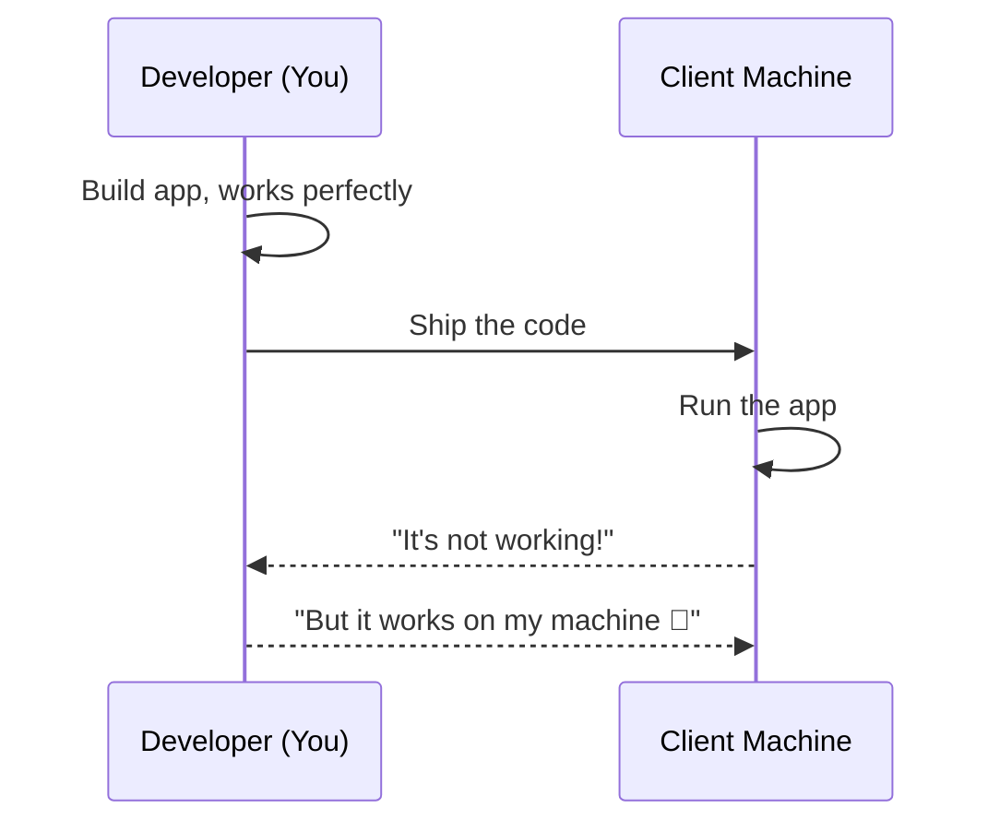

This happens because of differences in:
- OS (Windows vs macOS vs Linux)
- Installed library versions
- Environment variables / configs
- Missing dependencies

### 1.2 What is Docker?

**Docker** is an **open-source containerization platform** that packages an application together with everything it needs (code, runtime, system libraries, dependencies, config) into a single unit called a **container**, so it runs identically anywhere - your laptop, a teammate's laptop, or a cloud server.

> **Note:** Docker doesn't just create a "virtual environment" - it uses **Linux kernel features** (namespaces and cgroups) to isolate processes. This is the actual mechanism, not magic. More on this below.

### 1.3 History of Docker

| Year | Event |
|------|-------|
| 2013 | Docker was released as open source by **dotCloud** (a PaaS company), first announced publicly at **PyCon 2013** |
| 2015 | Docker donates the container runtime spec, forming the basis of the **OCI (Open Container Initiative)** |
| 2017 | **containerd** (Docker's core runtime) is donated to the **CNCF (Cloud Native Computing Foundation)** |
| Today | Docker is the industry-standard containerization tool used by virtually every tech company |

### 1.4 Why Docker? (Use Cases)

- Eliminates "works on my machine" problems
- Consistent dev → test → staging → production environments
- Lightweight compared to Virtual Machines
- Fast startup times (seconds vs minutes for VMs)
- Easy to scale, ship, and version applications (via images)

### 1.5 Virtualization vs Containerization

This is one of the most commonly asked **interview questions**.

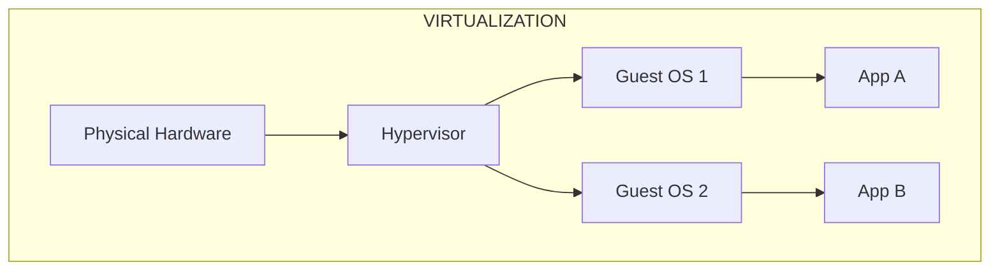

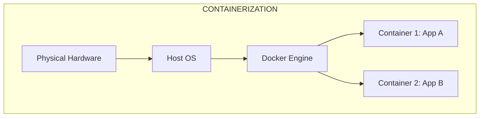

| Aspect | Virtual Machine (VM) | Container |
|---|---|---|
| Isolation unit | Full Guest OS via **Hypervisor** | Process, isolated via **namespaces/cgroups** |
| Boot time | Minutes | Seconds |
| Size | GBs (full OS) | MBs (just app + deps) |
| Resource usage | Heavy - dedicated RAM/CPU per VM | Light - shares host OS kernel |
| Density | Few VMs per machine (e.g., 1–2 on 8GB RAM) | Many containers per machine |
| Tools | VMware, VirtualBox, Hyper-V | Docker, **Podman**, **containerd** |

> **Note:** A container is **NOT** "a lightweight VM." That's a common oversimplification. A container is just an **isolated process on the host OS kernel** - it does not virtualize hardware or boot its own kernel. That's precisely *why* it's so much lighter than a VM.

> **Note:** The actual isolation is done using two Linux kernel primitives:
> - **Namespaces** → isolate what a process can *see* (its own PID list, network interfaces, mount points, hostname, users)
> - **cgroups (control groups)** → limit what a process can *use* (CPU, memory, disk I/O limits)
>
> Docker is just a nice UX/tooling layer on top of these kernel features.

---

## 2. Docker Architecture

### 2.1 The Three Core Components

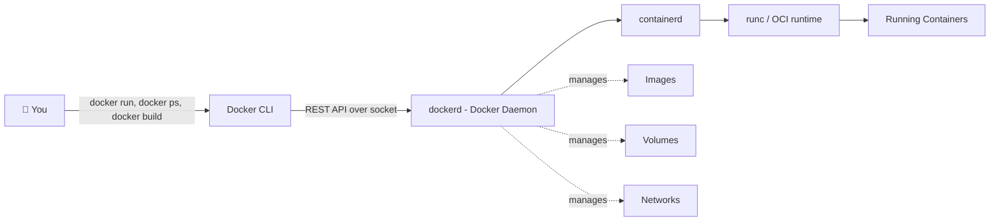

| Component | What it does |
|---|---|
| **Docker CLI** | The command-line tool you type commands into (`docker run`, `docker ps`, etc.). Talks to the daemon via a REST API. |
| **Docker Daemon (`dockerd`)** | Background service (Docker Engine) that does the actual work - builds images, runs containers, manages networks/volumes. |
| **containerd** | A CNCF project, written in Go, that Docker uses internally to actually manage the container lifecycle (create, start, stop). |
| **runc** | The low-level OCI-compliant runtime that actually creates the container using namespaces/cgroups. `containerd` calls `runc` under the hood. |
| **Docker Client / Docker Desktop** | GUI or CLI that talks to the Engine via the API and shows you containers, images, volumes, etc. |

---

## 3. Installing Docker

### 3.1 Local (Windows/Mac)

1. Search "Download Docker Desktop" → go to docker.com
2. Create a Docker account (needed for Docker Hub)
3. Download and install Docker Desktop for your OS
4. Docker Desktop gives you a GUI showing Containers, Images, Volumes, Builds

### 3.2 On an AWS EC2 Instance (Ubuntu)

```bash
# 1. Launch an Ubuntu EC2 instance (t2.medium recommended for practice, t2.micro = free tier)
# 2. SSH into your instance
chmod 400 your-key.pem
ssh -i your-key.pem ubuntu@<your-ec2-public-ip>

# 3. Update the system
sudo apt-get update

# 4. Install Docker
sudo apt install docker.io

# 5. Check Docker daemon status
sudo systemctl status docker

# 6. Fix "permission denied" error on docker commands
sudo usermod -aG docker $USER
newgrp docker      # refresh group without logging out

# 7. Verify
docker ps
```

---

## 4. Docker Images

### 4.1 The Analogy

Think of it like an exam **cheat sheet (chit)**:

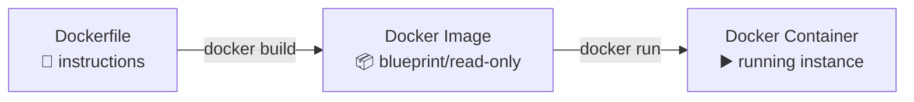

- **Dockerfile** = the recipe / cheat sheet you write
- **Docker Image** = a read-only, portable, layered blueprint built from the Dockerfile - like a "template" or "class"
- **Docker Container** = a running (or stopped) **instance** of the image - like an "object" of that class

> **Note:** Images are made of **layers**. Each instruction in a Dockerfile (`FROM`, `RUN`, `COPY`, etc.) creates a new read-only layer, cached and stacked on top of each other. This is *why* Docker builds are fast on rebuild (layer caching) and why image size grows with each layer.

### 4.2 Pulling & Running Pre-built Images

```bash
docker login                 # log in with Docker Hub username + Personal Access Token (safer than password)
docker pull hello-world      # download image from Docker Hub
docker images                # list local images
docker run hello-world       # docker run = pull (if not present) + create container + start it
```

### 4.3 Running MySQL as an Example

```bash
docker pull mysql
docker run -e MYSQL_ROOT_PASSWORD=root mysql
```

- `-e` → pass an environment variable into the container (needed by MySQL to set root password)
- Without `-d` (detached mode), your terminal is **attached** to the container and gets blocked

### 4.4 Container Lifecycle Commands

```bash
docker ps                 # running containers
docker ps -a               # ALL containers (running + stopped/exited)
docker stop <container_id> # gracefully stop
docker start <container_id># restart a stopped container
docker rm <container_id>   # remove a container
docker rmi <image_id>      # remove an image
docker run -d ...          # run in background (detached mode)
docker run -it ...         # interactive terminal mode
docker run -itd ...        # interactive + detached + persistent (won't exit immediately)
```

> **Note:** A container's default lifecycle is: **run the CMD → exit.** If your CMD is just `echo "hello"`, the container runs it and dies immediately. That's expected behavior - not a bug! Use `-itd` for long-running processes like `ubuntu bash` that you want to keep alive.

### 4.5 Rebuilding After Code Changes

If you change your app's source code, the **image must be rebuilt** - a running container will NOT auto-pick-up host file changes (unless using volumes/bind mounts, covered later).

```bash
docker build -t java-app .
docker run java-app
```

---

## 5. Dockerfile Deep Dive (Java Example)

### 5.1 The Maggi Noodles Analogy 🍜

A Dockerfile is just a **recipe** - a sequence of steps:
1. Take a pot (base image)
2. Add water (set up environment)
3. Add noodles, boil (copy code, install deps)
4. Turn on the gas (run the app)

### 5.2 Anatomy of a Basic Dockerfile

```dockerfile
# 1. Base image - gives you the OS + runtime you need
FROM openjdk:17-alpine

# 2. Working directory inside the container
WORKDIR /app

# 3. Copy source code from host → container
COPY . .

# 4. Run a build/setup command (executed AT BUILD TIME)
RUN javac Main.java

# 5. Command to run when the container STARTS (executed AT RUNTIME)
CMD ["java", "Main"]
```

### 5.3 Key Dockerfile Instructions

| Instruction | Purpose | When it runs |
|---|---|---|
| `FROM` | Pulls the base image | Build time |
| `WORKDIR` | Sets/creates working directory inside container | Build time |
| `COPY` | Copies files from host → image | Build time |
| `RUN` | Executes a command, creates a new image layer (installs, compiles) | Build time |
| `ENV` | Sets environment variables | Build & runtime |
| `EXPOSE` | Documents which port the app listens on (doesn't actually publish it) | Metadata only |
| `CMD` | Default command when container **starts** | Runtime - **can be overridden** by `docker run <image> <new-cmd>` |
| `ENTRYPOINT` | Fixed command when container starts | Runtime - **cannot be overridden**, only appended to |

> **CMD vs ENTRYPOINT:** Think of `ENTRYPOINT` as the glass, and `CMD` as the straw. You can swap out the straw (`CMD` is overridable at `docker run`), but the glass stays fixed (`ENTRYPOINT` isn't). Many real Dockerfiles combine both:
> ```dockerfile
> ENTRYPOINT ["python"]
> CMD ["run.py"]
> ```
> Running `docker run image` → executes `python run.py`
> Running `docker run image other.py` → executes `python other.py` (only CMD part is replaced)

### 5.4 Building & Running

```bash
docker build -t java-app .      # -t = tag (name) the image; "." = build context (where Dockerfile + code live)
docker run java-app
```

### 5.5 Python/Flask Example

```dockerfile
FROM python:3.7-slim
WORKDIR /app
COPY . .
RUN pip install -r requirements.txt
ENTRYPOINT ["python"]
CMD ["run.py"]
```

```bash
docker build -t flask-app .
docker run -d -p 8080:80 flask-app
```

### 5.6 Port Publishing Explained

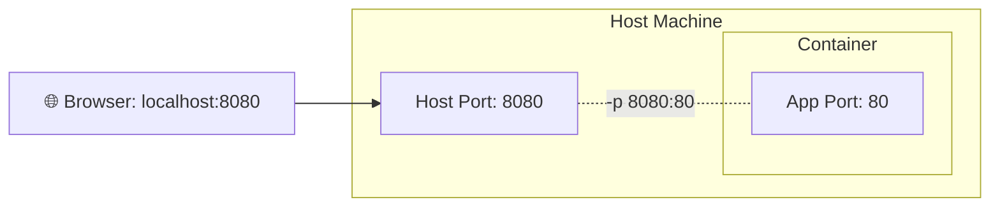

`-p <host_port>:<container_port>` - maps a port on your host machine to a port inside the container. Without this, the app is only reachable *inside* the container's network namespace.

> **Note:** If your app still isn't reachable, check your **cloud provider's Security Group / Firewall rules** - the container port mapping is a Docker-level concern; the cloud firewall is a separate, additional layer you must also open.

### 5.7 Useful Debugging Commands

```bash
docker logs <container_id>            # view logs (one-time snapshot)
docker attach <container_id>          # attach your terminal live to the container's stdout
docker exec -it <container_id> bash   # get an interactive shell INSIDE a running container
```

---

## 6. Docker Networking

### 6.1 Why Networking Is Needed

By default, each container is **isolated** - two containers can't talk to each other unless you explicitly connect them via a network.

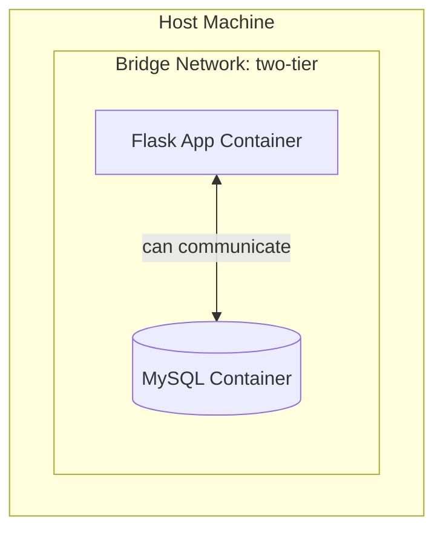

### 6.2 Docker Network Drivers

| Driver | Description | When used |
|---|---|---|
| **bridge** | Default network; Docker creates a virtual bridge between host and containers | Default for standalone containers |
| **host** | Container shares the host's network stack directly (no isolation, no port mapping needed) | Rare - performance-critical or debugging use |
| **user-defined bridge** | A custom bridge network you create - containers on it can resolve each other **by container name** (this is the key feature!) | **Recommended for multi-container apps** |
| **none** | No networking at all - fully isolated | Security-sensitive, batch jobs needing no network |
| **macvlan** | Assigns a container a real MAC address on the physical network | Advanced / legacy-integration use cases |
| **ipvlan** | Similar to macvlan but shares MAC, splits by IP | Advanced networking setups |
| **overlay** | Multi-host networking, used in Docker Swarm clusters | Swarm / multi-host orchestration |

### 6.3 Commands

```bash
docker network ls                              # list networks
docker network create --driver bridge my-net   # create custom network
docker network inspect my-net                  # see which containers are on it

# connect containers to the same custom network at creation
docker run -d --name mysql --network my-net -e MYSQL_ROOT_PASSWORD=root mysql
docker run -d --name flask-app --network my-net -e MYSQL_HOST=mysql my-flask-image
```

> **Note:** Inside a user-defined bridge network, the **container name acts as its hostname**. So `flask-app` can reach `mysql` at hostname `mysql` - Docker's internal DNS resolves it automatically.

---

## 7. Docker Volumes & Storage

### 7.1 The Problem: Containers are Ephemeral


If you `docker rm` a container (or it crashes), **any data written inside its writable layer is lost forever** - including database data.

### 7.2 The Solution: Volumes

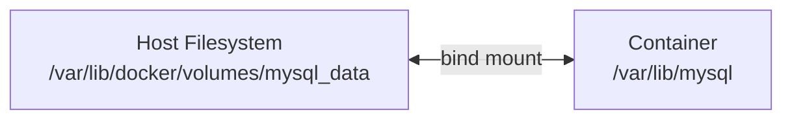

A **volume** maps a directory on the **host** to a directory **inside** the container. Even if the container is deleted, the data on the host survives, and a new container can re-attach to the same volume.

### 7.3 Two Ways to Persist Data

**A) Named Volumes** (Docker-managed, recommended)
```bash
docker volume create mysql_data
docker volume ls
docker volume inspect mysql_data     # shows host path, e.g. /var/lib/docker/volumes/mysql_data/_data

docker run -d --name mysql -v mysql_data:/var/lib/mysql -e MYSQL_ROOT_PASSWORD=root mysql
```

**B) Bind Mounts** (you control the exact host path)
```bash
mkdir -p ~/volumes/mysql
docker run -d --name mysql -v ~/volumes/mysql:/var/lib/mysql -e MYSQL_ROOT_PASSWORD=root mysql
```

| | Named Volume | Bind Mount |
|---|---|---|
| Managed by | Docker | You (any host path) |
| Location | `/var/lib/docker/volumes/...` | Anywhere you specify |
| Best for | Production, portability | Local dev, need exact host path access |

---

## 8. Docker Compose

### 8.1 Why Compose?

Manually running `docker build`, `docker run`, `docker network create`, `docker volume create` for every container, every time, is tedious and error-prone. **Docker Compose** lets you define your **entire multi-container application** in a single YAML file and spin it all up/down with one command.

### 8.2 Anatomy of `docker-compose.yml`

```yaml
services:
  mysql:
    image: mysql:8
    container_name: mysql
    environment:
      MYSQL_ROOT_PASSWORD: root
      MYSQL_DATABASE: myapp_db
    volumes:
      - mysql_data:/var/lib/mysql
    ports:
      - "3306:3306"
    networks:
      - two-tier
    healthcheck:
      test: ["CMD", "mysqladmin", "ping", "-h", "localhost", "-uroot", "-proot"]
      interval: 10s
      timeout: 5s
      retries: 5
      start_period: 30s
    restart: always

  backend:
    build:
      context: .
    container_name: flask-backend
    depends_on:
      mysql:
        condition: service_healthy
    ports:
      - "5000:5000"
    environment:
      MYSQL_HOST: mysql
      MYSQL_USER: root
      MYSQL_PASSWORD: root
      MYSQL_DB: myapp_db
    networks:
      - two-tier
    restart: always

volumes:
  mysql_data:

networks:
  two-tier:
```


### 8.3 Key Directives

| Directive | Purpose |
|---|---|
| `services` | Defines each container to build/run |
| `build.context` | Folder containing the Dockerfile to build from |
| `image` | Use a pre-built image instead of building |
| `environment` | Env vars - same as `docker run -e` |
| `depends_on` | Controls **startup order** (not readiness - see below) |
| `healthcheck` | Defines a test command to verify the container is truly ready |
| `networks` / `volumes` (top-level) | Declares shared networks/volumes referenced by services |
| `restart: always` | Auto-restarts the container on crash/reboot |


### 8.4 Commands

```bash
docker compose up              # build (if needed) + start all services, attached
docker compose up -d           # detached mode
docker compose up --build      # force rebuild images even if cached
docker compose down            # stop and remove all containers, networks (keeps named volumes)
docker compose ps
docker compose logs -f <service>
```

---

## 9. Docker Registry (Docker Hub)

### 9.1 Tag → Push → Pull Workflow

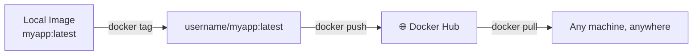

```bash
docker login -u <username>          # use Personal Access Token as password, not your account password

docker tag two-tier-backend:latest yourusername/two-tier-backend:latest
docker push yourusername/two-tier-backend:latest
docker pull yourusername/two-tier-backend:latest
```

> **Note:** A **Personal Access Token (PAT)** should always be preferred over your Docker Hub account password for CLI login - especially in CI/CD pipelines - because tokens can be scoped (read/write/delete) and revoked individually without changing your main account password.

### 9.2 Using a Pushed Image in Compose

Instead of `build: context: .`, reference the pushed image directly:
```yaml
services:
  backend:
    image: yourusername/two-tier-backend:latest
```

This avoids rebuilding on every machine - pull the pre-built image instead.

> **Note:** Docker Hub's free tier has **public repositories by default**. You can also create **private repositories** (limited number on free tier) if you don't want your image publicly accessible. Alternatives to Docker Hub include **AWS ECR**, **Google Artifact Registry**, **GitHub Container Registry (ghcr.io)**, and self-hosted registries.

---

## 10. Multi-Stage Docker Builds

### 10.1 The Problem: Bloated Images

A base image like `python:3.7` (needed to *install* packages) can be **~1GB**, even though your final running app only needs the *installed* packages, not the entire build toolchain.

### 10.2 The Solution

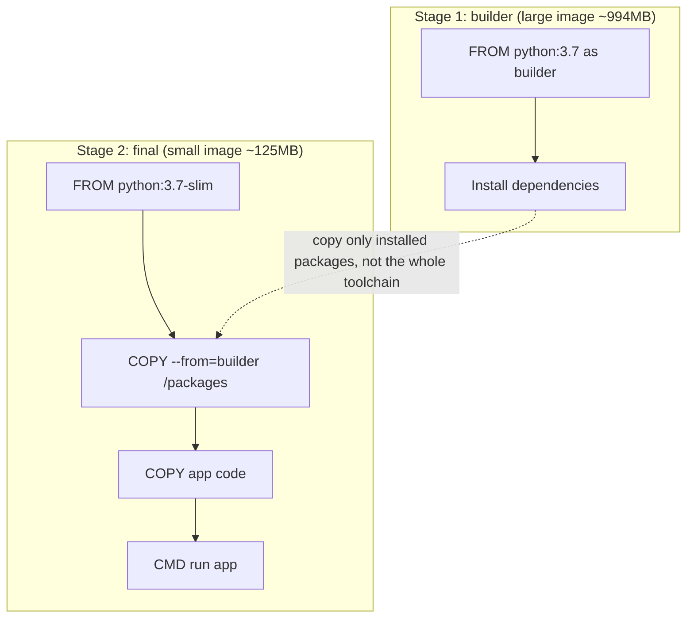

```dockerfile
# ---- Stage 1: Build ----
FROM python:3.7 AS builder
WORKDIR /app
COPY requirements.txt .
RUN pip install -r requirements.txt

# ---- Stage 2: Final (lightweight) ----
FROM python:3.7-slim
WORKDIR /app
COPY --from=builder /usr/local/lib/python3.7/site-packages /usr/local/lib/python3.7/site-packages
COPY . .
CMD ["python", "run.py"]
```

### 10.3 Real-World Java/Maven Example

```dockerfile
# ---- Stage 1: build the JAR using Maven ----
FROM maven:3.8.3-openjdk-17 AS builder
WORKDIR /app
COPY . .
RUN mvn clean install -DskipTests=true

# ---- Stage 2: run the JAR on a slim JRE ----
FROM openjdk:17-alpine
WORKDIR /app
COPY --from=builder /app/target/*.jar app.jar
CMD ["java", "-jar", "app.jar"]
```

> **Why this matters (interview point):** Smaller images mean:
> - Faster `docker pull`/`docker push`
> - Faster container startup
> - Smaller attack surface (fewer packages = fewer vulnerabilities) - ties directly into **Docker Scout** scanning (Section 15)
> - Lower storage/bandwidth costs in CI/CD pipelines

---

## 11. Monitoring & Logging

```bash
docker logs <container_id>              # snapshot of logs so far
docker logs -f <container_id>           # follow logs live (like tail -f)
docker attach <container_id>            # attach terminal directly (blocks your terminal!)

# redirect logs to a file in the background using nohup
nohup docker attach <container_id> &> nohup.out &
```

> **Note - production-grade logging:** `docker logs` is fine for local debugging, but in production you typically ship container logs to a centralized system:
> - **Docker logging drivers**: `json-file` (default), `syslog`, `fluentd`, `awslogs`, `gelf`
> - **The ELK/EFK stack** (Elasticsearch/Fluentd/Logstash + Kibana) or **Grafana Loki**
> - **`docker stats`** - for real-time CPU/memory/network usage per container:
> ```bash
> docker stats                 # live resource usage of all running containers
> docker stats <container_id>  # for one specific container
> ```

---

## 12. Orchestration: Kubernetes Intro

### 12.1 Why Not Just Run Containers Directly in Production?

```bash
docker stop <id>   # container crashes → your app is DOWN, nobody restarts it automatically
```

Standalone Docker containers have **no built-in high availability, auto-healing, or auto-scaling**. This is why production systems use an **orchestrator**.

### 12.2 What Kubernetes Does

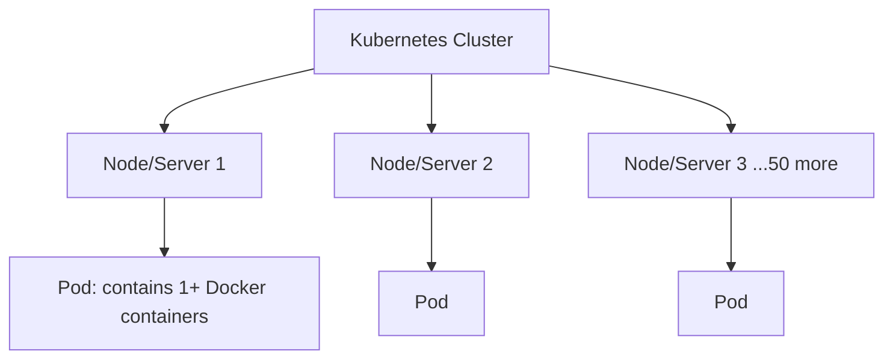

| Concept | Meaning |
|---|---|
| **Pod** | Smallest deployable unit - wraps one or more containers that share network/storage |
| **Deployment** | Manages a set of identical Pods (replicas), handles rolling updates |
| **Service** | Stable network endpoint to reach a set of Pods (load balancing) |
| **Ingress** | Manages external HTTP(S) routing into the cluster |
| **Auto-healing** | If a Pod/container crashes, Kubernetes automatically restarts/replaces it |
| **Auto-scaling** | Automatically adds/removes Pods based on load (CPU, custom metrics) |

> Under the hood, Kubernetes still runs your **Docker (or containerd) containers** - it just adds a management/orchestration layer on top so you don't manually babysit containers across dozens/hundreds of machines.

---

## 13. Project 1: Django + Nginx + MySQL (Two-Tier + Reverse Proxy)

### 13.1 Architecture

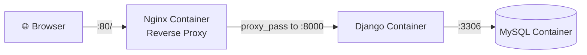

### 13.2 What Nginx Does Here

Nginx acts as a **reverse proxy** - the outside world only ever talks to port `80`. Internally, Nginx forwards (`proxy_pass`) requests to the Django app running on port `8000`, so the client never needs to know or use that internal port.

```nginx
server {
    listen 80;
    location / {
        proxy_pass http://django_container:8000;
    }
}
```

---

## 14. Project 2: Spring Boot + Nginx + MySQL + Domain Mapping

### 14.1 Architecture

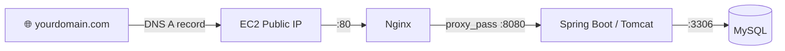

### 14.2 Multi-Stage Build for the Spring Boot App

```dockerfile
FROM maven:3.8.3-openjdk-17 AS builder
WORKDIR /app
COPY . .
RUN mvn clean install -DskipTests=true

FROM openjdk:17-alpine
WORKDIR /app
COPY --from=builder /app/target/*.jar app.jar
CMD ["java", "-jar", "app.jar"]
```

### 14.3 Debugging Lesson - Real MySQL/JDBC Gotcha

`PublicKeyRetrievalNotAllowed` type errors, fixed by adding to the JDBC URL:
```
jdbc:mysql://mysql:3306/expenses_tracker?allowPublicKeyRetrieval=true&useSSL=false
```

> **Explanation:** MySQL 8+'s default authentication plugin (`caching_sha2_password`) requires either an SSL connection or explicit permission (`allowPublicKeyRetrieval=true`) to exchange the RSA public key used for password encryption over an unencrypted channel. This is a **security feature**, not a bug - good to explain to students so they understand *why*, not just copy-paste the fix.

### 14.4 Domain Name Mapping

1. Buy a domain (GoDaddy, Namecheap, etc.)
2. Go to **DNS Management** → Add an **A Record**
   - Host: `@` or subdomain (e.g., `docker`)
   - Value: your EC2 instance's **public IPv4 address**
   - TTL: e.g., 600 seconds
3. Update your Nginx config's `server_name` to match the domain
4. Rebuild/restart containers
5. Open a browser → `http://yourdomain.com`

> **Note:** For a real production domain, you'd also want **HTTPS**. The standard free approach is **Let's Encrypt** via **Certbot**, often automated with the `nginx-proxy` + `acme-companion` Docker images, or a reverse proxy like **Traefik** or **Caddy** which handles automatic TLS certificate issuance for you.

---

## 15. Bonus: Docker Scout & Docker Init

### 15.1 Docker Scout - Image Vulnerability Scanning

```bash
docker scout quickview <image_name>
docker scout cves <image_name>          # detailed CVE (Common Vulnerabilities & Exposures) report
```

Docker Scout analyzes your image (and its base image) for known security vulnerabilities, categorized as **Critical / High / Medium / Low** severity, and links to the actual CVE database entries.

### 15.2 Docker Init - Auto-generate Boilerplate

```bash
docker init
```

Interactively asks about your app's language/platform, port, etc., and auto-generates:
- `Dockerfile` (often multi-stage, with best practices baked in)
- `compose.yaml`
- `.dockerignore`
- `README.Docker.md`

### 15.3 `.dockerignore`

```
node_modules
.env
.git
*.log
```

Prevents unnecessary/sensitive files from being copied into your build context and final image - same idea as `.gitignore`.

---

## 16. Command Cheat Sheet

```bash
# IMAGES
docker build -t name:tag .
docker images
docker rmi <image_id>
docker rmi -f $(docker images -aq)     # remove ALL images forcefully
docker pull <image>
docker push <username>/<image>:<tag>
docker tag <old> <username>/<new>:<tag>
docker scout quickview <image>
docker scout cves <image>

# CONTAINERS
docker run -d -p host:container --name mycontainer -e KEY=VALUE image
docker ps / docker ps -a
docker stop / start / restart <id>
docker rm <id>
docker exec -it <id> bash
docker logs -f <id>
docker attach <id>
docker stats

# NETWORKS
docker network ls
docker network create --driver bridge mynet
docker network inspect mynet

# VOLUMES
docker volume create myvol
docker volume ls
docker volume inspect myvol

# COMPOSE
docker compose up -d
docker compose up --build
docker compose down
docker compose logs -f <service>

# CLEANUP
docker system prune            # remove stopped containers, unused networks/images/build cache
docker system prune -a --volumes  # nuke everything unused (careful!)
```

---