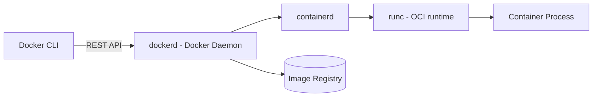

# Docker Interview Questions & Answers

> Organized by topic, from fundamentals to advanced. Pairs well with the Kubernetes
> tutorial/interview files — Docker questions typically come first since K8s builds on it.


## Table of Contents
1. [Fundamentals](#1-fundamentals)
2. [Images & Dockerfile](#2-images--dockerfile)
3. [Containers — Lifecycle & Runtime](#3-containers--lifecycle--runtime)
4. [Networking](#4-networking)
5. [Storage / Volumes](#5-storage--volumes)
6. [Docker Compose](#6-docker-compose)
7. [Docker Architecture & Internals](#7-docker-architecture--internals)
8. [Security](#8-security)
9. [Registry & Image Distribution](#9-registry--image-distribution)
10. [Performance & Optimization](#10-performance--optimization)
11. [Scenario-Based Questions](#11-scenario-based-questions)
12. [Rapid-Fire One-Liners](#12-rapid-fire-one-liners)

## 1. Fundamentals

**Q1. What is Docker?**
Docker is a platform for building, shipping, and running applications inside lightweight, portable **containers** — packages that bundle an application with all its dependencies (libraries, runtime, config) so it runs consistently across any environment ("works on my machine" → "works everywhere").

**Q2. What is a container?**
A running instance of an image — an isolated, lightweight process that shares the host OS kernel but has its own filesystem, network namespace, and process space. Containers start in seconds and use far fewer resources than VMs.

**Q3. What is the difference between a container and a virtual machine?**
| | Container | Virtual Machine |
|---|---|---|
| Isolation level | Process-level, shares host kernel | Full hardware virtualization, own kernel |
| Size | MBs | GBs |
| Startup time | Seconds | Minutes |
| Overhead | Low | High |
| Portability | Very high | Lower |

**Q4. What is a Docker image?**
A read-only, immutable template made up of layered filesystem snapshots, containing the application code, runtime, libraries, and configuration needed to run a container. Containers are created *from* images.

**Q5. What is the difference between an image and a container?**
An image is the static blueprint (like a class); a container is a running instance of that image (like an object). You can create many containers from one image, and each container has its own writable layer on top of the shared read-only image layers.

**Q6. Why is Docker considered "lightweight" compared to VMs?**
Because containers don't bundle a full guest OS — they share the host machine's kernel and only isolate the process/filesystem/network at the OS level, so they consume far less disk, memory, and CPU overhead than a VM running a full separate OS.

## 2. Images & Dockerfile

**Q7. What is a Dockerfile?**
A text file containing a sequence of instructions (`FROM`, `RUN`, `COPY`, `CMD`, etc.) that Docker reads to automatically build an image.

**Q8. Explain the common Dockerfile instructions.**
| Instruction | Purpose |
|---|---|
| `FROM` | Base image to build on top of |
| `WORKDIR` | Sets the working directory inside the image |
| `COPY` / `ADD` | Copies files from host into the image (`ADD` also supports remote URLs/auto-extracting tar archives) |
| `RUN` | Executes a command **at build time**, creating a new layer |
| `ENV` | Sets environment variables |
| `EXPOSE` | Documents which port the container listens on (doesn't actually publish it) |
| `CMD` | Default command to run **when the container starts** (can be overridden at `docker run`) |
| `ENTRYPOINT` | The fixed executable that always runs; `CMD` args get appended to it |
| `ARG` | Build-time variable (not available at runtime unless passed into `ENV`) |
| `VOLUME` | Declares a mount point for persistent/shared storage |
| `USER` | Sets the user the container process runs as |

**Q9. What is the difference between `CMD` and `ENTRYPOINT`?**
`CMD` provides default arguments that **can be fully overridden** by whatever is passed to `docker run`. `ENTRYPOINT` sets a fixed command that **always runs**; anything passed to `docker run` is appended as arguments to it rather than replacing it. They're often combined: `ENTRYPOINT ["python3", "app.py"]` with `CMD ["--debug"]` as a default flag.

**Q10. What is the difference between `COPY` and `ADD`?**
`COPY` simply copies files/directories from the build context into the image. `ADD` does everything `COPY` does, plus it can fetch remote URLs and auto-extract compressed archives (`.tar.gz`). Best practice: prefer `COPY` unless you specifically need `ADD`'s extra behavior, since it's more predictable.

**Q11. What are Docker image layers, and why do they matter?**
Each instruction in a Dockerfile (mainly `RUN`, `COPY`, `ADD`) creates a new, cached, read-only layer stacked on top of the previous one. Layers matter because: (1) Docker caches unchanged layers to speed up rebuilds, (2) common layers are shared/reused across images, saving disk space, and (3) layer ordering affects build cache efficiency.

**Q12. How does Docker's build cache work, and how do you optimize for it?**
Docker checks, layer by layer, whether the instruction and its inputs are unchanged since the last build — if so, it reuses the cached layer instead of re-executing it. To optimize: put instructions that change *least often* (e.g., installing dependencies) **before** instructions that change *often* (e.g., copying source code), so a source code change doesn't invalidate the expensive dependency-install layer.

**Q13. What is a multi-stage build, and why use one?**
A Dockerfile with multiple `FROM` stages, where you build/compile the app in one stage (with all the build tools) and then copy only the final compiled artifacts into a slim final-stage image — discarding build tools, source code, and intermediate files from the final image. This drastically reduces final image size and attack surface.

```dockerfile
# Stage 1: build
FROM golang:1.22 AS builder
WORKDIR /app
COPY . .
RUN go build -o myapp .

# Stage 2: final minimal image
FROM alpine:latest
COPY --from=builder /app/myapp /usr/local/bin/myapp
ENTRYPOINT ["myapp"]
```

**Q14. How do you reduce the size of a Docker image?**
- Use a minimal base image (`alpine`, `distroless`, `slim` variants).
- Use multi-stage builds to drop build-time dependencies from the final image.
- Combine related `RUN` commands into one to avoid extra layers (e.g., `apt-get update && apt-get install -y ... && rm -rf /var/lib/apt/lists/*`).
- Use a `.dockerignore` file to avoid copying unnecessary files (like `.git`, `node_modules`, local env files) into the build context.
- Remove package manager caches after installing.

**Q15. What is `.dockerignore` used for?**
Similar to `.gitignore` — it excludes specified files/folders from being sent to the Docker build context, which speeds up builds and prevents accidentally baking secrets, `.git` history, or large unnecessary files into the image.

## 3. Containers — Lifecycle & Runtime

**Q16. What are the basic container lifecycle commands?**
```bash
docker run <image>          # create + start a new container
docker start <container>    # start a stopped container
docker stop <container>     # gracefully stop (SIGTERM, then SIGKILL after timeout)
docker restart <container>
docker pause / unpause <container>
docker rm <container>       # remove a stopped container
docker kill <container>     # force stop (SIGKILL immediately)
```

**Q17. What's the difference between `docker stop` and `docker kill`?**
`docker stop` sends `SIGTERM` first (giving the process a chance to shut down gracefully) and waits a grace period (default 10s) before sending `SIGKILL`. `docker kill` sends `SIGKILL` immediately, terminating the process with no cleanup opportunity.

**Q18. What does `docker run -d -p 8080:80 nginx` do?**
Runs an `nginx` container in **detached** mode (`-d`, runs in background) and **publishes** port 80 inside the container to port 8080 on the host (`-p host:container`), so `localhost:8080` reaches the container's port 80.

**Q19. How do you get a shell inside a running container?**
```bash
docker exec -it <container> bash    # or sh, if bash isn't available
```
`-i` keeps STDIN open, `-t` allocates a pseudo-TTY.

**Q20. What is the difference between `docker exec` and `docker attach`?**
`docker exec` starts a **new process** inside an already-running container (e.g., opening a new shell) without affecting the main process. `docker attach` connects your terminal to the container's **existing** main process (PID 1) stdin/stdout/stderr — exiting or Ctrl+C can stop the container's main process itself.

**Q21. How do you view logs from a container?**
```bash
docker logs <container>
docker logs -f <container>     # follow/stream logs live
docker logs --tail 100 <container>
```

**Q22. How do you check resource usage of running containers?**
```bash
docker stats
```
Shows live CPU%, memory usage/limit, network I/O, and block I/O per container.

**Q23. What happens to data written inside a container when it's removed?**
It's lost — a container's writable layer is deleted when the container is removed, unless the data was stored in a **volume** or **bind mount**, which persist independently of the container's lifecycle.

**Q24. How do you limit CPU/memory for a container?**
```bash
docker run -d --memory="512m" --cpus="1.5" myimage
```

## 4. Networking

**Q25. What are the default Docker network drivers?**
- **bridge** (default): an isolated private network on the host; containers on the same bridge can talk to each other via container name/IP; needs port publishing (`-p`) to reach the host/outside world.
- **host**: container shares the host's network namespace directly — no network isolation, no port mapping needed, but less secure and no port conflicts protection.
- **none**: no networking at all — fully isolated.
- **overlay**: used for multi-host networking, typically in Docker Swarm, letting containers on different physical hosts communicate.
- **macvlan**: assigns a container its own MAC address, making it appear as a physical device on the network.

**Q26. How do two containers on the same custom bridge network communicate?**
By container name — Docker's embedded DNS resolves container names to their internal IPs automatically on user-defined bridge networks (this doesn't work on the *default* bridge network, only custom/user-defined ones).

```bash
docker network create mynet
docker run -d --name db --network mynet mysql
docker run -d --name app --network mynet myapp   # app can reach db via hostname "db"
```

**Q27. What's the difference between the default bridge network and a user-defined bridge network?**
The default bridge network doesn't provide automatic DNS resolution between containers (you'd need `--link`, which is legacy/deprecated); a user-defined bridge network does provide automatic DNS by container name, and is generally recommended.

**Q28. How does `-p 8080:80` differ from `-P` (capital)?**
`-p host:container` maps a specific host port to a specific container port. `-P` automatically publishes **all** ports the image `EXPOSE`s to random available host ports.

## 5. Storage / Volumes

**Q29. What are the ways to persist data in Docker?**
- **Volumes**: managed by Docker itself, stored under Docker's storage area (`/var/lib/docker/volumes/`), the recommended approach for persistence.
- **Bind mounts**: map a specific host filesystem path directly into the container — useful for local development (e.g., live-mounting source code).
- **tmpfs mounts**: stored only in host memory, never written to disk — used for sensitive/temporary data.

**Q30. What's the difference between a volume and a bind mount?**
| | Volume | Bind Mount |
|---|---|---|
| Managed by | Docker | You (arbitrary host path) |
| Location | Docker-controlled area | Anywhere on host filesystem |
| Portability | High (works across environments) | Low (depends on host path existing) |
| Best for | Production persistence, sharing data between containers | Local dev (live code mounting) |

```bash
docker run -v myvolume:/data myimage        # named volume
docker run -v $(pwd):/app myimage           # bind mount
```

**Q31. How do you list, inspect, and remove volumes?**
```bash
docker volume ls
docker volume inspect <name>
docker volume rm <name>
docker volume prune       # remove all unused volumes
```

**Q32. Can multiple containers share the same volume?**
Yes — multiple containers can mount the same named volume simultaneously, useful for sharing data (e.g., a sidecar container reading logs written by the main container).

## 6. Docker Compose

**Q33. What is Docker Compose, and why use it?**
A tool for defining and running **multi-container** applications using a single declarative YAML file (`docker-compose.yml`), rather than manually running many `docker run` commands with matching networks/volumes. Great for local development and simple multi-service setups.

**Q34. Example `docker-compose.yml` for a simple app + database:**
```yaml
version: "3.9"
services:
  app:
    build: .
    ports:
      - "3000:3000"
    environment:
      - DB_HOST=db
    depends_on:
      - db
  db:
    image: mysql:8.0
    environment:
      - MYSQL_ROOT_PASSWORD=root
    volumes:
      - db-data:/var/lib/mysql

volumes:
  db-data:
```

**Q35. Common Docker Compose commands?**
```bash
docker compose up -d           # build/create/start all services in background
docker compose down            # stop and remove containers/networks
docker compose down -v         # also remove volumes
docker compose logs -f <svc>
docker compose ps
docker compose build
```

**Q36. What does `depends_on` actually guarantee?**
By default, it only controls **start order** (the dependency container is started first) — it does **not** wait for the dependency to be actually *ready* (e.g., DB accepting connections). For a true readiness wait, use a healthcheck combined with `depends_on: condition: service_healthy`, or an app-level retry/wait mechanism.

## 7. Docker Architecture & Internals

**Q37. Describe Docker's client-server architecture.**
The **Docker CLI** (client) sends commands over a REST API to the **Docker daemon** (`dockerd`), which does the actual work of building images, running containers, and managing networks/volumes. The daemon can run on the same host as the client or remotely.



**Q38. What is `containerd`, and how does it relate to Docker?**
`containerd` is a lower-level container runtime (a CNCF project) that Docker uses internally to manage the container lifecycle (pulling images, running, stopping containers). Docker's daemon (`dockerd`) sits on top of `containerd`, adding the higher-level CLI/API/build features.

**Q39. What is `runc`?**
The low-level OCI (Open Container Initiative)-compliant runtime that actually creates and runs containers by interfacing directly with Linux kernel features (namespaces, cgroups). `containerd` calls `runc` to spawn the actual container process.

**Q40. What Linux kernel features make containers possible?**
- **Namespaces**: isolate what a process can *see* (PID namespace, network namespace, mount namespace, UTS, IPC, user namespace) — giving each container its own isolated view of the system.
- **cgroups (control groups)**: limit and account for resource usage (CPU, memory, I/O) per container/process group.
- **Union/overlay filesystems** (e.g., OverlayFS): implement the layered image filesystem efficiently.

**Q41. What is the OCI (Open Container Initiative)?**
An industry standard defining specifications for container **images** and **runtimes**, ensuring images/runtimes built by different tools (Docker, Podman, containerd) remain interoperable.

## 8. Security

**Q42. What are best practices for securing Docker containers?**
- Don't run containers as `root` — use `USER` in the Dockerfile to run as a non-root user.
- Use minimal base images to reduce attack surface.
- Regularly scan images for vulnerabilities (`docker scout`, Trivy, Docker Scout/Snyk).
- Avoid baking secrets into images — use runtime secrets/env injection or a secrets manager instead.
- Keep the Docker daemon and host OS patched.
- Use read-only root filesystems where possible (`--read-only`).
- Limit container capabilities (`--cap-drop=ALL`, add back only what's needed).
- Avoid mounting the Docker socket (`/var/run/docker.sock`) into containers unless absolutely necessary (it effectively grants root access to the host).

**Q43. Why is running a container as root risky?**
If an attacker breaks out of the container (via a kernel exploit or misconfiguration), running as root inside the container increases the chance of also achieving root-level access on the host, since container isolation isn't a full security boundary.

**Q44. How do you scan a Docker image for vulnerabilities?**
```bash
docker scout cves <image>
# or third-party tools:
trivy image <image>
```

**Q45. What is image signing / content trust?**
A mechanism (Docker Content Trust, using Notary) to cryptographically sign images so consumers can verify an image came from a trusted publisher and hasn't been tampered with, before pulling/running it.

## 9. Registry & Image Distribution

**Q46. What is a Docker registry?**
A storage/distribution service for Docker images — Docker Hub is the default public registry; organizations often run private registries (AWS ECR, GCR, Harbor, GitLab Registry, self-hosted `registry:2`).

**Q47. How do you tag and push an image to a registry?**
```bash
docker build -t myuser/myapp:1.0 .
docker login
docker push myuser/myapp:1.0
```

**Q48. What does the `latest` tag actually mean?**
Nothing special by default — it's just a convention/default tag applied when you don't specify one; it does **not** automatically mean "most recently built" version by Docker itself. Relying on `latest` in production is discouraged because it's not immutable/traceable — always prefer explicit version tags (or digest pinning) for reproducible deployments.

**Q49. How do you pull a specific image by digest instead of tag, for full reproducibility?**
```bash
docker pull myimage@sha256:abcd1234...
```
Digests are content-addressable and immutable, unlike tags which can be overwritten/re-pushed.

## 10. Performance & Optimization

**Q50. How do you clean up unused Docker resources?**
```bash
docker system prune            # removes stopped containers, unused networks, dangling images
docker system prune -a         # also removes all unused images (not just dangling)
docker container prune
docker image prune
docker volume prune
docker builder prune           # clear build cache
```

**Q51. What is a "dangling" image?**
An image layer with no tag, usually left behind after rebuilding an image with the same tag (the old, now-untagged version becomes `<none>:<none>`). Safe to prune if not in use.

**Q52. How can you speed up Docker builds in CI/CD?**
Use build cache effectively (order Dockerfile instructions from least-to-most frequently changing), use `--cache-from` with a previously pushed image as a cache source in CI, use BuildKit (`DOCKER_BUILDKIT=1`) for parallelized, more efficient builds, and use multi-stage builds to avoid rebuilding unrelated stages.

**Q53. What is BuildKit, and why is it better than the legacy builder?**
BuildKit is Docker's modern build engine — it builds independent stages/layers in parallel, has smarter caching (including remote cache import/export), skips unused build stages, and provides better secret handling during builds (`--secret` flag, avoiding secrets leaking into layers).

## 11. Scenario-Based Questions

**Q54. Your container exits immediately after `docker run`. How do you debug it?**
```bash
docker ps -a                 # check exit code
docker logs <container>      # see what error was printed before exit
```
Common causes: the main process (`CMD`/`ENTRYPOINT`) completed and exited (containers stop when their PID 1 process exits — this is expected for non-daemon processes), a missing required env var/config causing a crash, or the entrypoint script has an error.

**Q55. Two containers on the same host need to talk to each other — what's the correct setup?**
Put them on the same **user-defined bridge network** so Docker's embedded DNS resolves them by container name, rather than relying on hardcoded IPs (which can change) or the legacy `--link` flag.

**Q56. How would you debug high memory usage in a running container without stopping it?**
```bash
docker stats <container>              # live resource usage
docker exec -it <container> top       # process-level view inside the container (if available)
docker inspect <container>            # check configured memory limits
```

**Q57. Your image build is very slow because it reinstalls dependencies every time, even though only source code changed. What's wrong and how do you fix it?**
The Dockerfile likely copies the entire source code **before** installing dependencies, invalidating the dependency-install layer's cache on every code change. Fix: copy only the dependency manifest first (e.g., `package.json`/`requirements.txt`), run the install step, *then* copy the rest of the source code:
```dockerfile
COPY package.json package-lock.json ./
RUN npm install
COPY . .
```

**Q58. How would you migrate a running container's persistent data to a new host?**
If data lives in a named volume: back it up (e.g., `docker run --rm -v myvolume:/data -v $(pwd):/backup busybox tar czf /backup/backup.tar.gz /data`), transfer the archive, then restore it into a new volume on the target host with the reverse command.

**Q59. How do you make sure a container automatically restarts if it crashes or the host reboots?**
```bash
docker run -d --restart unless-stopped myimage
```
Options: `no` (default), `on-failure[:max-retries]`, `always`, `unless-stopped` (restarts unless explicitly stopped by the user).

**Q60. Your production image is 1.2GB and you need to shrink it. Walk through your approach.**
Switch to a slim/alpine or distroless base image; convert to a multi-stage build so build tools/compilers aren't in the final image; add a `.dockerignore`; combine `RUN` layers and clean package caches in the same layer they were created; remove unused dependencies; verify with `docker history <image>` to see which layers are the biggest contributors.

## 12. Rapid-Fire One-Liners

| Question | Short Answer |
|---|---|
| Default registry? | Docker Hub |
| File that defines how to build an image? | Dockerfile |
| Command to build an image? | `docker build -t name:tag .` |
| Command to list running containers? | `docker ps` |
| Command to list all containers (including stopped)? | `docker ps -a` |
| Command to list images? | `docker images` |
| Instruction that runs at build time vs runtime? | `RUN` (build time) vs `CMD`/`ENTRYPOINT` (runtime) |
| File to exclude files from build context? | `.dockerignore` |
| Default network driver? | bridge |
| Multi-container orchestration on a single host tool? | Docker Compose |
| Low-level runtime that spawns containers? | runc |
| Kernel feature for process isolation? | Namespaces |
| Kernel feature for resource limiting? | cgroups |
| Command to exec into a running container? | `docker exec -it <container> bash` |
| Command to view container logs? | `docker logs -f <container>` |
| Command to clean up unused resources? | `docker system prune` |
| Persisting data beyond a container's life? | Volumes (or bind mounts) |
| Reducing final image size using two `FROM` stages? | Multi-stage build |
| Content-addressable, immutable image reference? | Image digest (`@sha256:...`) |