# Kubernetes Complete Tutorial


## 1. Why Kubernetes? Monolith vs Microservices

**Monolith**: One giant application/repo doing everything (login, cart, products…).
- Hard to manage, one bug can crash the whole app, scaling means scaling *everything*.

**Microservices**: The app is broken into small independent services (auth-service, cart-service, product-service…).
- Each piece can scale/fail independently → cheaper, more resilient.
- But now you have *many* moving containers that need to be started, healed, scaled, and networked together automatically.

**Kubernetes (K8s)** = a container **orchestration** tool that manages all these containers: starts them, restarts them if they crash (self-healing), scales them up/down, and handles networking between them.

- Origin: Google's internal system called **Borg** (2014) → open-sourced as Kubernetes.
- "K8s" = K + 8 letters + s.
- Kubernetes is a **CNCF** (Cloud Native Computing Foundation) graduated project.

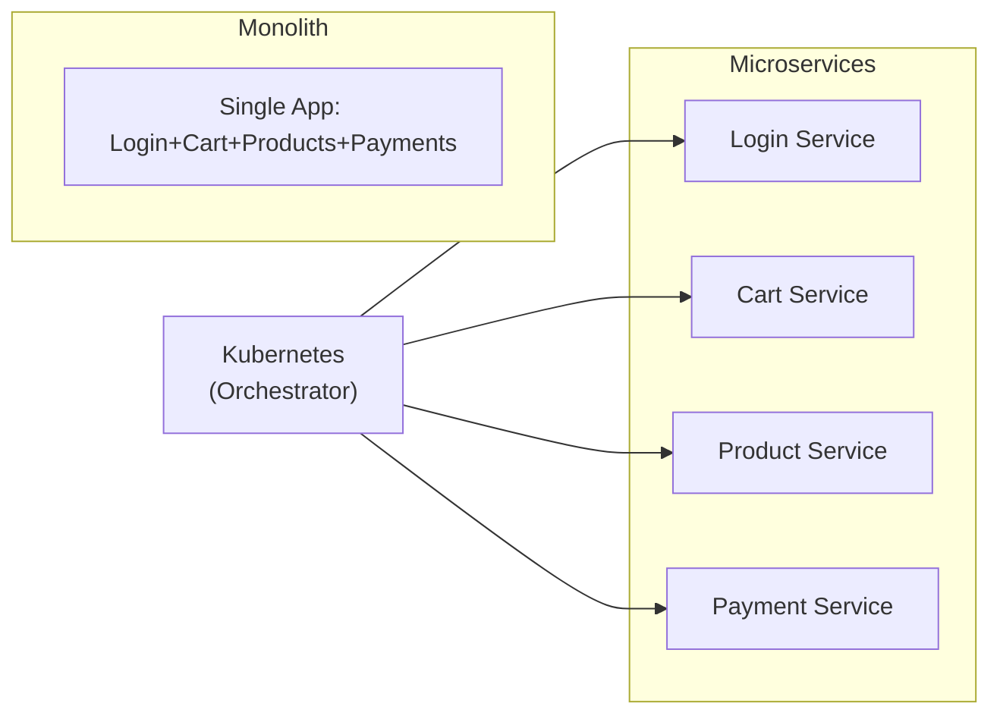

---

## 2. Kubernetes Architecture

Analogy used in the course: a company with a **Head Office (Master Node)** that only *manages* work, and **Branch Offices (Worker Nodes)** where the actual work (containers) happens.

### Master Node (Control Plane) components
| Component | Role |
|---|---|
| **API Server** | The single communication gateway. Everything (kubectl, kubelet, controllers) talks through it. |
| **Scheduler** | Decides *which worker node* a new Pod should run on. |
| **Controller Manager** | Watches the cluster state and makes sure the actual state matches the desired state (self-healing, node health, etc.) |
| **etcd** | Key-value datastore holding the entire cluster state/data. |

### Worker Node components
| Component | Role |
|---|---|
| **Kubelet** | Agent on each worker node; talks to API server, ensures containers/Pods are running correctly. |
| **Kube-proxy (Service Proxy)** | Handles networking rules so Services can route traffic to the right Pods. |
| **Container Runtime** | Actually runs the containers (containerd, Docker, etc.) inside Pods. |

### Client
- **kubectl (Kube Control)** — CLI tool used to send commands to the API Server.

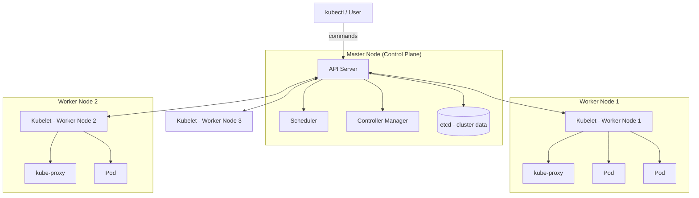

**Key exam fact:** Application containers *never* run on the Master Node — only on Worker Nodes.

Communication between nodes happens over a **CNI (Container Network Interface)** — e.g., Calico, Weave Net.

---

## 3. Setting Up a Cluster (Kind, Minikube, Kubeadm)

There are several ways to create a K8s cluster:

| Method | Use case |
|---|---|
| **Kind** (Kubernetes IN Docker) | Runs a full multi-node cluster *inside Docker containers* on a single machine. Great for local dev. |
| **Minikube** | Single VM/local cluster, easy add-ons (metrics-server, ingress, dashboard). |
| **kubeadm** | Manually bootstrap a real cluster across multiple servers/VMs (bare metal / EC2). Used to understand what a managed service does under the hood. |
| **EKS / AKS / GKE** | Fully managed Kubernetes by AWS / Azure / Google — control plane managed for you. |

### Kind Cluster (quick reference)
```bash
# install kind + kubectl via a script, then:
kind create cluster --name k8s-one-shot --config config.yaml
```
Example `config.yaml` (1 control-plane + 3 workers):
```yaml
kind: Cluster
apiVersion: kind.x-k8s.io/v1alpha4
nodes:
  - role: control-plane
    image: kindest/node:v1.31.0
  - role: worker
    image: kindest/node:v1.31.0
  - role: worker
    image: kindest/node:v1.31.0
  - role: worker
    image: kindest/node:v1.31.0
extraPortMappings:
  - containerPort: 80
    hostPort: 80
    protocol: TCP
  - containerPort: 443
    hostPort: 443
    protocol: TCP
```

### Minikube (quick reference)
```bash
minikube start --driver docker
kubectl get nodes
minikube delete
```

### kubeadm (bare metal / manual, high level)
1. Disable swap, load kernel modules, set sysctl params — on **both** master & worker.
2. Install `containerd` (container runtime) — on **both**.
3. Install `kubelet`, `kubeadm`, `kubectl` — on **both**.
4. On the master only: `sudo kubeadm init` → this node becomes the Control Plane.
5. Copy `/etc/kubernetes/admin.conf` to `~/.kube/config` so `kubectl` works as a normal user.
6. Apply a CNI plugin (e.g., Calico) so nodes can talk to each other:
   ```bash
   kubectl apply -f https://.../calico.yaml
   ```
7. On each worker: run the `kubeadm join ...` command (generated by `kubeadm token create --print-join-command` on the master).
8. Verify: `kubectl get nodes` — new node shows `NotReady` → `Ready` after ~30-60s.

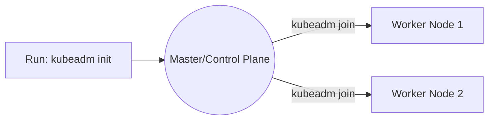

---

## 4. Namespaces

A **Namespace** is a way to logically group/isolate Kubernetes resources (Pods, Deployments, Services) — like separate "groups"/folders inside one cluster.

- If you don't specify a namespace, resources go into `default`.
- Built-in namespaces: `default`, `kube-system` (control plane components), `kube-node-lease`, `kube-public`.

```yaml
apiVersion: v1
kind: Namespace
metadata:
  name: nginx
```
```bash
kubectl apply -f namespace.yaml
kubectl get ns
kubectl get pods -n nginx
```

---

## 5. Pods

A **Pod** is the smallest deployable unit in Kubernetes — a wrapper around one (or more) containers.

```yaml
apiVersion: v1
kind: Pod
metadata:
  name: nginx-pod
  namespace: nginx
spec:
  containers:
    - name: nginx
      image: nginx:latest
      ports:
        - containerPort: 80
```
```bash
kubectl apply -f pod.yaml
kubectl get pods -n nginx
kubectl exec -it nginx-pod -n nginx -- bash
kubectl describe pod nginx-pod -n nginx
kubectl logs <pod-name>
kubectl delete pod nginx-pod -n nginx
```

**Pod lifecycle states**: `Pending` → `ContainerCreating` → `Running` → `Completed`/`Terminating`/`CrashLoopBackOff`/`ImagePullBackOff`.

**Flow when a Pod is created:**
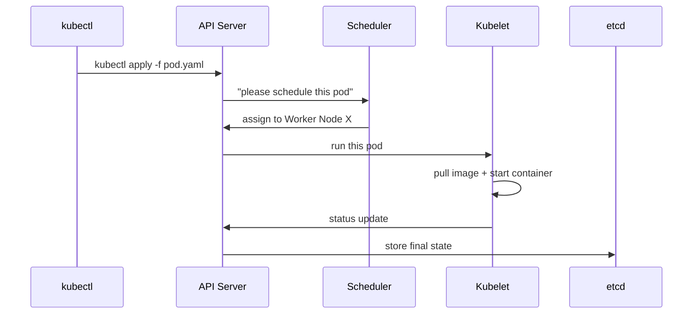

---

## 6. Deployments, ReplicaSets, DaemonSets, StatefulSets

Directly running bare Pods isn't scalable — if a Pod dies, nobody restarts it. These "workload controllers" wrap Pods with self-healing/scaling logic.

### Labels & Selectors (used by all of them)
- **Label**: a tag on a Pod (e.g., `app: nginx`).
- **Selector**: how a controller *finds* which Pods belong to it (`matchLabels: app: nginx`).

### Deployment
Manages replicas of a Pod **and** supports **rolling updates** (updates Pods gradually, avoiding downtime) and rollbacks.

```yaml
apiVersion: apps/v1
kind: Deployment
metadata:
  name: nginx-deployment
  namespace: nginx
spec:
  replicas: 2
  selector:
    matchLabels:
      app: nginx
  template:
    metadata:
      labels:
        app: nginx
    spec:
      containers:
        - name: nginx
          image: nginx:latest
          ports:
            - containerPort: 80
```
```bash
kubectl apply -f deployment.yaml
kubectl scale deployment nginx-deployment --replicas=5 -n nginx
kubectl set image deployment/nginx-deployment nginx=nginx:1.27.1 -n nginx   # rolling update
kubectl rollout status deployment/nginx-deployment -n nginx
kubectl rollout undo deployment/nginx-deployment -n nginx                  # rollback
```

### ReplicaSet
Same replica-management concept as a Deployment, but **no rolling update support**. In practice, a Deployment creates and manages a ReplicaSet for you — you rarely create a ReplicaSet directly.

### DaemonSet
Ensures **exactly one Pod runs on every node** (like a "langar/free-food-for-everyone" — every node gets one). Used for node-level agents: log collectors, monitoring agents, CNI plugins.

```yaml
apiVersion: apps/v1
kind: DaemonSet
metadata:
  name: nginx-daemonset
  namespace: nginx
spec:
  selector:
    matchLabels:
      app: nginx
  template:
    metadata:
      labels:
        app: nginx
    spec:
      containers:
        - name: nginx
          image: nginx:latest
```

### StatefulSet
Used for **stateful apps** (databases like MySQL/MongoDB) where each Pod needs:
- A **stable, predictable name** (`mysql-0`, `mysql-1`, `mysql-2` — not random suffixes).
- **Persistent storage** tied to that specific Pod identity (via `volumeClaimTemplates`).
- A **headless Service** (`clusterIP: None`) for direct Pod-to-Pod addressing.

```yaml
apiVersion: apps/v1
kind: StatefulSet
metadata:
  name: mysql-statefulset
  namespace: mysql
spec:
  serviceName: mysql-service
  replicas: 3
  selector:
    matchLabels:
      app: mysql
  template:
    metadata:
      labels:
        app: mysql
    spec:
      containers:
        - name: mysql
          image: mysql:8.0
          ports:
            - containerPort: 3306
          env:
            - name: MYSQL_ROOT_PASSWORD
              value: "root"
          volumeMounts:
            - name: mysql-data
              mountPath: /var/lib/mysql
  volumeClaimTemplates:
    - metadata:
        name: mysql-data
      spec:
        accessModes: ["ReadWriteOnce"]
        resources:
          requests:
            storage: 1Gi
```

### Comparison Table
| Feature | Deployment | ReplicaSet | DaemonSet | StatefulSet |
|---|---|---|---|---|
| Manages replicas | ✅ | ✅ | 1 per node | ✅ |
| Rolling updates | ✅ | ❌ | ✅ | ✅ (ordered) |
| Stable Pod identity | ❌ | ❌ | ❌ | ✅ |
| Use case | Stateless apps | (rarely used directly) | Node agents/logging | Databases |

---

## 7. Jobs & CronJobs

### Job
Runs a container **once until completion**, then stops (not meant to run forever like a server).

```yaml
apiVersion: batch/v1
kind: Job
metadata:
  name: demo-job
  namespace: nginx
spec:
  completions: 1
  parallelism: 1
  template:
    metadata:
      labels:
        app: batch-job
    spec:
      containers:
        - name: batch
          image: busybox:latest
          command: ["sh", "-c", "echo Job started...; sleep 10; echo Job completed"]
      restartPolicy: Never
```

### CronJob
Runs a **Job on a schedule**, following standard cron syntax (`min hour day month weekday`).

```yaml
apiVersion: batch/v1
kind: CronJob
metadata:
  name: minute-backup
  namespace: nginx
spec:
  schedule: "*/1 * * * *"     # every minute
  jobTemplate:
    spec:
      template:
        metadata:
          labels:
            app: backup-job
        spec:
          containers:
            - name: backup
              image: busybox
              command: ["sh", "-c", "echo Backup started; mkdir -p /backups; cp -r /demo-data/* /backups/ 2>/dev/null; echo Backup completed"]
              volumeMounts:
                - name: data-volume
                  mountPath: /demo-data
                - name: backup-volume
                  mountPath: /backups
          restartPolicy: OnFailure
          volumes:
            - name: data-volume
              hostPath:
                path: /demo-data
            - name: backup-volume
              hostPath:
                path: /backups
```
```bash
kubectl get cronjob -n nginx
kubectl logs pod/<job-pod-name> -n nginx
```

---

## 8. Storage: PV, PVC, StorageClass

**Problem**: Pods are ephemeral — if a Pod dies, its data dies with it. To persist data, we need storage decoupled from the Pod's lifecycle.

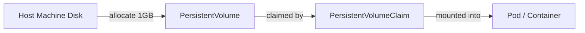

- **PersistentVolume (PV)**: A chunk of real storage carved out from the host (or cloud disk).
- **PersistentVolumeClaim (PVC)**: A *request* for storage — "I need 1Gi with ReadWriteOnce access." It binds to a matching PV.
- **StorageClass**: Defines *how/where* storage is provisioned (local disk, EBS, etc.) — e.g. `local-path`, `gp2`.

```yaml
apiVersion: v1
kind: PersistentVolume
metadata:
  name: local-pv
  labels:
    type: local
spec:
  capacity:
    storage: 1Gi
  accessModes:
    - ReadWriteOnce
  persistentVolumeReclaimPolicy: Retain
  storageClassName: local-storage
  hostPath:
    path: "/mnt/data"
---
apiVersion: v1
kind: PersistentVolumeClaim
metadata:
  name: local-pvc
spec:
  accessModes:
    - ReadWriteOnce
  resources:
    requests:
      storage: 1Gi
  storageClassName: local-storage
```

Mounting it inside a Pod/Deployment:
```yaml
      volumes:
        - name: my-volume
          persistentVolumeClaim:
            claimName: local-pvc
      containers:
        - name: nginx
          volumeMounts:
            - name: my-volume
              mountPath: /usr/share/nginx/html
```

**Access Modes**: `ReadWriteOnce` (one node r/w), `ReadOnlyMany`, `ReadWriteMany`.

---

## 9. ConfigMaps & Secrets

Both let you decouple configuration/credentials from your Pod spec so you don't hardcode values inside Deployment YAMLs.

### ConfigMap (plain-text config, e.g. non-sensitive env vars)
```yaml
apiVersion: v1
kind: ConfigMap
metadata:
  name: mysql-config
  namespace: mysql
data:
  MYSQL_DATABASE: "devops"
```
Used inside a container:
```yaml
          env:
            - name: MYSQL_DATABASE
              valueFrom:
                configMapKeyRef:
                  name: mysql-config
                  key: MYSQL_DATABASE
```

### Secret (base64-encoded — NOT strong encryption, just obfuscation)
```bash
echo -n "root" | base64     # -> cm9vdA==
```
```yaml
apiVersion: v1
kind: Secret
metadata:
  name: mysql-secret
  namespace: mysql
data:
  MYSQL_ROOT_PASSWORD: cm9vdA==
```
Used inside a container:
```yaml
          env:
            - name: MYSQL_ROOT_PASSWORD
              valueFrom:
                secretKeyRef:
                  name: mysql-secret
                  key: MYSQL_ROOT_PASSWORD
```

> ⚠️ Base64 is **encoding**, not encryption — anyone can decode it (`base64 -d`). Use it to make Secrets binary-safe for the API, not for true security. For real secrets management, integrate a vault/secret manager.

---

## 10. Services & Ingress

Pods get new IPs every time they restart — you can't rely on Pod IPs directly. **Services** give a stable network identity + load balancing across a group of Pods.

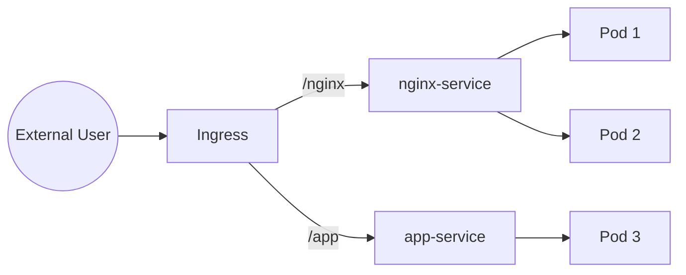

### Service Types
| Type | Behavior |
|---|---|
| `ClusterIP` (default) | Internal-only virtual IP, reachable inside the cluster. |
| `NodePort` | Exposes the Service on a static port (30000-32000) on every node's IP. |
| `LoadBalancer` | Provisions a cloud load balancer (AWS/GCP/Azure). |
| `ExternalName` | Maps a Service to an external DNS name. |
| Headless (`clusterIP: None`) | Used with StatefulSets — gives direct per-Pod DNS. |

```yaml
apiVersion: v1
kind: Service
metadata:
  name: nginx-service
  namespace: nginx
spec:
  selector:
    app: nginx
  type: ClusterIP
  ports:
    - protocol: TCP
      port: 80          # port exposed by the Service
      targetPort: 80    # port the container listens on
```
```bash
kubectl port-forward svc/nginx-service -n nginx 8080:80
```

### Ingress
Routes external HTTP(S) traffic to different Services based on **host/path**, avoiding the need for a separate LoadBalancer per Service. Requires an **Ingress Controller** (e.g., ingress-nginx) running in the cluster.

```yaml
apiVersion: networking.k8s.io/v1
kind: Ingress
metadata:
  name: app-ingress
  namespace: nginx
  annotations:
    nginx.ingress.kubernetes.io/rewrite-target: /
spec:
  rules:
    - host: myapp.local
      http:
        paths:
          - path: /nginx
            pathType: Prefix
            backend:
              service:
                name: nginx-service
                port:
                  number: 80
          - path: /app
            pathType: Prefix
            backend:
              service:
                name: app-service
                port:
                  number: 8000
```

**Internal Service DNS pattern** (very useful inside the cluster):
```
<service-name>.<namespace>.svc.cluster.local
```

---

## 11. Scaling: HPA & VPA

### Prerequisite: Metrics Server
`kubectl top nodes` / `kubectl top pods` only work once a **Metrics Server** is installed — it collects CPU/memory usage from nodes and pods.

### Horizontal Pod Autoscaler (HPA)
Increases/decreases the **number of Pod replicas** based on metrics like CPU utilization.

```yaml
apiVersion: autoscaling/v2
kind: HorizontalPodAutoscaler
metadata:
  name: apache-hpa
  namespace: apache
spec:
  scaleTargetRef:
    apiVersion: apps/v1
    kind: Deployment
    name: apache-deployment
  minReplicas: 1
  maxReplicas: 5
  metrics:
    - type: Resource
      resource:
        name: cpu
        target:
          type: Utilization
          averageUtilization: 5
```

### Vertical Pod Autoscaler (VPA)
Increases/decreases the **resource limits (CPU/memory) of a single Pod** instead of adding replicas — good for stateful apps that can't easily be scaled horizontally.

```yaml
apiVersion: autoscaling.k8s.io/v1
kind: VerticalPodAutoscaler
metadata:
  name: apache-vpa
  namespace: apache
spec:
  targetRef:
    apiVersion: apps/v1
    kind: Deployment
    name: apache-deployment
  updatePolicy:
    updateMode: "Auto"
```

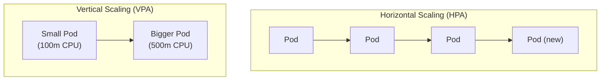

### Resource Requests & Limits (needed for autoscaling to work sensibly)
```yaml
          resources:
            requests:
              cpu: "100m"
              memory: "128Mi"
            limits:
              cpu: "200m"
              memory: "256Mi"
```

---

## 12. Taints & Tolerations / Node Affinity

- **Taint**: Applied to a *Node* — "don't schedule Pods here unless they tolerate me."
  ```bash
  kubectl taint node <node-name> prod=true:NoSchedule
  kubectl taint node <node-name> prod=true:NoSchedule-   # remove
  ```
- **Toleration**: Applied to a *Pod* — allows it to be scheduled onto a tainted node.
  ```yaml
      tolerations:
        - key: "prod"
          operator: "Equal"
          value: "true"
          effect: "NoSchedule"
  ```
- **Node Affinity**: The opposite direction — tells a Pod which nodes it *prefers/requires* based on node labels (like a `nodeSelector` with more expressive rules).

---

## 13. RBAC (Role-Based Access Control)

Controls **who can do what** inside the cluster.

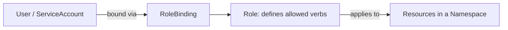

- **ServiceAccount**: an identity a Pod/process uses (like a "user" for automation).
- **Role**: defines *what actions* (`get`, `list`, `create`, `delete`, `watch`…) are allowed on which resources — scoped to a **namespace**.
- **RoleBinding**: connects a ServiceAccount/User to a Role.
- **ClusterRole / ClusterRoleBinding**: same idea, but scoped to the **entire cluster** (used for cluster-wide tools like a Dashboard).

```yaml
apiVersion: v1
kind: ServiceAccount
metadata:
  name: apache-user
  namespace: apache
---
apiVersion: rbac.authorization.k8s.io/v1
kind: Role
metadata:
  name: apache-manager
  namespace: apache
rules:
  - apiGroups: [""]
    resources: ["pods", "services"]
    verbs: ["get", "list", "watch", "create", "apply", "delete"]
  - apiGroups: ["apps"]
    resources: ["deployments"]
    verbs: ["get", "list", "watch", "create", "apply", "delete"]
---
apiVersion: rbac.authorization.k8s.io/v1
kind: RoleBinding
metadata:
  name: apache-manager-binding
  namespace: apache
subjects:
  - kind: ServiceAccount
    name: apache-user
    namespace: apache
roleRef:
  kind: Role
  name: apache-manager
  apiGroup: rbac.authorization.k8s.io
```

Check permissions:
```bash
kubectl auth can-i get pods --as=system:serviceaccount:apache:apache-user -n apache
```

---

## 14. Monitoring: Metrics Server & Kubernetes Dashboard

1. Install metrics-server so `kubectl top` works.
2. Deploy the official **Kubernetes Dashboard** manifests.
3. Create a `ServiceAccount` + `ClusterRoleBinding` (to `cluster-admin`) for dashboard access.
4. Generate a login token:
   ```bash
   kubectl -n kubernetes-dashboard create token admin-user
   ```
5. `kubectl proxy` and open the dashboard URL, paste the token.

This gives a web UI to browse every namespace's Pods, Deployments, Services, logs, and events.

---

## 15. Helm — The Package Manager

Helm is to Kubernetes what `apt`/`brew` is to your OS — a **package manager** that bundles all the YAML (Deployment, Service, HPA, etc.) for an app into a reusable, configurable **Chart**.

```bash
helm create apache-helm      # scaffolds Chart.yaml, values.yaml, templates/
```

Chart structure:
```
apache-helm/
├── Chart.yaml          # chart metadata (name, version)
├── values.yaml         # your configurable inputs (image, replicas, port…)
└── templates/
    ├── deployment.yaml # uses {{ .Values.xxx }} placeholders
    ├── service.yaml
    ├── hpa.yaml
    └── serviceaccount.yaml
```

Install a chart from a public repo:
```bash
helm repo add prometheus-community https://prometheus-community.github.io/helm-charts
helm repo update
helm install kube-prom-stack prometheus-community/kube-prometheus-stack \
  --namespace monitoring --create-namespace \
  --set grafana.service.type=NodePort \
  --set prometheus.service.type=NodePort
```

Lifecycle commands:
```bash
helm install dev-apache ./apache-helm --namespace dev-apache --create-namespace
helm upgrade prod-apache ./apache-helm --namespace prod-apache
helm rollback prod-apache 1
helm uninstall dev-apache -n dev-apache
helm list -A
```

> One `helm install` command can spin up an entire Deployment + Service + HPA + ConfigMap set — this is how you install things like Prometheus, Grafana, ArgoCD, and Ingress-Nginx in one shot.

---

## 16. Init Containers vs Sidecar Containers

Both run *inside the same Pod spec* alongside your "main" container.

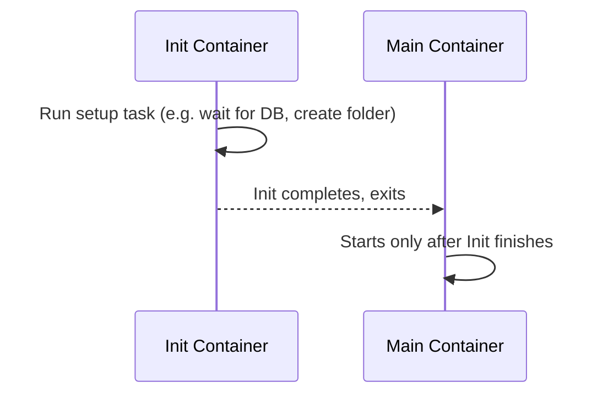

### Init Container
Runs **before** the main container starts, and must **complete** first. Used for setup/prerequisite tasks (e.g., "wait until MySQL is reachable before starting the backend").

```yaml
spec:
  initContainers:
    - name: init-container
      image: busybox
      command: ["sh", "-c", "echo Init started...; sleep 10; echo Init done"]
  containers:
    - name: main-container
      image: busybox
      command: ["sh", "-c", "echo Main container started"]
```

### Sidecar Container
Runs **alongside** the main container for the Pod's entire lifetime, helping it (e.g., shipping logs, a proxy). Both containers run in parallel, sharing a Volume.

```yaml
spec:
  containers:
    - name: main-container       # produces logs
      image: busybox
      command: ["sh","-c","while true; do echo hello >> /var/log/app.log; sleep 5; done"]
      volumeMounts:
        - name: shared-logs
          mountPath: /var/log
    - name: sidecar-container     # ships/displays logs
      image: busybox
      command: ["sh","-c","tail -f /var/log/app.log"]
      volumeMounts:
        - name: shared-logs
          mountPath: /var/log
  volumes:
    - name: shared-logs
      emptyDir: {}
```

| | Init Container | Sidecar Container |
|---|---|---|
| Timing | Runs & finishes **before** main container | Runs **alongside** main container |
| Use case | Setup/prerequisite checks | Ongoing helper (logging, proxy, metrics) |

---

## 17. Service Mesh (Istio)

As microservices multiply, tracking "which service calls which" becomes chaotic. A **Service Mesh** (Istio being the most popular) sits between services and:
- Injects a **sidecar proxy (Envoy)** into every Pod to intercept traffic.
- Provides traffic routing, mTLS encryption between services, retries, load balancing.
- Gives visibility (via **Kiali** dashboard) into the actual traffic graph between microservices.

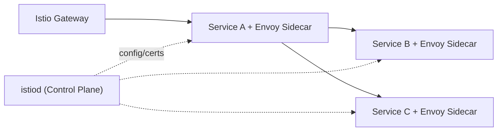

Basic setup flow:
```bash
istioctl install
kubectl label namespace default istio-injection=enabled
kubectl apply -f samples/bookinfo/platform/kube/bookinfo.yaml
kubectl apply -f samples/bookinfo/gateway-api/bookinfo-gateway.yaml
kubectl apply -f samples/addons     # installs Kiali, Grafana, etc.
istioctl dashboard kiali
```

---

## 18. Custom Resource Definitions (CRDs)

Kubernetes only understands built-in resources (Pod, Deployment, Service…) out of the box. A **CustomResourceDefinition** lets you teach Kubernetes about *your own* resource type.

```yaml
apiVersion: apiextensions.k8s.io/v1
kind: CustomResourceDefinition
metadata:
  name: devbatches.example.com
spec:
  group: example.com
  scope: Namespaced
  names:
    plural: devbatches
    singular: devbatch
    kind: DevBatch
    shortNames: ["db"]
  versions:
    - name: v1
      served: true
      storage: true
      schema:
        openAPIV3Schema:
          type: object
          properties:
            spec:
              type: object
              properties:
                name: { type: string }
                duration: { type: string }
                mode: { type: string }
                platform: { type: string }
```

Now you can create instances of your custom kind:
```yaml
apiVersion: example.com/v1
kind: DevBatch
metadata:
  name: batch-9
spec:
  name: "DevOps Batch 9"
  duration: "3 months"
  mode: "Live"
  platform: "TrainWithShubham"
```
```bash
kubectl apply -f crd.yaml
kubectl apply -f devbatch.yaml
kubectl get devbatches
```

> **Operators** (built with frameworks like Kopf for Python) take this further — they watch your Custom Resources and run automation logic in response (e.g., the Prometheus Operator, ArgoCD).

---

## 19. Prometheus + Grafana Monitoring Stack

The three pillars of Observability:

| Pillar | Answers | Tools |
|---|---|---|
| **Metrics** | *What* is happening? (CPU, memory, network) | Prometheus, Grafana |
| **Logs** | *Why* did it happen? | Loki, Promtail |
| **Traces** | *How* did the request flow? | Jaeger, OpenTelemetry |

### Full monitoring data flow
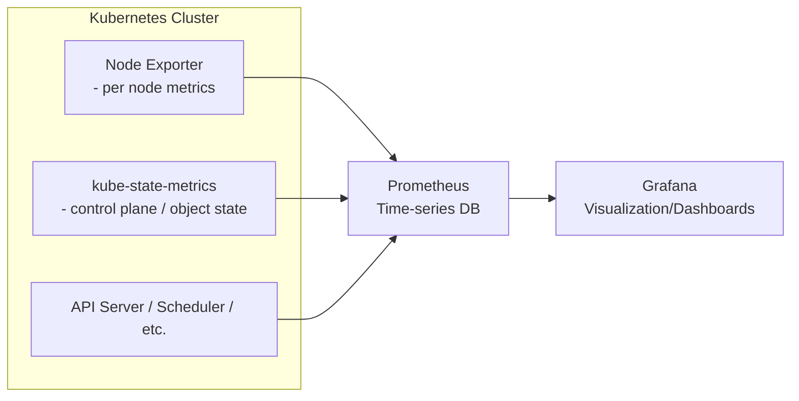

Install everything with one Helm command (via the `kube-prometheus-stack` chart):
```bash
kubectl create namespace monitoring
helm repo add prometheus-community https://prometheus-community.github.io/helm-charts
helm repo update
helm install kube-prom-stack prometheus-community/kube-prometheus-stack \
  --namespace monitoring \
  --set prometheus.service.type=NodePort \
  --set prometheus.service.nodePort=30000 \
  --set grafana.service.type=NodePort \
  --set grafana.service.nodePort=31000
```

Get Grafana's auto-generated admin password:
```bash
kubectl get secret kube-prom-stack-grafana -n monitoring \
  -o jsonpath="{.data.admin-password}" | base64 --decode
```

Then in Grafana: **Dashboards → Import**, and paste a dashboard ID from [grafana.com/grafana/dashboards](https://grafana.com/grafana/dashboards) (e.g., a "Kubernetes Cluster Monitoring" dashboard) — Prometheus is already wired up as the data source by the Helm chart.

---

## 20. Project Walkthroughs

### Project A — 3-Tier Chat App (React + Node.js + MongoDB) on Minikube
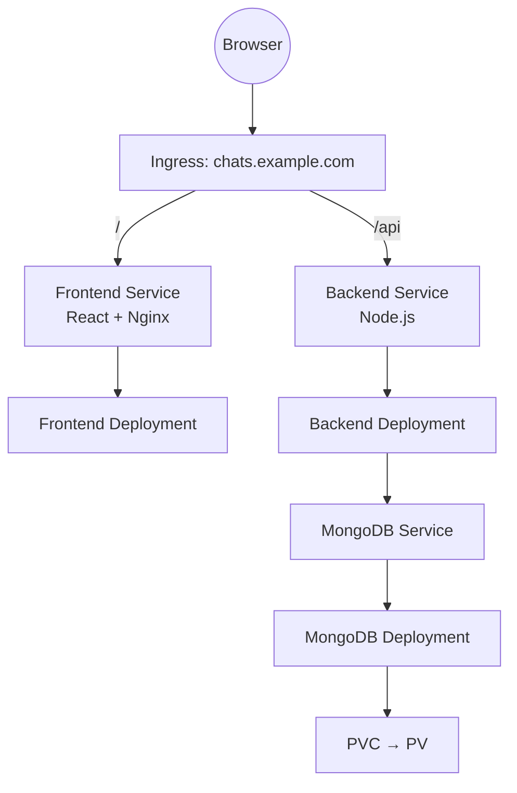
Build order:
1. Build & push `backend` and `frontend` Docker images to a registry.
2. Create `Namespace`.
3. Create MongoDB: `PersistentVolume` → `PersistentVolumeClaim` → `Deployment` (mounting the PVC) → `Service`.
4. Create Backend `Deployment` (env vars: `MONGODB_URI`, `JWT_SECRET` from a `Secret`) → `Service`.
5. Create Frontend `Deployment` (depends on backend Service being reachable via internal DNS) → `Service`.
6. Create `Ingress` routing `/` → frontend, `/api` → backend.

### Project B — .NET/Python/Node Voting App on Kind (with Prometheus/Grafana)
A multi-language voting app (`vote` → `redis` → `worker` → `db` (Postgres) → `result`), deployed with plain manifests, then monitored with the `kube-prometheus-stack` Helm chart — demonstrating how to correlate load (e.g., a spike in votes) with per-node/per-Pod resource usage in Grafana.

### Project C — Mega Project on EKS (CI/CD + GitOps)
The most advanced setup, tying everything together:
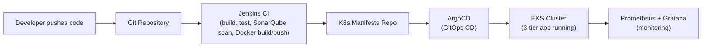

Creating the EKS cluster with `eksctl`:
```bash
eksctl create cluster \
  --name tws-cluster \
  --region ap-south-1 \
  --version 1.31 \
  --without-nodegroup

eksctl utils associate-iam-oidc-provider \
  --region ap-south-1 --cluster tws-cluster --approve

eksctl create nodegroup \
  --cluster tws-cluster \
  --region ap-south-1 \
  --name tws-cluster-ng \
  --node-type t2.medium \
  --nodes 2 --nodes-min 2 --nodes-max 2 \
  --node-volume-size 20 \
  --ssh-access --ssh-public-key k8s-in-one-shot

aws eks update-kubeconfig --region ap-south-1 --name tws-cluster
kubectl get nodes
```
Pipeline stages typically covered: **Jenkins** (build/test/scan with SonarQube, build & push Docker image), **ArgoCD** (watches the manifests repo and auto-syncs changes to the EKS cluster — GitOps), and **Prometheus/Grafana** for observability, all layered on top of everything covered in Sections 1–19.

---

## 21. Quick Command Cheatsheet

```bash
# Cluster / context
kubectl get nodes
kubectl config get-contexts
kubectl config use-context <name>
kubectl cluster-info

# Namespaces
kubectl get ns
kubectl create ns <name>

# Generic resource ops
kubectl apply -f <file>.yaml
kubectl get <resource> -n <namespace>
kubectl describe <resource> <name> -n <namespace>
kubectl delete -f <file>.yaml
kubectl logs <pod> -n <namespace> [-c <container>]
kubectl exec -it <pod> -n <namespace> -- bash

# Deployments
kubectl scale deployment <name> --replicas=N -n <ns>
kubectl rollout status deployment/<name> -n <ns>
kubectl rollout undo deployment/<name> -n <ns>

# Debugging
kubectl get events -n <ns> --sort-by='.lastTimestamp'
kubectl top nodes
kubectl top pods -n <ns>

# Port forwarding
kubectl port-forward svc/<service> <local-port>:<service-port> -n <ns>

# RBAC check
kubectl auth can-i <verb> <resource> --as=system:serviceaccount:<ns>:<sa> -n <ns>

# Helm
helm repo add <name> <url>
helm repo update
helm install <release> <chart> -n <ns> --create-namespace
helm upgrade <release> <chart> -n <ns>
helm rollback <release> <revision>
helm uninstall <release> -n <ns>
```