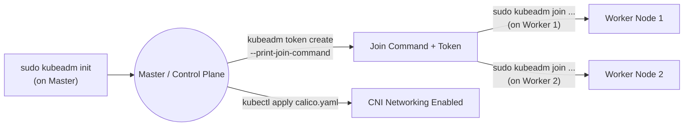

# Kubernetes Setup & Installation Guide (Linux)

> Covers every common way to get Kubernetes running on a Linux machine:
> **Kind** (fastest, local, multi-node in Docker), **Minikube** (local, single-node with add-ons),
> and **kubeadm** (real multi-server cluster — what managed services like EKS do under the hood).
> Pick the one matching your goal in the [Which one should I use?](#0-which-one-should-i-use) section.


## 0. Which one should I use?

| Method | Best for | Nodes | Effort |
|---|---|---|---|
| **Kind** | Local dev/testing, CI pipelines, simulating multi-node behavior | Multiple (as Docker containers) | Low |
| **Minikube** | Local dev, quick add-ons (dashboard, ingress, metrics-server) | Usually single-node | Low |
| **kubeadm** | Learning real cluster internals, on-prem/bare-metal/VMs (e.g., EC2 instances) | Real multiple physical/virtual machines | High |
| **EKS/AKS/GKE** | Production, managed control plane | Managed by cloud provider | Medium (out of scope here — covered separately) |

If you just want to **learn and practice** → use **Kind**.
If you want a **quick GUI dashboard / ingress out of the box** → use **Minikube**.
If you want to understand **exactly how a cluster is bootstrapped** (great for interviews) → use **kubeadm**.


## 1. Common Prerequisites (all methods)

### 1.1 System requirements
- Linux (Ubuntu 20.04/22.04/24.04 used in examples — Debian/CentOS work similarly with `yum`/`dnf` instead of `apt`).
- Minimum 2 CPUs, 2GB RAM (4GB+ recommended) per node.
- `sudo`/root access.

### 1.2 Update the system
```bash
sudo apt update && sudo apt upgrade -y
```

### 1.3 Install Docker (needed for Kind; also commonly used to build images for Minikube/kubeadm workloads)
```bash
sudo apt-get update
sudo apt-get install -y docker.io
sudo systemctl enable docker
sudo systemctl start docker

# allow running docker without sudo (log out/in or run `newgrp docker` after this)
sudo usermod -aG docker $USER
newgrp docker

docker --version
docker ps
```

### 1.4 Install `curl`, `wget`, `unzip` (usually needed by install scripts)
```bash
sudo apt-get install -y curl wget unzip
```

## 2. Install kubectl

`kubectl` is the CLI you use to talk to *any* Kubernetes cluster (Kind, Minikube, kubeadm, or a cloud-managed one) — install this regardless of which method you choose below.

```bash
curl -LO "https://dl.k8s.io/release/$(curl -L -s https://dl.k8s.io/release/stable.txt)/bin/linux/amd64/kubectl"

# make it executable and move it into your PATH
chmod +x kubectl
sudo mv kubectl /usr/local/bin/

kubectl version --client
```

> For ARM64 machines, replace `amd64` with `arm64` in the URL above.

## 3. Method A: Kind (Kubernetes IN Docker)

Kind runs each "node" of your cluster as a Docker container — great for spinning up realistic multi-node clusters locally in seconds.

### 3.1 Install Kind
```bash
curl -Lo ./kind https://kind.sigs.k8s.io/dl/v0.24.0/kind-linux-amd64
chmod +x ./kind
sudo mv ./kind /usr/local/bin/kind

kind version
```

### 3.2 Create a simple single-node cluster
```bash
kind create cluster --name my-cluster
kubectl get nodes
```

### 3.3 Create a multi-node cluster (1 control-plane + 3 workers) via config file
Create `kind-config.yaml`:
```yaml
kind: Cluster
apiVersion: kind.x-k8s.io/v1alpha4
nodes:
  - role: control-plane
    image: kindest/node:v1.31.0
    extraPortMappings:
      - containerPort: 80
        hostPort: 80
        protocol: TCP
      - containerPort: 443
        hostPort: 443
        protocol: TCP
  - role: worker
    image: kindest/node:v1.31.0
  - role: worker
    image: kindest/node:v1.31.0
  - role: worker
    image: kindest/node:v1.31.0

```
Then:
```bash
kind create cluster --name tws-cluster --config kind-config.yaml
kubectl get nodes
```

### 3.4 Working with multiple Kind clusters
```bash
kind get clusters
kubectl config get-contexts
kubectl config use-context kind-<cluster-name>
```

### 3.5 Delete the cluster
```bash
kind delete cluster --name tws-cluster
```

## 4. Method B: Minikube

### 4.1 Install Minikube
```bash
curl -Lo minikube https://storage.googleapis.com/minikube/releases/latest/minikube-linux-amd64
chmod +x minikube
sudo mv minikube /usr/local/bin/

minikube version
```

### 4.2 Start the cluster
```bash
minikube start --driver=docker
kubectl get nodes
```
> `--driver=docker` runs Minikube's node as a Docker container — good when you're already on a headless server (e.g., an EC2 instance) without a hypervisor.

### 4.3 Useful add-ons
```bash
minikube addons list
minikube addons enable metrics-server
minikube addons enable ingress
minikube addons enable dashboard
```

### 4.4 Open the dashboard
```bash
minikube dashboard
```

### 4.5 Access a Service running inside Minikube
```bash
minikube service <service-name> -n <namespace>
# or, if using Ingress:
minikube tunnel
```

### 4.6 Stop / Delete
```bash
minikube stop
minikube delete
```

## 5. Method C: kubeadm (Real Multi-Node Cluster)

This is how you'd build a cluster across **real/separate machines** (e.g., 3 EC2 instances, or 3 VMs) — one becomes the control-plane, others join as workers. Run the steps in **Section 5.1** on *every* machine (master + workers), and the master-only/worker-only steps where indicated.

### 5.1 On ALL nodes (master + every worker)

**Disable swap** (Kubernetes requires this):
```bash
sudo swapoff -a
sudo sed -i '/ swap / s/^\(.*\)$/#\1/g' /etc/fstab   # persist across reboot
```

**Load required kernel modules:**
```bash
cat <<EOF | sudo tee /etc/modules-load.d/k8s.conf
overlay
br_netfilter
EOF

sudo modprobe overlay
sudo modprobe br_netfilter
```

**Set required sysctl params (networking):**
```bash
cat <<EOF | sudo tee /etc/sysctl.d/k8s.conf
net.bridge.bridge-nf-call-iptables  = 1
net.bridge.bridge-nf-call-ip6tables = 1
net.ipv4.ip_forward                 = 1
EOF

sudo sysctl --system
```

**Install containerd (container runtime):**
```bash
sudo apt-get update
sudo apt-get install -y containerd

sudo mkdir -p /etc/containerd
containerd config default | sudo tee /etc/containerd/config.toml

# enable SystemdCgroup (required for kubelet compatibility)
sudo sed -i 's/SystemdCgroup = false/SystemdCgroup = true/' /etc/containerd/config.toml

sudo systemctl restart containerd
sudo systemctl enable containerd
```

**Install kubeadm, kubelet, kubectl (pinned versions, current apt repo method):**
```bash
sudo apt-get update
sudo apt-get install -y apt-transport-https ca-certificates curl gpg

sudo mkdir -p /etc/apt/keyrings
curl -fsSL https://pkgs.k8s.io/core:/stable:/v1.31/deb/Release.key | \
  sudo gpg --dearmor -o /etc/apt/keyrings/kubernetes-apt-keyring.gpg

echo "deb [signed-by=/etc/apt/keyrings/kubernetes-apt-keyring.gpg] https://pkgs.k8s.io/core:/stable:/v1.31/deb/ /" | \
  sudo tee /etc/apt/sources.list.d/kubernetes.list

sudo apt-get update
sudo apt-get install -y kubelet kubeadm kubectl
sudo apt-mark hold kubelet kubeadm kubectl   # prevent auto-upgrade breaking the cluster

kubeadm version
kubelet --version
```

> Change `v1.31` in the URL above to whichever minor version you want to install.

### 5.2 On the MASTER node ONLY

**Initialize the control plane:**
```bash
sudo kubeadm init --pod-network-cidr=192.168.0.0/16
```
> `--pod-network-cidr` must match whatever CNI plugin you install next (Calico's default is `192.168.0.0/16`).

**Configure kubectl for your normal (non-root) user:**
```bash
mkdir -p $HOME/.kube
sudo cp -i /etc/kubernetes/admin.conf $HOME/.kube/config
sudo chown $(id -u):$(id -g) $HOME/.kube/config
```

**Install a CNI plugin (Calico) so nodes/Pods can network with each other:**
```bash
kubectl apply -f https://raw.githubusercontent.com/projectcalico/calico/v3.28.0/manifests/calico.yaml
```

**Generate the join command for workers** (save this output — you'll need it in 5.3):
```bash
kubeadm token create --print-join-command
```

### 5.3 On EACH WORKER node ONLY

Run the join command printed above (with `sudo`):
```bash
sudo kubeadm join <master-ip>:6443 --token <token> \
  --discovery-token-ca-cert-hash sha256:<hash>
```

> If you accidentally ran `kubeadm init` on a machine meant to be a worker, undo it first:
> ```bash
> sudo kubeadm reset
> ```

### 5.4 Back on the MASTER — verify workers joined
```bash
kubectl get nodes
# nodes show NotReady briefly, then Ready once the CNI finishes setting up networking
kubectl get nodes -w   # watch live until all nodes show Ready
```




## 6. Verifying Your Cluster

Regardless of which method you used:
```bash
kubectl get nodes                  # all nodes should show "Ready"
kubectl get pods -A                # check control plane / system pods are Running
kubectl cluster-info
kubectl config current-context     # confirm you're pointed at the right cluster
```

Run a quick smoke test:
```bash
kubectl create deployment nginx-test --image=nginx
kubectl expose deployment nginx-test --port=80 --type=NodePort
kubectl get pods
kubectl get svc nginx-test
kubectl delete deployment nginx-test
kubectl delete svc nginx-test
```

## 7. Common Setup Errors & Fixes

| Error | Likely Cause | Fix |
|---|---|---|
| `swap is enabled; production deployments recommend disabling swap` | Swap not disabled | `sudo swapoff -a` and comment out swap in `/etc/fstab` |
| Nodes stuck `NotReady` after joining | CNI plugin not installed / not matching `--pod-network-cidr` | Apply Calico (or another CNI) and ensure CIDR matches |
| `permission denied` running docker commands | User not in the `docker` group | `sudo usermod -aG docker $USER && newgrp docker` |
| `dial tcp ... connect: connection refused` from kubectl | `~/.kube/config` missing/misconfigured | Re-copy `/etc/kubernetes/admin.conf` (see Section 5.2) |
| `kind create cluster` fails on WSL/some systems | Docker daemon not running, or nested virtualization issue | `sudo systemctl start docker`, verify `docker ps` works first |
| `kubeadm join` token expired | Tokens expire after 24h by default | Re-run `kubeadm token create --print-join-command` on master |
| Pods stuck `Pending` | Insufficient node resources, or no CNI, or unbound PVC | `kubectl describe pod <pod>` → check Events section |
| Multiple kubeconfigs conflicting | Kind/Minikube/kubeadm all merged into `~/.kube/config` | `kubectl config get-contexts` then `kubectl config use-context <name>` |

## 8. Uninstalling / Cleaning Up

**Kind:**
```bash
kind delete cluster --name <name>
```

**Minikube:**
```bash
minikube delete --all --purge
```

**kubeadm (on every node):**
```bash
sudo kubeadm reset -f
sudo rm -rf /etc/cni/net.d
sudo rm -rf $HOME/.kube
sudo apt-get purge -y kubeadm kubectl kubelet kubernetes-cni
sudo apt-get autoremove -y
```

## 9. Quick Reference Table

```bash
# ----- Prereqs -----
sudo apt update && sudo apt upgrade -y
sudo apt-get install -y docker.io curl wget unzip
sudo usermod -aG docker $USER && newgrp docker

# ----- kubectl (all methods) -----
curl -LO "https://dl.k8s.io/release/$(curl -L -s https://dl.k8s.io/release/stable.txt)/bin/linux/amd64/kubectl"
chmod +x kubectl && sudo mv kubectl /usr/local/bin/

# ----- Kind -----
curl -Lo ./kind https://kind.sigs.k8s.io/dl/v0.24.0/kind-linux-amd64
chmod +x ./kind && sudo mv ./kind /usr/local/bin/kind
kind create cluster --name my-cluster

# ----- Minikube -----
curl -Lo minikube https://storage.googleapis.com/minikube/releases/latest/minikube-linux-amd64
chmod +x minikube && sudo mv minikube /usr/local/bin/
minikube start --driver=docker

# ----- kubeadm (master) -----
sudo kubeadm init --pod-network-cidr=192.168.0.0/16
mkdir -p $HOME/.kube && sudo cp -i /etc/kubernetes/admin.conf $HOME/.kube/config && sudo chown $(id -u):$(id -g) $HOME/.kube/config
kubectl apply -f https://raw.githubusercontent.com/projectcalico/calico/v3.28.0/manifests/calico.yaml
kubeadm token create --print-join-command

# ----- kubeadm (worker) -----
sudo kubeadm join <master-ip>:6443 --token <token> --discovery-token-ca-cert-hash sha256:<hash>

# ----- Verify -----
kubectl get nodes
kubectl get pods -A
```