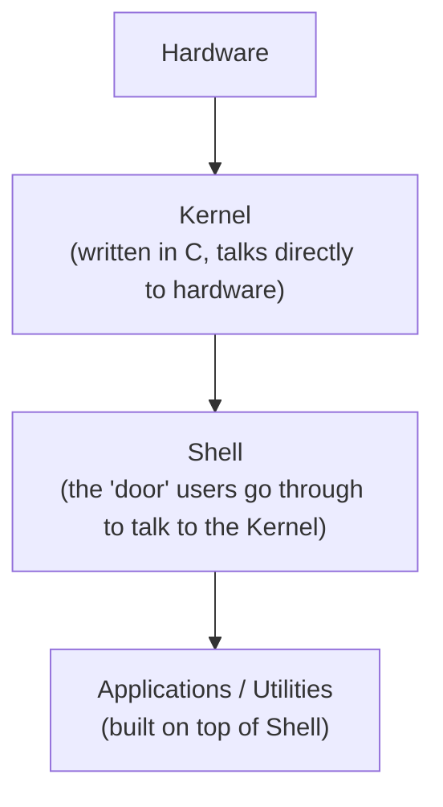
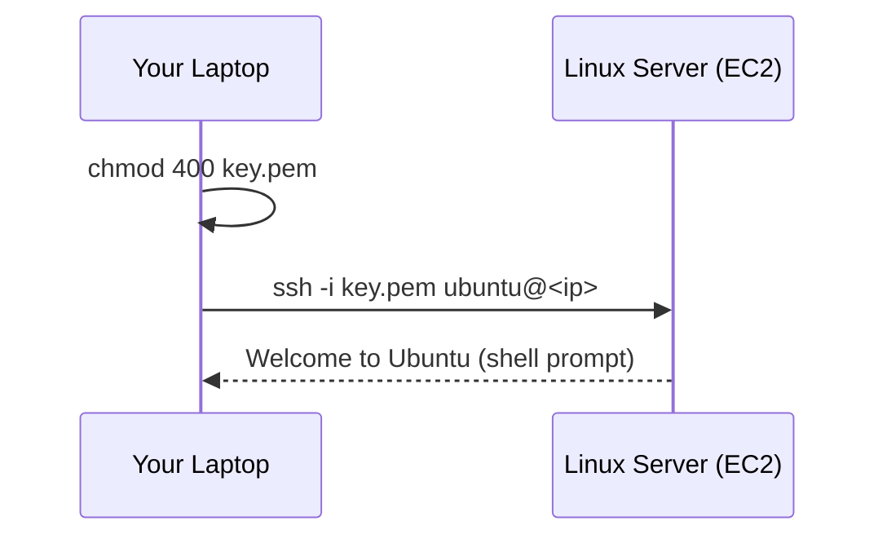
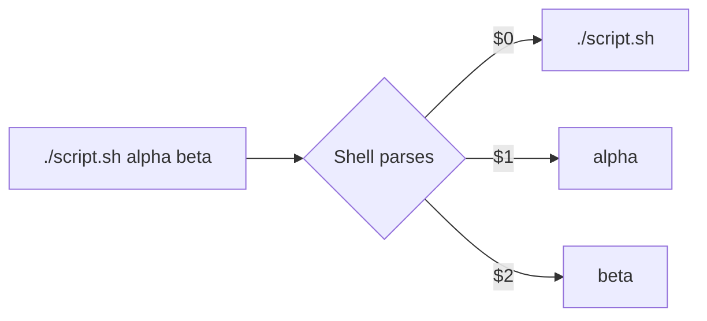
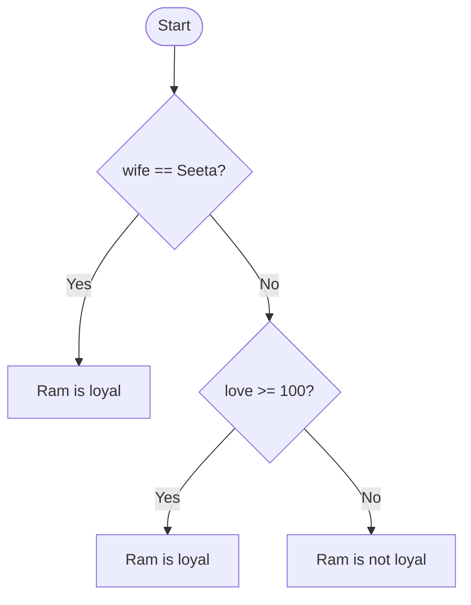
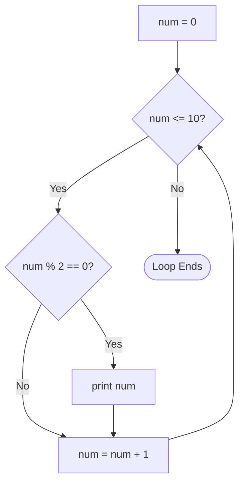
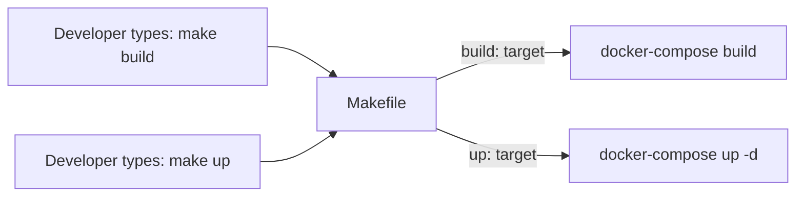
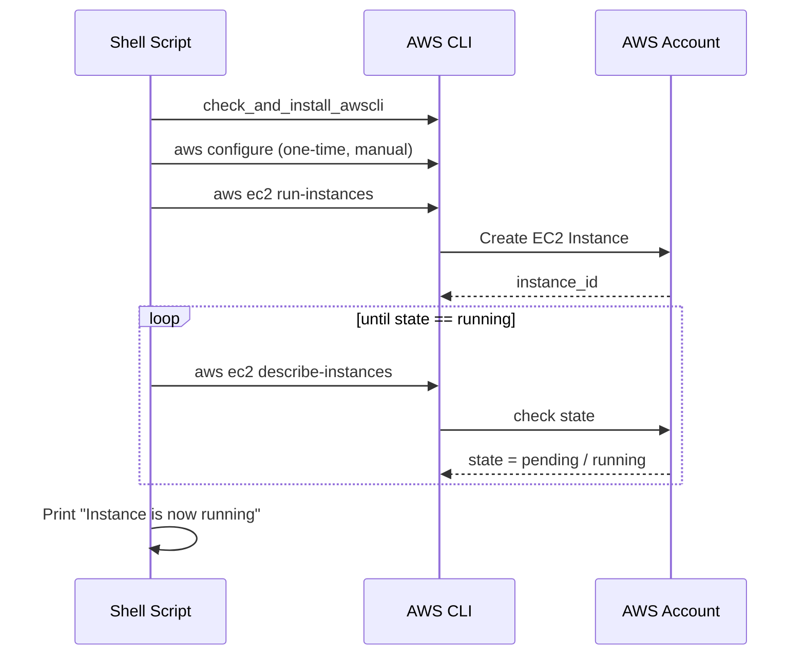
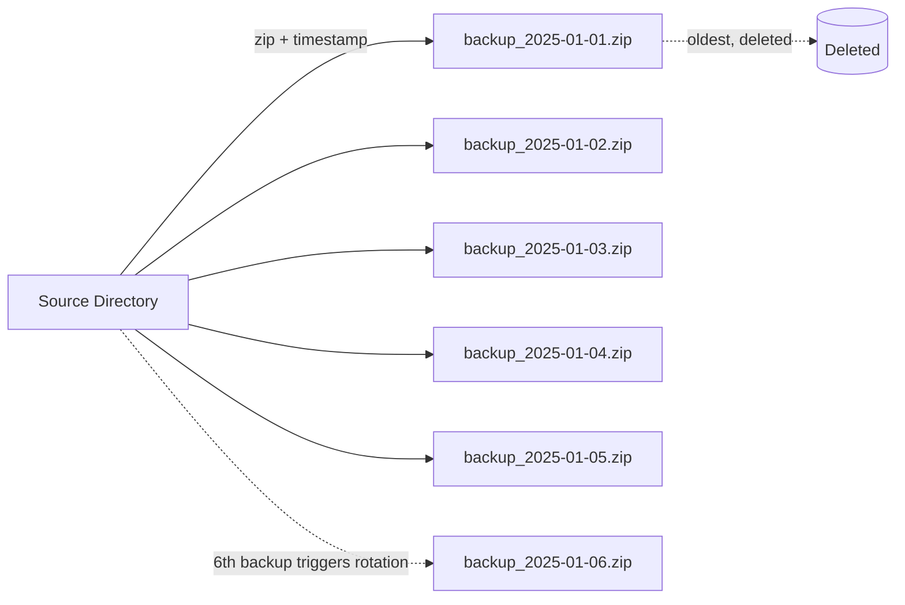
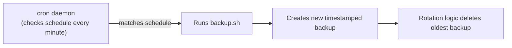

# Shell Scripting for DevOps

> Covers: Linux/Shell fundamentals → Environment Setup → Variables & Arguments → Conditionals →
> Loops → Functions → Error Handling → Makefiles → AWS CLI Automation → Backup & Rotation Projects.


## 1. What is Shell? Linux Architecture

Think of Linux as three layers, from the hardware outward:



- **Kernel**: The heart of Linux - a program (written in C by Linus Torvalds) that directly manages hardware, memory, processes, networking, etc.
- You (a human) don't speak C to the kernel directly. You need a **door/interface** - that's the **Shell**.
- **Shell**: A command-line interpreter that takes your commands (`mkdir`, `ls`, `echo`, etc.), and translates them into actions the kernel performs.
- **Applications**: Sit on top of the Shell and use it to do their work.

**Why learn Shell?** Once you understand Shell, you can automate/control the kernel - i.e., automate tasks. That automation, written as a sequence of Shell commands in a file, is a **Shell Script**.

## 2. History: sh vs bash

| Shell | Created by | Location | Notes |
|
| **sh** (Bourne Shell) | Steve Bourne (helped Linus Torvalds) | `/bin/sh` | The original shell |
| **bash** (Bourne Again SHell) | Community improvements on `sh` | `/bin/bash` | The most widely used shell today - **this is what we learn** |

Check which shell you're using:
```bash
which bash
# /usr/bin/bash
```

## 3. Environment Setup

You need three things to write and run shell scripts:
1. **A shell** (bash - already covered above).
2. **A Linux machine** - a cloud EC2 instance (Ubuntu, t2.micro/free tier) or a local VM/WSL.
3. **The ability to connect to that machine** - via SSH.

### Connecting via SSH (AWS EC2 example)
```bash
# secure the private key file so SSH will accept it
chmod 400 my-key.pem

# connect
ssh -i "my-key.pem" ubuntu@<public-ip-or-dns>
```



### A Text Editor
You need something to write scripts in - `vim`, `nano`, or `gedit`. This tutorial uses **vim**.

**Basic vim workflow:**
```bash
vim hello.txt      # opens/creates the file
```
| Mode | How to enter | Purpose |
|
| Command mode | Default / press `Esc` | Navigate, run commands |
| Insert mode | Press `i` | Actually type/edit text |
| Save & quit | `Esc` then `:wq` | Write and quit |
| Quit without saving | `Esc` then `:q!` | Discard changes |

## 4. Your First Shell Script

A shell script is just a text file where shell commands are written **in sequence** (like a movie script - one line/actor "speaks" after another), saved with a `.sh` extension.

### The Shebang (`#!`)
The **first line** of every shell script must declare which shell should interpret it:
```bash
#!/bin/bash
```
- `#` alone = a **comment** (ignored by the interpreter, used for documentation).
- `#!/bin/bash` = the **shebang** - tells the interpreter "this movie is brought to you by bash." Without it, the OS doesn't reliably know which shell to run the script with.

### Example: `hello.sh`
```bash
#!/bin/bash
# This is a script for TrainWithShubham

echo "Hello learners"
echo "DevOps folks say we'll comment for sure!"
```

That's it - a list of shell commands (`echo`, etc.) written top-to-bottom **is** a shell script.

## 5. File Permissions & Making Scripts Executable

Writing the script isn't enough - you must give it **execute permission** before you can run it.

```bash
ls -l hello.sh
# -rw-r--r--  1 ubuntu ubuntu ...   hello.sh
```

The permission string `-rw-r--r--` breaks down as:
```
-   rw-      r--      r--
type owner   group    others
```
Each permission group can have `r` (read), `w` (write), `x` (execute) - represented numerically:

| Value | Meaning |
|
| 4 | Read |
| 2 | Write |
| 1 | Execute |
| 7 | rwx (4+2+1) |
| 5 | r-x (4+1) |
| 4 | r-- |

```bash
chmod 755 hello.sh   # owner: rwx, group: r-x, others: r-x
chmod 700 hello.sh   # owner: rwx, group/others: no access
```

Once executable, the filename turns **green** in `ls` (color code: green = executable, white = normal file, blue = directory).

### Running a script
```bash
./hello.sh
```
`.` means "current directory," `/` is the path separator, so `./hello.sh` = "run the `hello.sh` file located right here."

You can also run it without making it executable, by explicitly invoking the interpreter:
```bash
bash hello.sh
```

## 6. Variables

A **variable** is a named container whose value can change ("vary-able").

```bash
#!/bin/bash
name="Ram"
echo "Name is $name"
```

Key rules:
- **Assignment**: `variable=value` - **no spaces** around `=`.
- **Reading/using**: prefix with `$` (e.g., `$name`) - this tells the shell "treat this as a variable, not literal text."
- Command substitution - run a command and store its output in a variable:
```bash
today=$(date)
echo "Today is $today"
```

### Real example: creating a Linux user via variables
```bash
#!/bin/bash
read -p "Enter the user name: " user_name
sudo useradd -m "$user_name"
echo "New user added: $user_name"
```

## 7. User Input (`read`)

Instead of hardcoding values, prompt the user and capture their input into a variable:

```bash
#!/bin/bash
echo "Enter the name:"
read user_name
echo "You entered $user_name"

# or combine prompt + read in one line:
read -p "Enter the user name: " user_name
echo "You entered $user_name"
```

**Practical use case - creating a Linux user from input:**
```bash
#!/bin/bash
read -p "Enter the user name: " user_name
sudo useradd -m "$user_name"
echo "New user added: $user_name"
```
Verify:
```bash
cat /etc/passwd | grep <user_name>
```

## 8. Arguments (`$0`, `$1`, `$2`...)

When you run a script with extra words after it, those words are **arguments**, accessible inside the script:

```bash
./myscript.sh alpha beta
```
| Token | Meaning |
|
| `$0` | The script's own name/path (`./myscript.sh`) |
| `$1` | First argument (`alpha`) |
| `$2` | Second argument (`beta`) |
| `$#` | Total number of arguments passed |
| `$@` | All arguments as a list |

```bash
#!/bin/bash
echo "Script name: $0"
echo "First argument: $1"
echo "Second argument: $2"
```

```bash
./create_user.sh shubham
./create_user.sh alice
```



## 9. Conditionals (if / elif / else)

Real-world logic always has "conditions" - `if this then that, else something else`.

### Basic syntax
```bash
#!/bin/bash
read -p "Enter the name: " wife

if [ "$wife" == "Seeta" ]; then
    echo "Ram is loyal"
else
    echo "Ram is not loyal"
fi
```
- `if [ condition ]; then ... fi` - note the **spaces** inside `[ ]` are mandatory, and the block is closed with `fi` (`if` spelled backwards).
- Comparison operators: `==` (equal, strings), `!=` (not equal), `-gt` / `-lt` / `-ge` / `-le` (greater/less than, numbers).

### Multiple conditions (elif)
```bash
#!/bin/bash
read -p "Enter the name: " wife
read -p "Enter love percentage: " love

if [ "$wife" == "Seeta" ]; then
    echo "Ram is loyal"
elif [ "$love" -ge 100 ]; then
    echo "Ram is loyal"
else
    echo "Ram is not loyal"
fi
```



## 10. Loops (for & while)

A **loop** = something that repeats until you tell it to stop.

### `for` loop
```bash
#!/bin/bash
for num in 1 2 3 4 5
do
    mkdir "demo$num"
done
```
- `for <var> in <list>; do <commands>; done`
- Numeric range style (C-like):
```bash
#!/bin/bash
for (( num=1; num<=5; num++ ))
do
    mkdir "demo$num"
done
```
> Note the double parentheses `(( ))` for C-style `for` loops, and double square brackets are common for numeric comparisons in more advanced scripts.

**Parameterized version (folder name + range via arguments):**
```bash
#!/bin/bash
# $1 = folder name prefix, $2 = start range, $3 = end range
for (( num=$2; num<=$3; num++ ))
do
    mkdir "$1$num"
done
```
```bash
./forloop.sh day 0 90 
```
> ⚠️ In `for (( ... ))`, there is **no semicolon needed right after** the closing `))` before `do` on the same line if you use a newline - but if you're used to C, remember Bash's `for` loop doesn't need a trailing `;` the way some other constructs do. Test small changes with trial and error - syntax errors are completely normal.

### `while` loop
Runs **as long as a condition remains true**.
```bash
#!/bin/bash
num=0
while [ $num -le 5 ]
do
    echo "loop $num"
    num=$((num+1))
done
```
- Arithmetic operations go inside `$(( ))`.
- Classic interview-style example - print even numbers up to 10:
```bash
#!/bin/bash
num=0
while [ $num -le 10 ]
do
    if [ $((num % 2)) -eq 0 ]; then
        echo "$num"
    fi
    num=$((num+1))
done
```



## 11. Functions

A **function** groups reusable logic under a name, so you don't repeat code.

```bash
#!/bin/bash

function is_loyal() {
    if [ "$1" == "Seeta" ]; then
        echo "$1 is loyal"
    else
        echo "$1 is not loyal"
    fi
}

# Function call - nothing happens until you call it!
is_loyal "$1"
```
```bash
./check_loyal.sh Tom
```

**Key points:**
- **Function definition**: `function name() { ... }` (the `function` keyword is optional in bash, but improves readability).
- **Function call**: writing `function_name arg1 arg2` - defining a function does **nothing** on its own; it must be *called*.
- Arguments passed to a function call become `$1`, `$2`, etc. **inside** the function (separate from the script's own `$1`).
- Turning `$name` in the function body into `$1` makes the function reusable for **any** input, not hardcoded to one value - this is the core idea of "modular" code.

## 12. Error Handling

Bash doesn't have `try/catch` like other languages - you simulate it with `if`/`exit` checks.

### Basic pattern
```bash
#!/bin/bash

function create_directory() {
    mkdir demo
}

create_directory
echo "This should not run if the previous command failed"
```
Problem: even if `mkdir demo` fails (e.g., directory already exists), the script *keeps going* and prints the next line anyway - that's bad. Fix it:

```bash
#!/bin/bash

function create_directory() {
    if ! mkdir demo; then
        echo "The code is being exited as the directory already exists"
        exit 1
    fi
}

create_directory
echo "This will only print if create_directory succeeded"
```
- `exit 1` - exit the script immediately with a non-zero (failure) status code.
- `exit 0` - exit successfully.
- Check the **exit status of the previous command** with `$?` (0 = success, non-zero = failure):
```bash
mkdir demo 2>/dev/null   # suppress error output
if [ $? -eq 0 ]; then
    echo "Backup generated successfully"
fi
```
- `2>/dev/null` redirects **stderr** (error output) to `/dev/null` - a "black hole" device that discards output, useful for silencing expected warnings.

### End-to-end example - deploying an app with error handling
```bash
#!/bin/bash
# Task: deploy a Django app and handle errors gracefully

clone_code() {
    echo "Cloning the Django app..."
    if ! git clone https://github.com/example/django-notes-app.git; then
        echo "Code already exists"
        cd django-notes-app || exit 1
    fi
}

install_requirements() {
    echo "Installing dependencies..."
    if ! sudo apt-get install -y docker.io nginx; then
        echo "Installation failed"
        exit 1
    fi
}

required_restart() {
    sudo chmod 666 /var/run/docker.sock
    if ! sudo systemctl restart docker; then
        echo "System fault identified while restarting docker"
        exit 1
    fi
}

deploy_application() {
    docker compose up -d
    echo "Deployment done"
}

clone_code
install_requirements
required_restart
deploy_application
```

**Design principle demonstrated**: each logical step (clone → install deps → restart services → deploy) is wrapped in its own function with its own error check, then the functions are **called in sequence** at the bottom of the script. If any step fails, `exit 1` stops the whole pipeline instead of silently continuing into a broken state.

## 13. Makefiles

A **Makefile** is a special file that lets you define short, memorable commands (`make build`, `make run`, `make clean`) that map to longer real commands - a light "task runner" widely used in real DevOps workflows (often layered on top of shell commands themselves).

### Basic structure
```makefile
target:
	shell-command-1
	shell-command-2
```

### Example: Docker workflow Makefile
```makefile
DOCKER_COMPOSE := docker-compose
OS := $(shell uname)

build:
	@echo "Running in $(OS)"
	$(DOCKER_COMPOSE) build

up:
	$(DOCKER_COMPOSE) up -d

down:
	$(DOCKER_COMPOSE) down

clean:
	docker system prune -f
```
```bash
make build
make up
make down
make clean
```

### Cross-platform conditional logic in a Makefile
```makefile
OS := $(shell uname)

build:
ifeq ($(OS),Linux)
	@echo "Running in Linux"
	docker-compose build
else
	@echo "Please add Windows commands"
endif
```
> Note: `ifeq`/`else`/`endif` in Makefiles must be properly indented per Make's own syntax rules (not Bash's) - Makefiles have their **own** language, distinct from shell scripting, even though the commands *inside* a target are plain shell commands.

### `.PHONY` targets
Declares that certain target names (`build`, `up`, `clean`, etc.) are **not actual files** - this avoids conflicts if a file with that same name ever exists in the directory, and documents "these are the commands available."
```makefile
.PHONY: build up down clean
```



## 14. AWS CLI + Shell Automation

Shell scripts can drive real cloud infrastructure via the **AWS CLI** - a command-line tool that lets your shell talk directly to your AWS account.

### Step 1 - Install AWS CLI (only if not already installed)
```bash
#!/bin/bash
check_and_install_awscli() {
    if ! command -v aws &> /dev/null; then
        echo "AWS CLI is not installed. Installing now..."
        curl "https://awscli.amazonaws.com/awscli-exe-linux-x86_64.zip" -o "awscliv2.zip"
        unzip awscliv2.zip
        sudo ./aws/install
    else
        echo "AWS CLI is already installed."
    fi
}
```
- `command -v aws &> /dev/null` - a standard idiom to check silently whether a command exists.

### Step 2 - Configure AWS CLI credentials (manual, one-time step)
Create an IAM user in AWS with the needed permissions (e.g., `AmazonEC2FullAccess`), generate an **Access Key**, then:
```bash
aws configure
# AWS Access Key ID: <paste>
# AWS Secret Access Key: <paste>
# Default region name: us-east-2   (or your preferred region)
# Default output format: (leave blank or json)
```

### Step 3 - Create an EC2 instance from a script
```bash
create_ec2_instance() {
    instance_id=$(aws ec2 run-instances \
        --image-id ami-xxxxxxxx \
        --instance-type t2.micro \
        --key-name my-key \
        --subnet-id subnet-xxxxxxxx \
        --security-group-ids sg-xxxxxxxx \
        --query 'Instances[0].InstanceId' \
        --output text)

    if [ -z "$instance_id" ]; then
        echo "Instance creation failed."
        exit 1
    fi
    echo "Instance created: $instance_id"
}
```

### Step 4 - Wait for the instance to reach "running" state
```bash
wait_for_instance() {
    local id=$1
    while true; do
        state=$(aws ec2 describe-instances \
            --instance-ids "$id" \
            --query 'Reservations[0].Instances[0].State.Name' \
            --output text)
        if [ "$state" == "running" ]; then
            echo "Instance is now running: $id"
            break
        fi
        sleep 10
    done
}
```

### Putting it together
```bash
#!/bin/bash
set -euo pipefail   # advanced flag: fail fast on errors, undefined vars, and pipe failures

check_and_install_awscli

create_ec2_instance
wait_for_instance "$instance_id"

echo "EC2 instance creation completed."
```



## 15. Project: Backup Script with Rotation

**Goal**: back up a directory daily, but only keep the **last N days** of backups (older ones get deleted automatically) - otherwise your backup storage grows forever.



### Full script
```bash
#!/bin/bash
<<'COMMENT'
This is a script for backup with 5-day rotation.
Usage: ./backup.sh <path-to-source> <path-to-backup-folder>
COMMENT

display_usage() {
    echo "Usage: $0 <path-to-source> <path-to-backup-folder>"
}

# 1. Validate arguments
if [ $# -eq 0 ]; then
    display_usage
    exit 1
fi

SOURCE_DIR=$1
BACKUP_DIR=$2
TIMESTAMP=$(date +"%Y-%m-%d_%H-%M-%S")

# 2. Create the backup
create_backup() {
    zip -r "$BACKUP_DIR/backup_$TIMESTAMP.zip" "$SOURCE_DIR" > /dev/null 2>&1
    if [ $? -eq 0 ]; then
        echo "Backup generated successfully for $TIMESTAMP"
    fi
}

# 3. Rotate old backups (keep only latest 5)
perform_rotation() {
    backups=($(ls -t "$BACKUP_DIR"/backup*))   # sorted newest-first

    if [ ${#backups[@]} -gt 5 ]; then
        echo "Performing rotation for 5 days"
        backups_to_remove=("${backups[@]:5}")   # everything after the first 5
        for backup in "${backups_to_remove[@]}"; do
            rm -f "$backup"
        done
    fi
}

create_backup
perform_rotation
```

**How it works, step by step:**
1. **Argument validation** - `$#` is the count of arguments; if zero, show usage and exit.
2. **Timestamped backup file** - `date +"%Y-%m-%d_%H-%M-%S"` generates a unique, sortable filename component.
3. **`zip -r`** compresses the source directory recursively; `> /dev/null 2>&1` silences both stdout and stderr so only your own `echo` messages show.
4. **`$?`** - checks the exit status of the previous command (`zip`) to confirm success before printing the success message.
5. **`ls -t`** - lists files sorted by modification time, **newest first**.
6. **Array slicing** - `"${backups[@]:5}"` takes everything **from index 5 onward** (i.e., everything after the 5 newest), which is exactly what should be deleted.
7. **`rm -f`** - force-remove each old backup in a loop.

## 16. Automating with Cron

Running the backup script manually defeats the purpose - schedule it with **cron**.

```bash
crontab -e   # opens your personal cron schedule in an editor (choose vim/nano)
```

Cron syntax (5 fields):
```
* * * * *  command
│ │ │ │ │
│ │ │ │ └── day of week (0-7)
│ │ │ └──── month (1-12)
│ │ └────── day of month (1-31)
│ └──────── hour (0-23)
└────────── minute (0-59)
```

**Run the backup script every minute** (for testing) - in production you'd typically use something like `0 2 * * *` (once daily at 2 AM):
```
* * * * * /bin/bash /home/ubuntu/backup.sh /home/ubuntu/data /home/ubuntu/backups
```
Save and exit - cron confirms: `crontab: installing new crontab`.

> A great resource for building cron schedules by hand: [crontab.guru](https://crontab.guru) - describe what you want in plain English criteria, and it generates the exact 5-field syntax.



## 17. Quick Command & Syntax Cheatsheet

```bash
# Shebang
#!/bin/bash

# Variables
name="value"
echo "$name"
result=$(some_command)

# User input
read -p "Prompt text: " variable_name

# Arguments
$0   # script name
$1   # first argument
$2   # second argument
$#   # number of arguments
$@   # all arguments

# Conditionals
if [ "$a" == "$b" ]; then
    echo "equal"
elif [ "$a" -gt 10 ]; then
    echo "greater than 10"
else
    echo "not equal"
fi

# Numeric comparisons
-eq  -ne  -gt  -lt  -ge  -le

# For loop
for i in 1 2 3; do echo "$i"; done
for (( i=1; i<=5; i++ )); do echo "$i"; done

# While loop
i=0
while [ $i -le 5 ]; do
    echo "$i"
    i=$((i+1))
done

# Functions
my_func() {
    echo "arg1 was $1"
}
my_func "hello"

# Error handling
if ! some_command; then
    echo "failed"
    exit 1
fi
echo "exit code of last command: $?"
command 2>/dev/null       # discard stderr
command > /dev/null 2>&1  # discard both stdout and stderr

# File permissions
chmod 755 script.sh   # rwx r-x r-x
chmod 700 script.sh   # rwx
ls -l script.sh        # inspect permissions

# Running scripts
./script.sh arg1 arg2
bash script.sh arg1 arg2

# Arrays
arr=(a b c d e f)
echo "${arr[@]}"        # all elements
echo "${#arr[@]}"        # length
echo "${arr[@]:3}"       # elements from index 3 onward

# Cron
crontab -e
* * * * * /bin/bash /path/to/script.sh arg1 arg2
```
