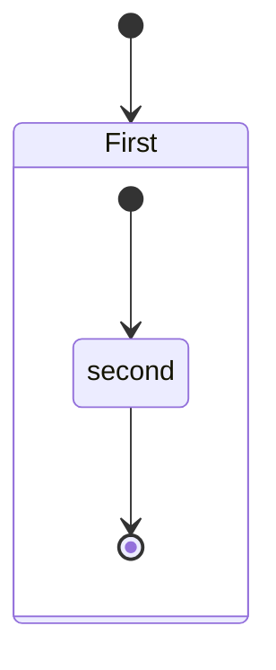

# 🔎 Web Application Vulnerability Hunting Methodology

## 1. Reconnaissance (Information Gathering)

**Goal: Collect as much information as possible about the target.**

### 🔹 Manual Techniques

- Google Dorking (search sensitive info in Google)
- Checking robots.txt, sitemap.xml, .git folders, hidden directories
- Identify technologies (CMS, framework, server type, versions)
- WHOIS lookup, subdomain enumeration manually

### 🔹 Automated Tools

- Subdomain Enumeration: amass, subfinder, assetfinder, crt.sh
- Port Scanning & Service Discovery: nmap, masscan
- Technology Fingerprinting: Wappalyzer, WhatWeb
- OSINT Tools: theHarvester, Shodan, Censys

## 2. Mapping the Application (Surface Discovery)

**Goal: Understand how the app works, entry points, parameters, flows.**

### 🔹 Manual Techniques

- Navigate the site, note down endpoints
- Identify GET/POST requests, cookies, headers, API calls
- Check for hidden parameters, developer comments in HTML/JS
- Understand authentication & roles

### 🔹 Automated Tools

- Crawler: Burp Suite Spider, OWASP ZAP Spider, Katana
- Content Discovery: gobuster, dirsearch, feroxbuster
- JS Analysis: LinkFinder, JSParser

## 3. Testing for Authentication & Session Issues

**Goal: Check login, sessions, access control.**

### 🔹 Manual Techniques

- Test weak/default credentials
- Check for missing rate limiting (bruteforce possible?)
- Test session fixation & cookie manipulation
- Try privilege escalation (normal user → admin)
- Test logout / session expiry

### 🔹 Automated Tools

- Burp Intruder for brute-force
- Hydra or Medusa for login bruteforce
- JWT Tool for JWT tampering

## 4. Input Validation & Injection Flaws
**Goal: Check if the app properly validates user input.**

### 🔹 Manual Techniques

- Test SQL Injection (`' OR 1=1 --`)
- XSS payloads (`<script>alert(1)</script>`)
- Command injection (`; ls`)
- Local File Inclusion (`../../etc/passwd`)
- Test GraphQL queries, APIs for injection

### 🔹 Automated Tools

- SQL Injection: `sqlmap`
- XSS: `XSStrike`, `Dalfox`
- Command Injection: `commix`
- LFI/RFI: `wfuzz`, `ffuf`

## 5. Authorization & Access Control Testing
**Goal: Check if users can access what they shouldn’t.**

### 🔹 Manual Techniques

- IDOR (change user_id=123 → 124)
- Test vertical privilege escalation (user → admin)
- Horizontal escalation (access another user’s data)

### 🔹 Automated Tools

- Autorize (Burp plugin)
- AuthMatrix
- Access Control Tester

## 6. Business Logic Vulnerabilities
**Goal: Break how the app is supposed to work.**

### 🔹 Manual Techniques

- Negative testing (buying items for negative price, bypassing payment)
- Skipping steps (checkout without payment)
- Abuse of workflows (redeem coupons multiple times)

### 🔹 Automated Tools

- ⚠️ Mostly manual — automation doesn’t catch these well.

## 7. Client-Side Vulnerabilities
**Goal: Test security in frontend, browser context.**

### 🔹 Manual Techniques

- DOM XSS testing
- CSRF token validation
- Clickjacking (iframe injection)
- Inspect localStorage/sessionStorage for sensitive info

### 🔹 Automated Tools

- `Burp Suite` DOM Invader
- `XSS Hunter`
- `Nuclei` (for template-based detection)

## 8. API Testing
**Goal: Test REST, GraphQL, SOAP APIs.**

### 🔹 Manual Techniques

- Look for undocumented endpoints
- Test with missing auth headers
- Test for mass assignment (PATCH /user with role=admin)
- Rate-limiting bypass

### 🔹 Automated Tools

- `Postman`, `Insomnia` (manual API exploration)
- `Nuclei` with API templates
- `Kiterunner` for API fuzzing

## 9. Automation & Continuous Scanning
**Goal: Run wide scans for known vulns.**

### 🔹 Automated Tools

- `Nuclei` (CVE/Template-based scanning)
- `Nikto` (common misconfigurations)
- `OpenVAS`, `Nessus` (vulnerability scanners)
- `Acunetix`, `Burp Scanner` (paid, but strong automation)

## 10. Reporting & Documentation
**Goal: Present findings clearly.**

### 🔹 Manual Steps

- Document vulnerable endpoint, payload, and impact
- Show Proof of Concept (PoC)
- Provide remediation advice

### 🔹 Tools
- `Dradis`, `Faraday` (collaboration/reporting)

---
## 🛠️ Quick Summary Table
| Phase          | Manual Techniques                 | Automated Tools          |
| -------------- | --------------------------------- | ------------------------ |
| Recon          | Google Dorking, tech fingerprint  | `amass`, `nmap`, `Wappalyzer`  |
| Mapping        | Endpoint discovery, param hunting | `Burp Spider`, `dirsearch`   |
| Auth           | Bruteforce, session tampering     | `Hydra`, `JWT Tool`          |
| Injection      | SQLi, XSS payloads                | `sqlmap`, `XSStrike`, `commix` |
| Access Control | IDOR, privilege escalation        | `Autorize`, `AuthMatrix`     |
| Logic          | Workflow abuse                    | `Mostly manual`            |
| Client-side    | DOM XSS, CSRF                     | `DOM Invader`, `XSS Hunter`  |
| API            | Mass assignment, fuzzing          | `Postman`, `Kiterunner`      |
| Scanning       | Recon + vuln scanning             | `Nuclei`, `Nikto`, `Nessus`    |
| Reporting      | PoC, remediation                  | `Dradis`, `Faraday`          |

---

## 🕵️ Web Application Vulnerability Hunting Playbook
### 🔹 Step 1: Reconnaissance (Find Info)
- Run subdomain enumeration → `amass`, `subfinder`
- Check certificates → `crt.sh`
- Scan open ports → `nmap -sV -Pn target.com`
- Identify technologies → `Wappalyzer`, `WhatWeb`
- Collect OSINT → `theHarvester`, `Shodan`

### 🔹 Step 2: Application Mapping (Attack Surface)
- Crawl app manually (note URLs, params, roles)
- Use crawler → `Burp Spider`, `Katana`
- Run directory brute force → `dirsearch -u target.com`
- Extract hidden endpoints from JS → `LinkFinder`

### 🔹 Step 3: Authentication Testing
- Try weak/default creds (admin:admin)
- Check login rate limiting (no captcha? no lockout?)
- Tamper cookies/session tokens manually
- JWT manipulation → `jwt_tool`
- Brute force → `Hydra`, `Burp Intruder`

### 🔹 Step 4: Input Validation & Injection
- Test SQLi → `sqlmap -u "url?param=1" --batch`
- Test XSS manually (`<script>alert(1)</script>`)
- Use XSStrike or Dalfox for XSS fuzzing
- Try LFI (`../../etc/passwd`)
- Test command injection (; ls) → `commix`
- Check GraphQL/JSON injections

### 🔹 Step 5: Access Control
- Change user IDs in requests (IDOR testing)
- Test accessing admin APIs as normal user
- Replay requests without authentication
- Use Autorize Burp plugin for systematic checks

### 🔹 Step 6: Business Logic Testing
- Skip steps in workflows (checkout without pay)
- Try negative values (price=-1)
- Reuse coupons/tokens multiple times
- Manipulate quantity/discount fields

- **(⚠️ Largely manual — automation doesn’t work well here)**

### 🔹 Step 7: Client-Side Testing
- Test DOM XSS via input reflection
- Check CSRF token missing or predictable
- Try clickjacking → iframe injection
- Inspect localStorage/sessionStorage for secrets
- Use Burp DOM Invader for automation

### 🔹 Step 8: API Testing
- Gather API endpoints (Swagger, Postman collections, JS files)
- Remove auth headers → test unauthorized access
- Fuzz APIs with kiterunner
- Check mass assignment (role=admin in request)
- Test rate limiting with repeated requests

### 🔹 Step 9: Automated Vulnerability Scanning
- Run nuclei -u target.com -t cves/ for known CVEs
- Run nikto -h target.com for misconfigurations
- Optionally scan with Nessus / OpenVAS
- Use Burp Scanner (if available)

### 🔹 Step 10: Reporting
- Document each finding (endpoint, payload, request/response)
- Provide PoC (screenshot, curl request, or script)
- Rate severity (High/Med/Low) using CVSS
- Suggest remediation (e.g., sanitize input, enable rate limiting)
- Write final report → Markdown, Dradis, or PDF

### ⚡ Quick Flow
     1. Recon → Find assets
     2. Mapping → Discover endpoints
     3. Auth → Break login/session
     4. Injection → Exploit inputs
     5. Access Control → Check roles
     6. Logic → Abuse workflows
     7. Client-Side → DOM, CSRF, clickjacking
     8. API → Fuzz, auth bypass
     9. Scan → Automate checks
    10. Report → Document clearly

## 🛡️ Web App Vulnerability Hunting Cheat Sheet
### 🔹 Reconnaissance
- amass, subfinder, assetfinder → Subdomains
- nmap, masscan → Ports/Services
- Wappalyzer, WhatWeb → Tech stack
- theHarvester, Shodan, Google Dorks

### 🔹 Mapping (Attack Surface)
- Burp/ZAP Spider, katana → Crawl
- dirsearch, feroxbuster → Hidden dirs
- LinkFinder, JSParser → JS endpoints

### 🔹 Authentication
- Weak creds (admin:admin)
- No rate limit → brute force (Hydra, Burp Intruder)
- Session tampering, JWT editing (jwt_tool)

### 🔹 Injection
- SQLi → sqlmap
- XSS → manual payloads, XSStrike, Dalfox
- LFI/RFI → ../../etc/passwd
- Command Injection → ; ls, commix
- GraphQL/JSON injection

### 🔹 Access Control
- IDOR → change user_id=123 → 124
- Vertical privilege escalation (user → admin)
- Burp Autorize, AuthMatrix

### 🔹 Business Logic
- Skip steps (checkout w/o payment)
- Negative values, coupon re-use
- Workflow abuse

### 🔹 Client-Side
- DOM XSS → Burp DOM Invader
- CSRF → check missing token
- Clickjacking → `<iframe>` test
- localStorage/sessionStorage leaks

### 🔹 API Testing
- Look for hidden endpoints (Swagger, JS, Postman)
- Auth bypass (missing headers)
- Rate limit abuse
- Mass assignment (role=admin)
- kiterunner, nuclei API templates

### 🔹 Automated Scanning
- nuclei -u target.com → CVEs
- nikto -h target.com → Misconfig
- Nessus, OpenVAS, Burp Scanner

### 🔹 Reporting
- Endpoint + payload + request/response
- PoC (screenshot / curl)
- Severity rating (CVSS)
- Fix recommendation

## **Flow: Recon → Mapping → Auth → Injection → Access Control → Logic → Client → API → Scanning → Report**

# 🧭 NahamSec-Inspired Web Application Vulnerability Hunting Methodology
## 🔍 1. Reconnaissance (Recon)
    Begin with comprehensive information gathering to identify potential attack surfaces.

### Subdomain Enumeration:
    Utilize tools like Amass, Subfinder, and Assetfinder to discover subdomains.

### Endpoint Discovery:
    Employ tools such as httpx and ffuf to identify hidden or less obvious endpoints.

### Web Archives:
    Leverage platforms like the Wayback Machine to uncover deprecated endpoints or older versions of the application.

### GitHub Dorks:
    Search for sensitive information, such as API keys, credentials, or exposed code.

### Automated Recon Workflows:
    Combine tools and scripts to streamline the reconnaissance process.

### Tools to Master:
    Amass, Subfinder, httpx, Waybackurls, Katana, and browser tools like Burp Suite or Caido for inspecting and manipulating traffic during recon.


## 🧩 2. Mapping the Attack Surface
**Understand the application's structure and identify potential entry points.**

### Crawl the Application:
    Manually navigate the application to identify URLs, parameters, and roles.

### Automated Crawling:
    Use tools like Burp Suite Spider or Katana for automated crawling.

### Directory Brute Forcing:
    Employ tools like dirsearch or feroxbuster to discover hidden directories and files.

### JavaScript Analysis:
    Use LinkFinder or JSParser to extract endpoints from JavaScript files.

## 🔐 3. Authentication & Session Management
**Assess the robustness of authentication mechanisms and session handling.**

### Credential Testing:
    Attempt to log in with default or weak credentials.

### Session Management:
    Check for session fixation, cookie manipulation, and token validation.

### Brute Force:
    Use tools like Hydra or Burp Intruder for password guessing.

### JWT Manipulation:
    Inspect and modify JSON Web Tokens using tools like jwt_tool.

## 🧪 4. Input Validation & Injection
**Test the application for common injection vulnerabilities.**

### SQL Injection:
    Use sqlmap to automate SQL injection testing.

### Cross-Site Scripting (XSS):
    Manually test for XSS vulnerabilities and use tools like XSStrike or Dalfox for automated testing.

### Command Injection:
    Test for command injection vulnerabilities using tools like commix.

### Local File Inclusion (LFI):
    Attempt to include local files by manipulating file paths.

### GraphQL Injection:
    Test for injection vulnerabilities in GraphQL queries.

## 🔓 5. Access Control & Authorization
**Verify that users can only access resources they are authorized to.**

### Insecure Direct Object References (IDOR):
    Manipulate identifiers in URLs or parameters to access unauthorized data.

### Privilege Escalation:
    Attempt to escalate privileges from user to admin.

### Automated Tools:
    Utilize Burp Suite extensions like Autorize or AuthMatrix to assist in testing.

🧠 6. Business Logic Testing
Identify flaws in the application's logic that could be exploited.

### Workflow Manipulation:
    Attempt to bypass or manipulate workflows, such as completing a purchase without payment.

### Negative Testing:
    Input invalid or unexpected data to test the application's response.

### Coupon/Token Abuse:
    Test for the reuse or abuse of coupons and tokens.

## 🧱 7. Client-Side & API Testing
**Examine the client-side code and APIs for vulnerabilities.**

### Cross-Site Request Forgery (CSRF):
    Test for CSRF vulnerabilities by crafting malicious requests.

### Clickjacking:
    Test for clickjacking by embedding the application in an iframe.

### API Testing:
    Use tools like Postman or Kiterunner to test API endpoints for vulnerabilities.

### JWT & Token Analysis:
    Inspect tokens for sensitive information and potential vulnerabilities.

## ⚙️ 8. Automated Scanning
**Employ automated tools to identify known vulnerabilities.**

### Nuclei:
    Use nuclei with templates to scan for CVEs and other vulnerabilities.

### Nikto:
    Run nikto to identify common web server misconfigurations.

### Nessus/OpenVAS:
    Utilize these tools for comprehensive vulnerability scanning.

### Burp Suite Scanner:
    Use the built-in scanner for automated vulnerability detection.

## 📝 9. Reporting & Documentation
**Clearly document findings and provide actionable recommendations.**

### Vulnerability Details:
    Include endpoint, payload, and impact.

### Proof of Concept (PoC):
    Provide a PoC demonstrating the vulnerability.

### Severity Rating:
    Assign a severity rating based on CVSS or other standards.

### Remediation Advice:
    Offer suggestions for mitigating the vulnerability.

**🔄 Continuous Learning & Adaptation Stay updated with the latest security trends and continuously improve your skills.**

---

# 🔹Framework-Specific Web App Vulnerability Hunting Methodology
## 1️⃣ Next.js Applications
### Characteristics:
    Server-Side Rendering (SSR), API routes, React-based frontend, Node.js backend.

### Testing Focus:

### API Routes (/api/\*):
    test for injection, IDOR, authentication flaws.

### Server-Side Rendering:
    SSR can expose sensitive server info if not properly sanitized.

### Next.js Pages & Params:
    Test dynamic routes (/product/[id]) for IDOR or SSRF.

### Static Exported Pages:
    Look for exposed files in .next or public folders.

### Tools/Techniques:

- Burp Suite/ZAP for requests
- ffuf / dirsearch to enumerate .next assets
- Manual testing for SSR injection, header manipulation, and misconfigured API endpoints

## 2️⃣ React.js Applications
### Characteristics
    SPA (Single Page Application), heavy client-side JS, state management libraries (Redux, MobX), API-driven.

### Testing Focus:
### DOM XSS
    unsanitized rendering of user input in dangerouslySetInnerHTML.

### Exposed API Endpoints 
    React SPAs consume backend APIs (check authorization and input validation).

### JWT/LocalStorage Handling 
    Tokens stored in localStorage/sessionStorage; test for theft/abuse.

### Client-side Logic 
    Look for hidden business logic in JS bundles.

### Tools/Techniques:

### Browser DevTools 
    inspect React components, state

### source-map-explorer 
    analyze JS bundle for sensitive info

### Automated XSS scanners 
    Dalfox, XSStrike

## 3️⃣ Angular Applications
### Characteristics
    SPA with TypeScript, two-way data binding, built-in sanitization for inputs.

### Testing Focus:

### Bypass Angular sanitization 
    try Angular-specific XSS payloads.

### API security 
    Angular apps usually call REST APIs, test authentication/IDOR.

### Route Guards 
    Check if client-side access controls are enforced; try forced URL access.

### Tools/Techniques:

- DOM inspection and Angular DevTools
- Burp Suite for API fuzzing
- Manual injection testing using Angular syntax payloads

## 4️⃣ Vue.js Applications
### Characteristics
    SPA, reactive data binding, Vuex for state.

### Testing Focus:

### Template Injection 
    try injecting Vue templates in inputs ({{7*7}}) if unsafe rendering exists.

### XSS 
    client-side rendering may expose stored or reflected XSS.

### API Abuse 
    similar to React, Vue apps consume backend APIs; test auth, rate-limiting.

### Tools/Techniques:

- Vue DevTools
- Burp Suite/ZAP
- Manual injection testing for template and DOM XSS

## 5️⃣ Django (Python)
### Characteristics
    Server-rendered pages, ORM, built-in CSRF protection.

### Testing Focus:

### SQL Injection 
    test API endpoints or form inputs (check ORM usage).

### CSRF Protection 
    verify token implementation; attempt CSRF attacks.

### Template Injection 
    Django template injection if unescaped user input is rendered.

### File Uploads 
    check for unrestricted file uploads.

### Tools/Techniques:

- sqlmap for SQLi
- Burp Suite for CSRF and input testing
- Static code inspection if source available

## 6️⃣ Laravel (PHP)
### Characteristics
    Server-side rendering, ORM (Eloquent), Blade templates, API support.

### Testing Focus:

### SQL Injection 
    check endpoints using user input.

### IDOR / Authorization bypass 
    test route access, object IDs.

### Blade Template Injection 
    test unescaped variables ({!! $input !!}).

### File Upload / File Inclusion 
    local/remote file inclusion.

### Tools/Techniques:

- Burp Suite for requests
- Manual testing for auth bypass and file inclusion
- wfuzz / ffuf for directory enumeration

## 7️⃣ Node.js / Express Applications
### Characteristics
    Backend APIs, server-rendered or API-only apps.

### Testing Focus:

### NoSQL Injection 
    if MongoDB used ($ne, $gt)

### Header / Auth Flaws 
    JWT or session handling

### Directory Traversal / File Upload 
    check for unsafe file handling

### API Security 
    rate limiting, mass assignment

### Tools/Techniques:

- Burp Suite / Postman for API fuzzing
- Manual inspection of JSON payloads
- mongo-sqli tools for NoSQL injection

## 8️⃣ General Methodology for Any Framework
|Step                   | Manual Testing                        | Automated / Tools                     |
|-----------------------|---------------------------------------|---------------------------------------|
|Recon & Mapping        | Browse app, check routes, params, APIs| ffuf, dirsearch, Burp Spider          |
|Auth & Session Test    | login, brute force, JWT tampering     | Burp Intruder, JWT_tool               |
|Input & Injection      | SQLi, XSS, template injection         | sqlmap, XSStrike, Dalfox              |
|API Testing            | Check REST/GraphQL, auth bypass       | Postman, Kiterunner                   |
|Business Logic Workflow| bypass, negative testing              | Mostly manual                         |
|Client-side            | DOM XSS, template injection           | DevTools, React/Angular/Vue devtools  |
|Reporting              | PoC, impact, severity                 | Dradis, Markdown, PDF                 |
----

## 🛡️ Framework-Based Web App Vulnerability Hunting Cheat Sheet
| Framework / Tech              | Common Vulnerabilities                               | Typical Attack Vectors                                   | Tools / Payloads                                     |
|-------------------------------|------------------------------------------------------|----------------------------------------------------------|-----------------------------------------------------|
| **Next.js (React SSR, API routes)** | SSR injection, IDOR, API auth bypass, info leakage    | Dynamic routes (`/product/[id]`), API routes (`/api/*`), query params | Burp Suite, ffuf, dirsearch, manual SSR payloads    |
| **React.js (SPA)**            | DOM XSS, exposed API endpoints, JWT abuse, business logic leaks | `dangerouslySetInnerHTML`, API requests, localStorage     | Dalfox, XSStrike, Burp Suite, source-map-explorer   |
| **Angular (SPA, TypeScript)** | Angular XSS bypass, API auth flaws, route guard bypass | Template injection, REST APIs, route URL manipulation     | Angular DevTools, Burp Suite, manual Angular XSS payloads |
| **Vue.js (SPA, Vuex)**        | Template injection, DOM XSS, API misuse              | Input fields, API endpoints, reactive rendering           | Vue DevTools, Burp Suite, manual `{{7*7}}` template injection |
| **Django (Python, SSR)**      | SQLi, CSRF bypass, template injection, file upload flaws | Forms, query params, file uploads, template rendering     | Burp Suite, sqlmap, manual CSRF tests               |
| **Laravel (PHP, Blade)**      | SQLi, IDOR, Blade template injection, file inclusion  | Forms, object IDs, `{!! $input !!}`, uploads              | Burp Suite, wfuzz/ffuf, manual payloads             |
| **Node.js / Express**         | NoSQL injection, auth flaws, directory traversal, API abuse | JSON inputs, JWT tokens, file endpoints                  | Burp Suite, Postman, mongo-sqli, manual NoSQL payloads |
| **WordPress / CMS**           | SQLi, XSS, auth bypass, file inclusion, plugin vulns  | Plugins, themes, query params, REST API                   | WPScan, Burp Suite, sqlmap                          |
| **General SPA (JS Frameworks)** | XSS, exposed APIs, business logic abuse, JWT leaks     | API endpoints, localStorage, frontend logic               | Burp Suite, Postman, Dalfox, manual payloads        |
| **Server-Side Frameworks (PHP, Python, Java)** | SQLi, RCE, file inclusion, auth bypass              | Query params, uploads, headers                            | Burp Suite, sqlmap, wfuzz, Nikto                    |
---

# 🔹 Notes / Testing Tips:
## Start with Recon & Mapping for all frameworks:

- ffuf / dirsearch → hidden endpoints
- Burp Spider / Katana → automated crawling
- API Security is Critical for SPAs (React, Vue, Angular):
- Test authorization, mass assignment, rate limiting

## Template & DOM Injection:

- Angular: {{7*7}}, Vue: {{7*7}}, React: dangerouslySetInnerHTML

## SSR Frameworks:

- Next.js, Django → SSR injection, sensitive headers, API auth bypass

## Check File Uploads & Inclusion:

- Laravel, Django, Node → unrestricted uploads can lead to RCE

## Tokens / JWT:

- Check localStorage, sessionStorage, token validation, and tampering

---
# 🔹 Web Browser Extension Security Testing Methodology

## 1. Reconnaissance & Setup
### Identify target extensions:
- Chrome Web Store / Firefox Add-ons / Edge Add-ons.
- Locate the extension ID, manifest, and permissions.
### Download & unpack extension:
- Chrome: .crx → rename .zip → unzip.
- Firefox: .xpi → unzip.

### Inspect the manifest (manifest.json):
#### Look for:
- Permissions: `tabs`, `cookies`, `webRequest`, `background`.
- `content_scripts` and host permissions (which sites it can access).
- background or service_worker scripts.

## 2. Static Analysis
### Check JavaScript files:
- Search for unsafe patterns: eval(), innerHTML injection, document.write.
- Look for hardcoded secrets or API keys.

### Review permissions vs functionality:
- Excessive permissions → potential attack surface.
- Look for outdated libraries:
- Identify vulnerable libraries bundled in extension (e.g., jQuery, lodash).

## 3. Dynamic Analysis
### Load extension in developer mode:
- Chrome: chrome://extensions → “Load unpacked”.
- Firefox: about:debugging → “Load Temporary Add-on”.

### Inspect network activity:
- Use browser DevTools or Burp Suite to see if extension sends sensitive data externally.

### Test content scripts:
- Check if scripts injected into web pages can be exploited (DOM XSS, data leakage).

### Background scripts & messaging:
- Test inter-script messaging (chrome.runtime.sendMessage, chrome.runtime.onMessage).

Check if external websites can send messages to extension (unauthenticated access).

## 4. Privilege Escalation & API Testing
### Check exposed APIs:
- If extension exposes endpoints (window.postMessage or chrome.runtime.onMessage), test for abuse.

### Cookie / storage access:
- Check if extension can read sensitive cookies, localStorage, or sessionStorage.

### Host permissions:
- Test if extension can manipulate sites it has permissions for.

### File system / clipboard access (if allowed):
- Test whether extension reads/writes more than expected.

## 5. Security Checks
### Content Security Policy (CSP):
- Check if CSP is properly defined to prevent XSS.

### Cross-Site Scripting (XSS):
- Test user input processed by the extension (options page, injected scripts).

### Cross-Site Request Forgery (CSRF):
- Test if extension performs sensitive actions via HTTP requests.

### Remote Code Execution (RCE):
- Look for unsafe eval() or Function() calls in scripts.

## 6. Data Exfiltration & Privacy
### Check what data is collected:
- Does it send browsing history, emails, or personal info to external servers?

### Intercept network requests:
- Look for plain-text transmissions or insecure endpoints.

### Analyze analytics / trackers:
- Check embedded third-party scripts for leakage.

## 7. Reporting
### Document:
- Extension ID, permissions, and files analyzed.
- Vulnerability type and severity (e.g., DOM XSS, privilege escalation).
- **PoC:** screenshots, requests, or code snippets.
- Mitigation recommendations.

## 🔧 Useful Tools
### Browser DevTools
    Network, Sources, Console.

### Burp Suite / OWASP ZAP
    Proxy extension traffic.

### CRXcavator
    Automated Chrome extension security analysis.

### Extension Source Viewer
    Chrome extension to view source.

### Static JS analysis tools
    eslint, node-scan, Retire.js.

## ⚡ Tips

- Focus on permissions first — more permissions = higher risk.
- Options page / background page are often vulnerable.
- Extensions are trusted by browsers, so any flaw can affect the whole system.

## 🛠️ Chrome Extension Security Testing Lab Guide
### Step 1: Pick and Download the Extension
    Go to Chrome Web Store and pick an extension.
    Note its Extension ID from the URL:
    `https://chrome.google.com/webstore/detail/<name>/<extension-id>`
    Download the .crx file using a tool like:
    CRX Downloader
    Or via Chrome Extension Downloader extensions.
    Rename .crx → .zip and unzip it:
    mv extension.crx extension.zip
    unzip extension.zip -d extension_folder

### Step 2: Load the Extension in Developer Mode
    Open Chrome → chrome://extensions/
    Enable Developer Mode.
    Click Load unpacked → select extension_folder.
    Now the extension is active, and you can inspect it.

### Step 3: Inspect the Manifest
- Open manifest.json.
- Key things to check:
```json
"permissions": [
    "tabs",
    "cookies",
    "webRequest",
    "http://*/*",
    "https://*/*"
],
"background": {
    "service_worker": "background.js"
},
"content_scripts": [
    {
        "matches": ["https://*/*"],
        "js": ["content.js"]
    }
]
```
    Look for:
    Excessive permissions
    Host access (https://_/_) → broad attack surface
    Background scripts → may handle sensitive APIs

### Step 4: Static Analysis
**Inspect all JS files in extension_folder.**
#### Search for:
    eval() or Function() → possible RCE.
    innerHTML assignments → potential DOM XSS.
    Hardcoded secrets or API keys.
    Check third-party libraries:
    Use Retire.js or npm audit on libraries for known vulnerabilities.

### Step 5: Dynamic Analysis
    Open DevTools → inspect:
    Background Page / Service Worker:
    chrome://extensions/ → click “background page” → console.
    Content Scripts:
    Inject code into a page the extension runs on.
    Check if input from page can be reflected or manipulated.
    Test network activity:
    Proxy traffic through Burp Suite or OWASP ZAP.
    Look for sensitive info being sent externally.

### Step 6: Messaging & API Testing
**Chrome extensions use chrome.runtime.sendMessage and onMessage.**

    Test for unauthenticated message handling:
    Open console in any website.
    Try sending messages to the extension:
    chrome.runtime.sendMessage("<extension-id>", {action: "test"}, console.log);
    See if the extension responds or executes actions it shouldn’t.
    Test host permissions by visiting allowed sites and sending malicious inputs.

### Step 7: Cookie, LocalStorage & Session Testing
    If the extension accesses cookies, localStorage, or sessionStorage:
    Check if sensitive data can be read or manipulated.
    Test for credential leakage or unintended data exposure.

### Step 8: Content Security Policy (CSP) Check
    Open manifest.json → look for content_security_policy.
    Weak CSP may allow DOM XSS:
    Test by injecting scripts in input fields/options page:
    ``

### Step 9: Simulate Attacks
    DOM XSS → manipulate pages where content script runs.
    CSRF / API abuse → send unauthorized requests via extension APIs.
    Privilege Escalation → if extension exposes admin functionality, try invoking via messages or background scripts.
    Data Exfiltration → intercept network requests to check if extension leaks info.

### Step 10: Reporting
#### Document:

    Extension ID and version
    Permissions and files analyzed
    Vulnerabilities found
    Proof-of-Concept (screenshot, code snippet, curl request)
    Severity (High/Medium/Low)
    Remediation suggestions (e.g., remove unnecessary permissions, sanitize inputs)

## 🔧 Tools for Testing Extensions
- **DevTools** → Inspect background/content scripts
- **Burp** Suite / OWASP ZAP → Intercept extension traffic
- **CRXcavator** → Automated extension analysis
- **Retire**.js / npm audit → Check library vulnerabilities
- **Extension** Source Viewer → Quick source inspection in browser


# 🔹 Understanding dangerouslySetInnerHTML in React
React usually escapes all HTML in JSX to prevent XSS.
```jsx
const name = "<script>alert(1)</script>";
return <div>{name}</div>; // renders as text, safe
```

dangerouslySetInnerHTML bypasses escaping, allowing raw HTML injection:
```jsx
const html = "";
return <div dangerouslySetInnerHTML={{ __html: html }}></div>;
```
Risk: If html comes from user input, an attacker can inject XSS.

## 🔹 Step 1: Locate dangerouslySetInnerHTML Usage
### Inspect React app source:
- In DevTools, check Sources → React JS bundles.
- Search for dangerouslySetInnerHTML.

### Identify where it is used:
- Options pages, user comments, API responses, dynamic content areas.

## 🔹 Step 2: Identify Input Sources
- Determine what feeds the HTML:
- API responses (fetch, axios)
- User inputs (forms, comments)
- URL parameters or query strings
- Example:
```html
<div dangerouslySetInnerHTML={{ __html: props.comment }}></div>
```
If props.comment comes from the server or user input → vulnerable.

## 🔹 Step 3: Test for XSS
### Manual Payloads:
```html

<svg/onload=alert(1)>
<iframe src="javascript:alert(1)"></iframe>
```

### Where to inject:

- Input fields (if reflected)
- API POST bodies (e.g., /comments endpoint)
- URL parameters (if rendered directly)
- Verify Execution: Open DevTools → Console → check if alert(1) fires.

## 🔹 Step 4: Automated Testing
### Tools:

#### XSStrike → automated DOM XSS scanner
```bash
python3 xsstrike.py -u "https://example.com/comment?msg=1"
```
#### Dalfox → fuzz URL parameters for XSS:
```bash
dalfox url https://example.com/page?name=testing --blind
```

### Test all possible inputs:
- `Query parameters`, `POST requests`, `cookies`, `API JSON payloads`.

## 🔹 Step 5: Test API Sources
**React apps often fetch data from APIs.**

### Check if API responses are sanitized before rendering:

```html
<div dangerouslySetInnerHTML={{ __html: apiData.content }}></div>
```
### Test by sending malicious content to API endpoints:
```json
{
    "content": ""
}
```
**Observe if React renders it unsanitized.**

## 🔹Step 6: Reporting
### Document:
- Endpoint or input field where injection occurs
- Payload used (``)
- Impact (Stored or Reflected XSS)

### Recommendation:
- Sanitize inputs server-side
- Avoid dangerouslySetInnerHTML or use libraries like DOMPurify
- Whitelist allowed HTML tags

## 🔹Step 7: Mitigation Tips
### Always sanitize input:

```jsx
import DOMPurify from 'dompurify';
<div dangerouslySetInnerHTML={{ __html: DOMPurify.sanitize(userInput) }}></div>
```

### Limit sources:
-Only trusted backend content
-Avoid inline JS in rendered HTML:
- Block `<script>` and event handlers (onload, onclick)
---

# Actual Work

## Step 1: Organize Your Methodology
**Convert your notes and cheat sheets into a structured checklist.**

### Example structure:

- **Recon** → Identify tech/framework, endpoints, APIs
- **Mapping** → Crawl, enumerate directories, dynamic routes
- **Auth** → Test login, roles, token handling
- **Input** → Test XSS, SQLi, template injections, NoSQLi
- **API** → Auth bypass, mass assignment, rate-limit
- **Client** → DOM XSS, template injection, token leaks
- **SSR**/File → File uploads, server-side rendering flaws
- **Reporting** → PoC, impact, mitigation
- **This** will serve as your field guide.

## Step 2: Set Up Your Testing Environment
### Browser & Proxy
- Chrome or Firefox DevTools
- `Burp Suite` or `OWASP ZAP` for intercepting requests

### Tools
- ffuf, dirsearch, nuclei, sqlmap, XSStrike, Dalfox, Kiterunner, etc.

### Sandbox Profile
- Use a separate browser profile for testing extensions or SPAs.

### Target Lab
#### Start with safe targets like:
- **OWASP Juice Shop**
  - **Frontend:** Angular (TypeScript, HTML, CSS)  
  - **Backend:** Node.js + Express (REST APIs)  
  - **Notes:** Modern single-page app. Contains realistic vulns (JWT flaws, OAuth, NoSQLi, XSS, business logic). Comes with official “Pwning Juice Shop” solutions guide.  

- **WebGoat**
  - **Frontend:** HTML, CSS, JavaScript  
  - **Backend:** Java (Spring Boot framework), REST APIs  
  - **Notes:** Includes lessons on OWASP Top 10 (XSS, SQLi, IDOR, CSRF, etc.). Great for step-by-step guided learning.  

- **bWAPP (Buggy Web Application)**
  - **Frontend:** PHP (HTML, CSS, JavaScript mix)  
  - **Backend:** PHP + MySQL  
  - **Notes:** Huge range of 100+ vulnerabilities (OWASP Top 10, CWE/SANS, plus advanced like Heartbleed, Shellshock). Great for broad coverage beyond just basics.  

- **DVWA (Damn Vulnerable Web App)**
  - **Frontend:** PHP (HTML, CSS, JavaScript mix)  
  - **Backend:** PHP + MySQL  
  - **Notes:** Covers classic OWASP vulns like SQLi, XSS, CSRF, File Upload. Has difficulty levels (low → high) for gradual practice.  


## Step 3: Begin Reconnaissance
### Identify:

- Framework & tech stack (React, Angular, Next.js, Django…)
- Endpoints, APIs, dynamic routes
- Authentication mechanisms

### Tools:

- `Wappalyzer`, `WhatWeb`, `httpx`, `nmap`, `amass` for recon

## Step 4: Map & Explore
- Crawl the web app manually and automatically.
- Identify hidden paths, parameters, API routes.
- Document everything in a spreadsheet or note-taking app:
- Endpoint, method, parameters, role required, etc.

## Step 5: Start Testing
### Use framework-specific attack vectors:

- React → dangerouslySetInnerHTML XSS
- Angular → template injection
- Next.js → SSR injection, API auth bypass
- Node/Django → SQLi, file upload, auth bypass

### Include:

- Manual testing
- Automated scanning (Nuclei, Burp Suite)
- API fuzzing (Postman, Kiterunner)

## Step 6: Document Vulnerabilities
### For each finding, record:

- Endpoint / input field
- Payload / request example
- Impact (Stored XSS, Reflected XSS, SQLi, etc.)
- Recommendations (sanitization, auth checks, rate limiting)

## Step 7: Continuous Improvement
- Review results and update your methodology.
- Add new frameworks, payloads, tools as you discover them.
- Learn from bug bounty reports and security blogs (NahamSec, PortSwigger, etc.)


# 🗂️ Web App Vulnerability Hunting Action Plan
## Week 1: Foundation & Environment Setup
**Goals: Set up tools, understand frameworks, and practice safe testing.**
## Tasks:

### Install & configure:

- Browser DevTools (Chrome/Firefox)
- Burp Suite / OWASP ZAP
- Python & Node.js (for scripts/tools)
- Recon tools: ffuf, dirsearch, httpx, amass
### Learn basic web technologies:
- HTML, JS, React, Angular basics

### Set up lab targets:

- OWASP Juice Shop
- WebGoat
- bWAP
- DVWA (Damn Vulnerable Web App)

## Week 2: Recon & Mapping Practice
**Goals: Identify endpoints, APIs, and framework tech stacks.**
## Tasks:
### Recon:

- Identify framework using Wappalyzer, WhatWeb, or JS bundle inspection.
- Subdomain & host enumeration with amass or subfinder.

#### Recon → Find shop.example.com
#### Crawl → Discover inside:
- /products?id=123
- /cart


### Mapping:
    1. Crawl the Application
    2. Discover Hidden Content
    3. Analyze JavaScript Files
    4. Map Authentication & Session Flows
    5. Identify User Roles & Access Control
    6. Note Parameters & Inputs
    7. Build Tech-Specific Attack Surface
- Crawl web app manually and with Burp Spider or Katana.
- Enumerate directories with dirsearch / ffuf.
- Document all endpoints, params, API routes in a spreadsheet.

## Week 3: Authentication & Session Testing
**Goals: Test login systems, session handling, token security.**
## Tasks:

- Test weak/default credentials.
- Check JWT handling, localStorage/sessionStorage tokens.
- Try session fixation, cookie tampering.
- Test rate-limiting / brute-force detection with Burp Intruder.

## Week 4: Input & Injection Testing
**Goals: Identify XSS, SQLi, template injection, NoSQLi vulnerabilities.**
## Tasks:

### React/Angular/Vue:

- DOM XSS testing (dangerouslySetInnerHTML, template injection)

### SSR frameworks (Next.js/Django):

- SSR injection, SQLi, info leakage

### Use automated tools:

- sqlmap, XSStrike, Dalfox
- Manual payload testing for tricky cases.

## Week 5: API & Client-Side Testing
**Goals: Test API endpoints and client-side security.**
## Tasks:

- Test API auth bypass, mass assignment, rate limiting.
- Inspect client-side logic for sensitive operations.
- Check localStorage / sessionStorage / cookies for sensitive data exposure.
- Use Kiterunner or Postman to fuzz API endpoints.

## Week 6: Business Logic & Workflow Abuse
**Goals: Exploit flaws in workflow/business logic.**
## Tasks:

- Skip steps in checkout/payment workflows.
- Reuse coupons, tokens, or manipulate quantities.
- Try privilege escalation or IDOR attacks.
- Document proof-of-concept for each business logic flaw.

## Week 7: File Uploads, SSR, & Advanced Attacks
**Goals: Test file uploads, server-side rendering, and advanced attacks.**
## Tasks:

- File upload testing (check extension validation, size limits, RCE possibilities).
- SSR template injections (Next.js/Django).
- Test clickjacking, CSRF, and other client-side vulnerabilities.
- Capture network traffic with Burp Suite.

## Week 8: Reporting & Review
**Goals: Compile findings and improve methodology.**
## Tasks:

- Document all findings: endpoint, payload, impact, recommendations.
- Rate severity (CVSS or internal scoring).
- Suggest mitigation strategies.
- Review methodology: add new frameworks, tools, payloads.

---

# 🔹 Turbo Intruder Full Advanced Tutorial

## 1. Installation
- Open Burp Suite → Extensions → BApp Store.
- Search for Turbo Intruder and install.
- It adds an “Extensions → Turbo Intruder” tab + right-click → Send to Turbo Intruder option.

## 2. Core Concepts
- Turbo Intruder scripts are Python-like (Jython) but with a special Burp API.
- Request Template: You send a base HTTP request (copied from Repeater/Proxy).
- Payload Source: Script decides where payloads come from (file, inline list, generator).
- Concurrency: Number of requests in-flight at once.
- Rate Control: Control over request bursts (needed for race conditions).
- Response Analysis: Handle responses inline in the script.

## 3. Basic Script (Hello World)
### Example: brute force admin password.
```py
def queueRequests(target, wordlists):
    engine = RequestEngine(
        endpoint=target.endpoint,
        concurrentConnections=5,
        requestsPerConnection=100,
        pipeline=False
    )
for word in open('/path/to/passwords.txt'):
    engine.queue(target.req, word.strip())

def handleResponse(req, interesting):
    if b"Welcome" in req.response:
        print("Valid password found:", req.words[0])
```
- engine.queue → sends the request with payload substitution (%s inside the request gets replaced).
- handleResponse → inspects response bodies.

## 4. Key Engine Parameters
### When creating RequestEngine:

- `concurrentConnections`: How many TCP sockets open at once.
- `requestsPerConnection`: How many requests per socket.
- `pipeline=True`: Sends multiple requests without waiting for responses (useful in smuggling/race).
- `timeout=5`: Timeout for responses.
- `resumeSSL=False`: Avoids reusing SSL sessions (sometimes needed).

👉 Tuning these is how you outperform Burp Intruder.

## 5. Advanced Use Cases
### 5.1 Password Spraying / Brute Force
#### Use a list of payloads (wordlists).
- Turbo Intruder can queue millions of requests without memory blowups.
```py
for word in open('/usr/share/wordlists/rockyou.txt'):
    engine.queue(target.req, word.strip())
```
### 5.2 Race Condition Exploitation
#### Race conditions need parallel requests hitting at exactly the same time.
```py
def queueRequests(target, wordlists):
    engine = RequestEngine(
        endpoint=target.endpoint,
        concurrentConnections=20,
        requestsPerConnection=10,
        pipeline=True
    )
for i in range(50): # Send 50 requests at once
    engine.queue(target.req, str(i))
```
- Sends 50 identical requests in parallel.
- If the backend doesn’t lock properly → double-spend, auth bypass, coupon re-use.

### 5.3 HTTP Request Smuggling
#### Turbo Intruder’s pipelining is perfect for this.
##### You can craft a CL.TE or TE.CL request and send it with concurrency.
```py
def queueRequests(target, wordlists):
    engine = RequestEngine(
        target.endpoint,
        concurrentConnections=1,
        requestsPerConnection=1
    )
smuggle = """POST / HTTP/1.1
Host: target.com
Content-Length: 60
Transfer-Encoding: chunked

0

GET /admin HTTP/1.1
Host: target.com

"""
engine.queue(smuggle)
```
- Forces smuggled request into backend.
- Must manually adjust headers to bypass WAF.

### 5.4 Timing Attacks (Blind SQLi, Padding Oracle)
#### Use response times as feedback.
```py
def handleResponse(req, interesting):
    if req.time > 5000: # Response took >5s
        print("Possible delay injection:", req.words[0])
```
- If payload delays response → vulnerable to time-based SQLi/command injection.

## 6. Response Handling
### Turbo Intruder lets you parse/analyze responses inline:
```py
def handleResponse(req, interesting):
    if "200 OK" in req.response:
        print(req.words[0], " => Success")
```
#### You can filter based on:

- Status codes
- Response length (req.length)
- Keywords in body
- Timing (req.time)

## 7. Pro Tips
### Template carefully → use %s where payloads go.

#### Avoid WAF detection:

- Add jitter/random delays.
- Use pipelines to appear like legit traffic.

#### Scale Smartly:

- Start small → increase concurrentConnections.
- Some apps rate-limit per IP — rotate with Burp Collaborator or proxies.

#### Logging:

##### Always save responses:
```py
print(req.response)
```
#### Performance:
- Turbo Intruder can outperform Intruder by 1000x, but don’t DoS the target.

## 8. When to Use Turbo Intruder (vs Burp Intruder)
### Use Turbo Intruder when:

- You need massive request volumes (brute-forcing, wordlists).
- You need precise timing/concurrency (race conditions).
- You want custom logic in attack (like smuggling scripts).

#### Stick with Burp Intruder when:
- You want quick, GUI-driven payload fuzzing.
- Smaller attacks (<5k requests).

---


# 🏴‍☠️ Practice Labs + Tools + Solutions
## 1️⃣ Beginner-Friendly Labs (Foundations)
### 🔹 PortSwigger Web Security Academy (Free & Best Starting Point)
- Covers every OWASP Top 10 vuln with hands-on labs.
- Labs range from easy → expert (e.g., XSS, SQLi, CSRF, Access Control, SSRF, Race Conditions).
- Each lab includes detailed solutions & explanations.

- 👉 Link: https://portswigger.net/web-security
- 👉 Tools: Burp Suite (CE or Pro)
- ✅ Why: Builds your fundamentals in methodology + exploitation.

### 🔹 DVWA (Damn Vulnerable Web Application)
- PHP/MySQL app with multiple difficulty levels.
- Includes XSS, SQLi, File Upload, Command Injection.
- Has tutorials + solutions online.

- 👉 GitHub: https://github.com/digininja/DVWA
- 👉 Tools: Burp, SQLmap, XSStrike
- ✅ Why: Practice manual + automated exploitation.

### 🔹 Juice Shop (OWASP)
- Modern web app (Angular frontend + Node.js backend).
- Covers business logic flaws, OAuth, JWT, APIs.
- Comes with hints + walkthroughs.

- 👉 Link: https://owasp.org/www-project-juice-shop/
- 👉 Tools: Burp, Postman, JWT Toolkit
- ✅ Why: Great for modern app security & logic bugs.

## 2️⃣ Intermediate Labs (Realistic Scenarios)
🔹 HackTheBox (Web Challenges & Machines)
- Has realistic web apps with misconfigurations, race conditions, chained exploits.
- Includes writeups (after root/own).
- Some boxes mimic bug bounty programs.

- 👉 Link: https://www.hackthebox.com
- 👉 Tools: Burp, Nmap, wfuzz, ffuf
- ✅ Why: Builds real-world mindset (multiple layers of security).

🔹 TryHackMe (Bug Bounty Paths)
- Has structured bug bounty learning paths.
- Labs cover API hacking, race conditions, SSRF, IDORs, privilege escalation.
- Walkthroughs included in premium.

- 👉 Link: https://tryhackme.com
- 👉 Tools: Burp, Nuclei, ffuf
- ✅ Why: Guided learning + practical labs.

### 🔹 bWAPP (Buggy Web Application)
- 100+ vulns (server-side, client-side, APIs).
- Broader than DVWA.
- Solutions available online.

- 👉 GitHub: https://sourceforge.net/projects/bwapp/
- ✅ Why: Massive vuln coverage in a single app.

## 3️⃣ Advanced Labs (Expert Level)
### 🔹 Real-World Simulation Labs
- VulnHub → VM-based vulnerable apps.
- PentesterLab Pro → paid, deep-dive into web vulns with certificates.
- Web Security Dojo → training VM with multiple apps pre-installed.

- 👉 VulnHub: https://www.vulnhub.com/
- 👉 PentesterLab: https://pentesterlab.com/
- 👉 Dojo: https://dojo.mavensecurity.com/

✅ Why: Prepares you for bug bounty-level programs with chained exploits.

### 🔹 Race Condition & Advanced Exploits
- NahamSec Race Condition Labs (GitHub repos + YouTube streams).
- PortSwigger’s Advanced Labs: HTTP Smuggling, Race Conditions, Caching Attacks.

- 👉 NahamSec GitHub: https://github.com/nahamsec
- 👉 PortSwigger Advanced: https://portswigger.net/web-security/all-labs

- ✅ Why: Helps you practice high-paying, rare bugs.

## 4️⃣ Tools for Practicing
- Burp Suite Pro/CE → proxy, repeater, intruder, turbo intruder.
- Nuclei → template-based scanning.
- ffuf / dirsearch → content discovery.
- XSStrike / Dalfox → XSS fuzzing.
- SQLmap → SQLi exploitation.
- JWT Toolkit → JWT analysis & exploitation.
- Postman/Insomnia → API testing.

## 5️⃣ Solutions & Walkthroughs
- PortSwigger Academy → every lab has official solutions.
- HackTricks: https://book.hacktricks.xyz/ → exploitation notes for every vuln.
- PayloadsAllTheThings: https://github.com/swisskyrepo/PayloadsAllTheThings → ready payloads for all labs.
### YouTube Hunters:
- NahamSec, Stok, InsiderPhD → full lab solutions.

# 🚀 Expert
- Start → DVWA, Juice Shop, PortSwigger Academy.
- Intermediate → HackTheBox, TryHackMe, bWAPP.
- Advanced → PentesterLab, VulnHub, race condition labs.
- Specialize → Focus on APIs, SSRF, Smuggling, Logic flaws.
- Apply to Bug Bounties → Start with public programs, then aim for private invites.


